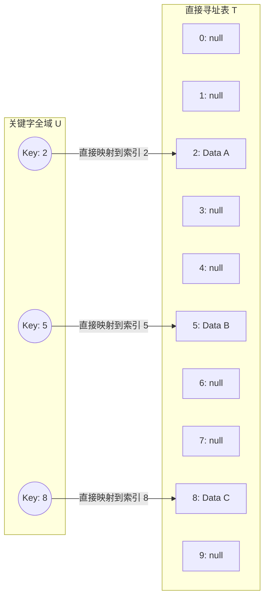

```text
.\CLRS\Chapter-11\
```

## 目录
- [[#通俗类比：酒店房卡与房间号映射]]
- [[#核心原理：Direct-address Tables]]
- [[#💡 架构师视角映射：Java BitSet 与海量数据判重]]
- [[#🔍 Deep Dive (深挖指南)]]

---

## 通俗类比：酒店房卡与房间号映射

想象你开了一家有 1000 个房间的酒店，房间号从 $0$ 到 $999$。每个房间都有一把实体钥匙。
为了快速找到某个房间的钥匙，你做了一个带有 1000 个格子的**钥匙柜**。
- **规则**：0 号房间的钥匙永远放在 0 号格子，1 号房间放在 1 号格子……以此类推。
- **优点**：当客人要拿 666 号房间的钥匙时，你不用从头查找到尾，直接把手伸向 666 号格子，**一步到位，耗时为 0**（严格来说是 $O(1)$ 时间）。
- **缺点**：如果在有 10,000,000 个房间规模的宇宙大酒店，而客人只有 3 个时，你需要造一个庞大的 10,000,000 格的柜子，**极其浪费空间**。

---

## 核心原理：Direct-address Tables

回到严谨的计算机科学视阈下，上述机制被称为**直接寻址表 (Direct-address Table)**。

### 原理定义
如果关键字的**全域（Universe of keys，记为 $U$）**相对较小，例如 $U = \{0, 1, ..., m-1\}$，并且没有两个元素具相同的关键字。那么我们可以用一个数组 $T[0..m-1]$ 来表示。



### 复杂度分析
操作非常简单，直接利用数组的特性进行访问：
- `DIRECT-ADDRESS-SEARCH(T, k)`: 返回 `T[k]` $\rightarrow O(1)$
- `DIRECT-ADDRESS-INSERT(T, x)`: `T[x.key] = x` $\rightarrow O(1)$
- `DIRECT-ADDRESS-DELETE(T, x)`: `T[x.key] = NIL` $\rightarrow O(1)$

> [!failure] 致命缺陷
> 当全域 $U$ 极大（例如 $U$ 是所有可能出现的长字符串，或是一个 64 位整数）时，分配一个大小等于 $|U|$ 的数组是不可能的。并且，如果实际存储的元素集合 $K$ 相对于 $U$ 非常小，分配绝大部分空间都是浪费的。这催生了随后的**散列技术**。

---

## 💡 架构师视角映射：Java BitSet 与海量数据判重

在实际工程架构中，如果我们真的遇到了 $|U|$ 很大且需要判重的场景，如何最大程度地利用直接寻址的 $O(1)$ 优势同时压缩空间？

1. **Java `BitSet` 的位图映射**：
   在 Java 中，一个 `boolean` 类型会占用 1 个字节（取决于 JVM 实现，有时作为数组占用 1 byte）。如果全域是 42 亿（32位无符号整数），用 boolean 数组需要大约 4GB 内存。
   而 `java.util.BitSet` 通过 `long[] words` 底层数组实现了**位图（Bitmap）**，每一个 `bit` 代表一个状态，通过位运算进行快速 `set` 和 `get`，直接将空间压缩到了原来的 $\frac{1}{8}$。

2. **Redis `setbit` 操作**：
   Redis 中的 Bitmap 本质也是字符串（最大 512MB），可以支持记录最多并判断近 42 亿个用户的日活状态（User ID 作为 offset 直接寻址 `T[k]`）。

> **术语闭环**：这些生产级的 Bitmap 结构，本质上是 **直接寻址表 (Direct-address Tables)** 的高度空间压缩版本（去除了 `Data`，仅保留 `Key` 的存在状态标识）。

---

## 🔍 Deep Dive (深挖指南)
- 如果你想了解上述 $O(1)$ 常数时间操作的底层位级极限压缩优化，可以翻阅 *《深入理解计算机系统 (CSAPP)》 第 2 章：信息的表示和处理*中关于位级运算和整数表示的细则。
- JVM 的 `BitSet` 源码是一个非常好的工程级位运算实践，建议直接在 IDEA 当中点进去阅读其 `set(int bitIndex)` 和 `get(int bitIndex)` 方法。
