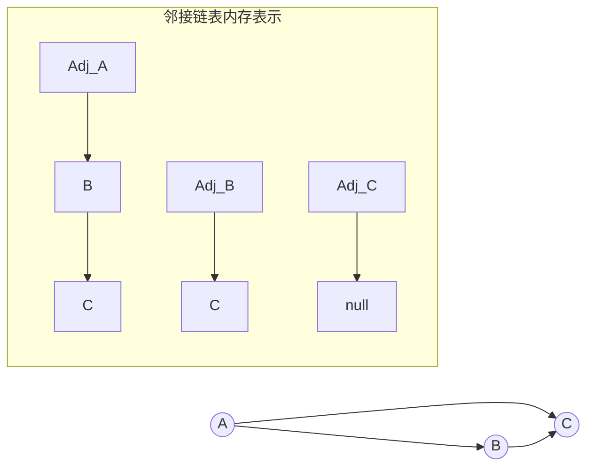

```text
.\CLRS\Chapter-22\
```

## 目录
- [[#通俗类比：微信朋友圈与微博关注网]]
- [[#核心精讲：图的在计算机内存中的两大呈现]]
	- [[#一、邻接链表 (Adjacency-List)]]
	- [[#二、邻接矩阵 (Adjacency-Matrix)]]
- [[#💡 架构师视角映射：Neo4j 与图存储系统的底层挣扎]]
- [[#🔍 Deep Dive (深挖指南)]]

---

## 通俗类比：微信朋友圈与微博关注网

要让计算机去理解错综复杂的人物社交关系网，有两种记录方式：
1. **邻接链表（个人微信通讯录模式）**：
   每个人手机里有一个独立的“通讯录数组”。A 打开手机（定位到 A 的数组），他看见一个链条串着 `[B的人脉条] -> [C的人脉条]`，说明他只认识 B 和 C。这种方式**极其省内存空间**（不会记录那些不认识的人），而且特别适合“获取 A 有哪些微信好友？”这样的需求。但是如果你突然问 A：“你认不认识一个远在天边的陌生人 Z？”，A 必须要把自己通讯录整个翻一遍才能确定没有 Z。
2. **邻接矩阵（上帝视角的微博粉丝大盘）**：
   上帝直接画了一个 $14亿 \times 14亿$ 人的巨无霸二维表格表格。里面全是 `0` 或者 `1`。`Matrix[A][B] == 1` 代表 A 认识 B，否则就是 0。
   好处：你想知道这十四亿人中 A 和 Z 认不认识，只需要在表格坐标找一点，**耗时 $O(1)$**。
   坏处：大部分人只认识身边的百十号人！这个浩如烟海的表格里 $99.9999\%$ 的格子都是没用的 `0`，**严重浪费服务器内存**！

---

## 核心精讲：图的在计算机内存中的两大呈现

在图论算法中，图 $G = (V, E)$ 包含顶级概念：**节点 (Vertices/Nodes) $V$** 与 **边 (Edges) $E$**。对于加权图可以追加权重函数 $w_e$。

### 一、邻接链表 (Adjacency-List)
对于图 $G$ ，其邻接链表表示由一个包含 $|V|$ 个链表的数组 $Adj$ 组成，每个结点对应一个长条链表。
$$Adj[u]$$ 表示包含所有与 $u$ 存在边关联（如果是有向图，则是发出有向边）的顶点实体 $v$。
- **内存消耗空间**：$\Theta(V + E)$。不论是有向图还是无向图，它都极其适合表示 **稀疏图 (Sparse Graph，其中 $|E| \ll |V|^2$)**。
- **缺点判定边存在**：如果需要判定图中是否存在一条边 $(u, v)$，则必须从头顺序搜索 $Adj[u]$整条链表，时间开销并不理想。



### 二、邻接矩阵 (Adjacency-Matrix)
图的邻接矩阵是一个 $|V| \times |V|$ 的二维矩阵 $A = (a_{ij})$。若规定顶点进行编号：
$a_{ij} = 1$ （若存在边 $(i, j) \in E$）
$a_{ij} = 0$ （否则）
- **内存消耗空间**：严格的 $\Theta(V^2)$。与边的数量毫不相关！它适用于 **稠密图 (Dense Graph，即 $|E|$ 接近 $|V|^2$)**。
- **核心优点**：判定任意边 $(u, v)$ 的存在时间只需要绝对的 $O(1)$ 常数数组寻址！
> 在无向图中，矩阵关于主对角线是 **绝对对称**的（$a_{ij} = a_{ji}$），因此可以压缩一半存储空间。

---

## 💡 架构师视角映射：Neo4j 与图存储系统的底层挣扎

在传统 Java 后端或 MySQL 内，解决“多对多”关联关系通常是依靠建立一张臃肿的“关联表（Many-to-Many Table）”。这等同于在残缺模拟“领接矩阵的零散行”。每次进行 $N$ 度人脉发现查询时，就会遭受毁灭性的 `Left Join` 笛卡尔积乘算从而死机！

如果你从事社交/风控业务，**图数据库 (Graph Database, 比如 Neo4j / Nebula)** 才是正确归宿：
在 Neo4j 的底层实现中，它抛弃了粗暴的邻接矩阵和指针飘忽不定的原生邻接链表，使用了 **免索引邻接 (Index-Free Adjacency)**：
Neo4j 给每个图形节点分配了一块**固定大小的磁盘块**。记录了它第一条发出边和接受边的磁盘内存地址；而每条“边”，又同时记录了它指向上一个和下一个关联边属性位置的游标链表指针。
通过这种**牺牲一定物理磁盘存放规整度、采用双向四游标极值链表**的存储结构，实现了无论你有百亿定点还是千亿条边，每次向外探索邻居在磁盘上的 $O(1)$ 微秒级下潜穿梭能力！这种数据结构底层的降维突围，正是本章第一节带来的深远思考。

---

## 🔍 Deep Dive (深挖指南)
- C++ 竞赛选手经常不喜欢在打比赛时为了建立领接链表而 `new Node`，这通常非常耗费常数时间并且容易触发段错误。学习 **链式前向星** 是一种利用静态一维数组来极限模拟多级邻接链表的图论必备技能！
- 了解稀疏矩阵压缩（如 CSR/CSC 格式）：在大数据人工智能 TensorFlow 等底层计算中，庞大的零阵列（邻接矩阵）必须被数学压缩结构拯救以加速 GPU 并行矩阵乘法操作。
