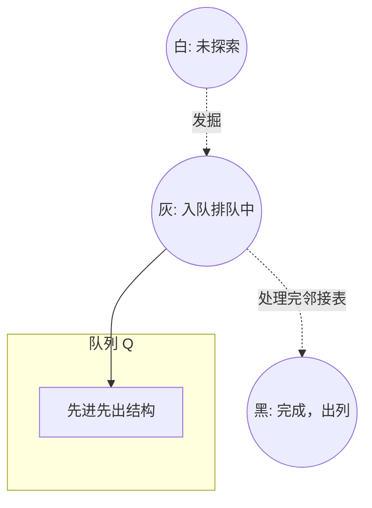

```text
.\CLRS\Chapter-22\
```

## 目录
- [[#通俗类比：池塘水波与同心圆探险]]
- [[#核心精讲：广度优先 (Breadth-First Search)]]
	- [[#三色标记法 (Colors)]]
	- [[#BFS 最短路径属性]]
- [[#💡 架构师视角映射：全网爬虫架构与消息队列推挽]]
- [[#🔍 Deep Dive (深挖指南)]]

---

## 通俗类比：池塘水波与同心圆探险

假如你被扔在迷宫里的某个分岔口，你要找到距离最少步数的出口。
**DFS（深度优先，见 22.3）**性格非常执拗：选定一条道一路狂奔走到撞上南墙死路，才肯退回来走第二条。
而 **BFS（广度优先）** 的性格就像是往平静的池塘里扔了一块石头荡出的 **同心水波纹**！
1. 第一波（距离打点人步数为 1）：你同时派出了 3 个影子分身，走向紧挨着你出发地的 3 个屋子。
2. 第二波（距离打点人步数为 2）：在这个基础上，这3个屋子的人再派出身影，去摸排**所有只隔了 2 个岔路口的屋子**。
如果有一个屋子刚好同时被 2 个人跑到，规则就是：**谁先到，算谁的（距离最短）**。

因此，水波纹能够完美解决：**如何在没有任何权重的普通图中，寻找到步数最少的那个最短安全逃跑路径距离 (Shortest Path)**。

---

## 核心精讲：广度优先 (Breadth-First Search)

广度优先搜索 (BFS) 是最简单的图搜索算法之一。它也是众多核心算法（比如 Prim 的最小生成树和 Dijkstra 算法）的底层核心思想内核。

为了控制搜索过程从源顶点 $s$ 能够系统发散并且防止回路“死循环”，算法导论对其使用了非常严密的 **三色标记状态机系统 (Vertex Colors)**，以及追踪距离 $d$ 与前驱父属 $p(\pi)$ 的结构。我们同时必须利用一个具有 **FIFO 属性的队列 (Queue)** 来调遣顶点的发散顺序。

### 三色标记法 (Colors)
每个节点初始都被标记为无暇的，在发掘的过程中，状态改变：
- ⬜ **白色 (WHITE)**：顶点还尚未被 BFS 触及（也就是尚未发现它）。
- 🌫️ **灰色 (GRAY)**：它被探险队首次发现了！它被装进了先进先出 Queue 队列之中。此时这个灰色点被叫做 **搜寻边界 (Frontier)**。它正在发光发热，等待去唤醒它自己的后续邻居。
- ⬛ **黑色 (BLACK)**：它所有的直系相邻邻居，都已经被它检查过一遍了。它自己彻底功成身退，从 Queue 队首出列被染黑销毁！

> 只要我们对邻居一发掘，就染成灰色！这就绝伦地阻止了因为图中存在环路（如 A->B->A），导致波纹循环死锁荡漾的问题。



### BFS 最短路径属性
因为 BFS 将顶点划分为以 $s$ 为圆心距离递增的层序列（一层距离为 1，下一层距离为 2），通过维护每一顶点的发现距离 $u.d$，以及该点的“是谁把我拖下水拉来的（父节点记录属性 $u.\pi$）”。当算法运行终了：
- **无权最短图 (Unweighted Shortest Path)** 宣告破案！对于图里任何一个被染黑的定点 $v$，$v.d$ 就是它离原点跨过的最少条边；
- 沿着 $v.\pi$ 一路回溯到树根 $s$，那经过的每一条道路逆向就是我们要的**广度优先树 (Breadth-First Tree)** 最短路！
- **时间复杂度**：每一条边都只被检查一次（处理它的灰色发件人），每一个节点只会入队并且出队一次。时间总复杂度完美契合：**$O(V + E)$ 即 顶点数量 + 边的数量**。

---

## 💡 架构师视角映射：全网爬虫架构与消息队列推挽

假设你要实现一个搜索引擎爬虫引擎（Spider Web Crawler/Bot），从首页出发爬取全世界的所有网页 URL 链接网。怎么爬？
- 你会使用 DFS 无限深入吗？不行！顺着首页维基百科链接一点，一直深入直到进入暗网的底层或者无底深渊的互相引用链（A 搜 B、B 搜 A），爬虫堆栈全部炸裂溢出直接崩毁！
- **商业级的爬虫全都是借助分布式的 BFS！**

1. 爬虫抓取首页（源点 $s$），将页面里所有的 URLs 记录并塞入 **Kafka / RabbitMQ (分布式的 Queue 队列前沿阵地)**（这就等于上文说的把邻居变为**灰色对象**压栈）。
2. 同时使用超大规模的 **Redis BloomFilter 布隆过滤器缓存体系** 进行判重（这也就是上文标记的**变灰后变黑防重叠染色的三色标记系统机制**，绝不把同一个爬过的白帽 URL 放进去两次）。
3. 万台分布式机器作为消费者（Consumers），不断从 Kafka 队头拉取并 `Pop` URL 出列，疯狂平着层次往世界上铺爬网页爬取！
这种架构被我们称为**宽度控制（Breadth constraint crawler）**，绝不会因深渊链导致节点崩溃死掉，是现代大厂网络数据结构治理的黄金准则。

---

## 🔍 Deep Dive (深挖指南)
- 从单源走向多源：如果在池塘里同时扔进 10 块石头，水波互相激荡交融呢？这在算法题中非常常见，被称作 **多源 BFS (Multi-Source BFS)**。它的做法极其粗暴——游戏开局别只把源点 $s$ 给 Push 进去，把 10 块石头一并全部 Push 进 `Queue` 队列并统一染色，然后同时向外波荡处理逻辑！
- **双向跑毒 BFS (Bidirectional BFS)** 是面试超级进阶题的考点（为了寻找两者最短连线，与其单向像大海捞针，不如两个人同时向互相跑发射水波），它能在庞大图中生生把空间存储与时间复杂度缩减根号级！
