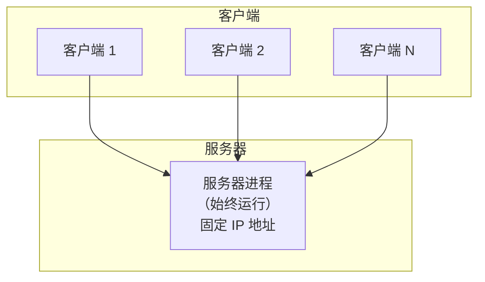
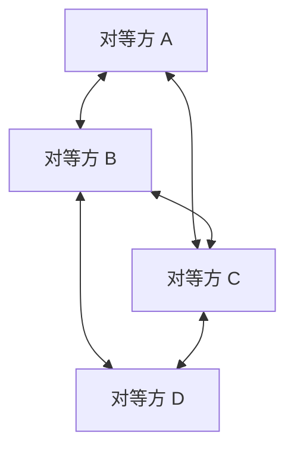
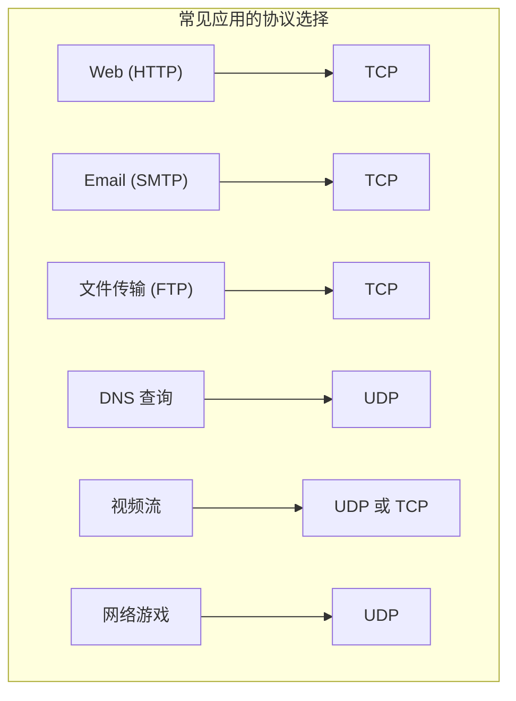

## 目录
- [[#网络应用体系结构]]
- [[#进程通信]]
- [[#可供应用程序使用的运输服务]]
- [[#Internet 提供的运输服务]]

---

## 网络应用体系结构

### 客户-服务器体系结构（C/S）



| 特性 | 服务器 | 客户端 |
|------|--------|--------|
| 是否始终运行 | ✅ 是 | ❌ 按需启动 |
| IP 地址 | 固定 | 动态分配 |
| 客户端之间通信 | 不直接通信 | 通过服务器中转 |

> 类比：银行柜台就是 C/S 模式——银行（服务器）一直开着，客户（客户端）随来随办事，客户之间不直接交流。
> CS 术语：**客户-服务器（Client-Server）** 体系结构中，服务器是核心资源的拥有者，客户端主动发起请求

### P2P 体系结构



> [!tip] P2P 的核心优势：自扩展性
> 每个新加入的对等方既是**消费者**也是**提供者**——下载的同时也在上传。
> 用户越多，整体容量越大！（与 C/S 相反——C/S 用户越多，服务器压力越大）
>
> 类比：迅雷/BT 下载。你下载电影的同时，也在把已下载的部分分享给别人。参与的人越多，下载越快。这就是 P2P 的自扩展性。
> CS 术语：**P2P（Peer-to-Peer）** 具有**自扩展性（Self-Scalability）**，系统容量随节点数量自然增长

---

## 进程通信

> [!note] 跨主机进程通信
> 同一主机上的进程通信：操作系统提供 IPC 机制（管道、共享内存等）
> 不同主机上的进程通信：通过**网络消息传递（交换报文）**

### 套接字（Socket）

> [!tip] 套接字的定位
> 套接字是进程与网络之间的"门"（API 接口）。

```
应用进程                        应用进程
    ↓ ①创建报文                     ↑ ④读取报文
[套接字] ← 进程与网络的接口 →  [套接字]
    ↓ ②交给运输层                   ↑ ③运输层交付
 运输层 → 网络层 → 链路层 ====> 链路层 → 网络层 → 运输层
```

> 类比：套接字就像你家的**门**——你（应用进程）写好信后把信放在门口（套接字），邮递员（运输层）来取走。对面也一样：邮递员把信放在对方家门口，对方从门口取信。你只负责写信和读信，中间怎么运的你不管。
> CS 术语：**套接字（Socket）** 是应用层与运输层之间的 API 接口，它是网络编程的基础抽象

### 进程寻址

一个进程需要两个信息来唯一标识：
1. **主机 IP 地址**：确定是哪台机器
2. **端口号（Port）**：确定是机器上的哪个进程

```
完整的进程标识:

IP 地址:   192.168.1.100  → 找到主机
端口号:    80              → 找到该主机上的 Web 服务器进程
```

---

## 可供应用程序使用的运输服务

应用程序对运输层的需求可以从四个维度衡量：

| 维度 | 说明 | 典型应用需求 |
|------|------|------------|
| **可靠数据传输** | 数据是否必须 100% 正确到达 | 文件传输、邮件 ✅ / 实时音视频 ❌ |
| **吞吐量** | 是否需要保证最低带宽 | 视频流需要 ✅ / 邮件不需要 ❌ |
| **定时** | 是否有延迟上限要求 | 在线游戏 ✅ / 文件下载 ❌ |
| **安全性** | 是否需要加密、认证 | 网上银行 ✅ |

> [!note] 弹性应用 vs 带宽敏感应用
> - **带宽敏感应用（Bandwidth-Sensitive）**：如视频流，需要最低吞吐保证
> - **弹性应用（Elastic Application）**：如邮件、文件传输，带宽多用多、少用少

---

## Internet 提供的运输服务

| 协议 | 可靠传输 | 吞吐量保证 | 定时保证 | 安全性 |
|------|---------|-----------|---------|--------|
| TCP | ✅ | ❌ | ❌ | ❌（需 TLS 补充） |
| UDP | ❌ | ❌ | ❌ | ❌ |

> [!warning] Internet 运输层的能力有限
> TCP 和 UDP 都**不提供**吞吐量保证和定时保证。
> 安全性方面，TCP 本身不加密，需要在 TCP 之上加一层 **TLS/SSL** 来实现加密传输（HTTPS = HTTP + TLS）。



> [!info] 💡 架构师视角映射
> - **Java 网络编程**：`java.net.Socket`（TCP）和 `java.net.DatagramSocket`（UDP）就是对套接字的封装
> - **Netty 的 Bootstrap**：`ServerBootstrap` 对应服务端套接字创建与绑定，`Bootstrap` 对应客户端套接字创建与连接
> - **gRPC 的运输层**：gRPC 默认基于 HTTP/2（TCP），但也有基于 QUIC（UDP）的实验性支持
> - **微服务注册发现**：Nacos、Eureka 的服务注册本质上就是"进程寻址"——通过服务名找到 IP:Port

> [!abstract] 🔖 Deep Dive
> 关于套接字编程的实操指南，详见原书 **2.7 节**。如果想深入理解 TLS 的握手过程，推荐阅读《HTTPS 权威指南》或 RFC 8446（TLS 1.3）。

---
