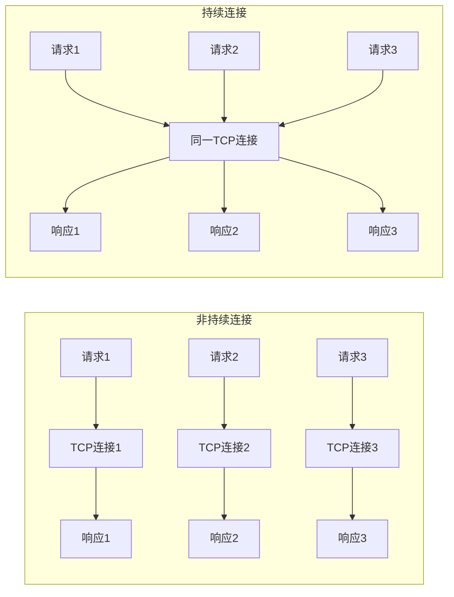
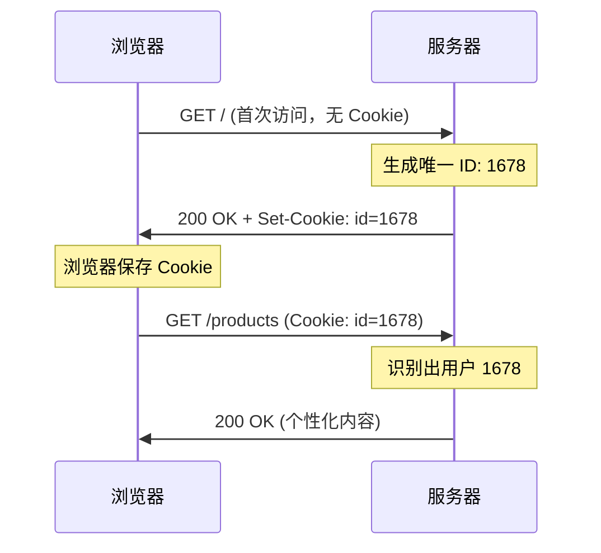
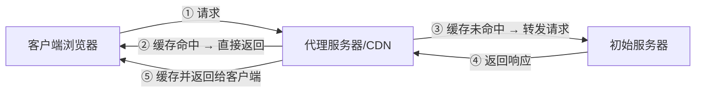
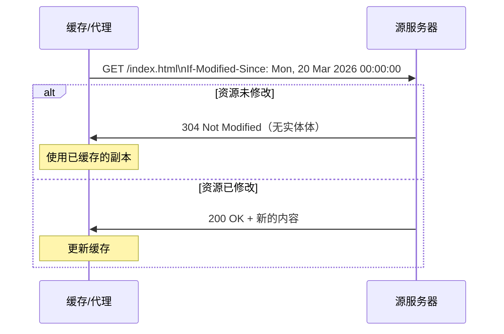

## 目录
- [[#HTTP 概述]]
- [[#非持续连接与持续连接]]
- [[#HTTP 报文格式]]
- [[#Cookie]]
- [[#Web 缓存（代理服务器）]]
- [[#条件 GET]]

---

## HTTP 概述

**HTTP（HyperText Transfer Protocol）** 是 Web 的应用层协议，定义了客户端（浏览器）和服务器之间如何交换报文。

### 核心特性

| 特性 | 说明 |
|------|------|
| **客户-服务器模型** | 客户端请求，服务器响应 |
| **使用 TCP** | HTTP 建立在 TCP 之上，保证可靠传输 |
| **无状态（Stateless）** | 服务器不记录客户端的状态信息 |

> [!tip] HTTP 为什么是无状态的？
> 类比：你每次去便利店，收银员都不记得你是谁、之前买过什么。每次交易都是独立的——这就是"无状态"。
> 这样设计的好处是：服务器简单——不需要为每个客户端维护状态信息，扩展性好（随便加服务器）。
> 坏处是：需要"记住用户"时（如购物车），需要额外机制（Cookie、Session）。
> CS 术语：**无状态协议（Stateless Protocol）** 不在服务端保留客户端状态，每个请求独立处理

---

## 非持续连接与持续连接

### 非持续连接（HTTP/1.0）

每请求一个对象就建立一次 TCP 连接：

```
请求一个包含 10 张图片的网页:

① TCP 三次握手              → 1 RTT
② 请求并获取 HTML 文件       → 1 RTT
③ 关闭 TCP 连接
④ TCP 三次握手（图片1）      → 1 RTT
⑤ 请求并获取图片1            → 1 RTT
⑥ 关闭 TCP 连接
... 重复 10 次 ...

总计: 1(HTML) + 10(图片) = 11 次 TCP 连接 = 22+ RTT
```

> [!warning] 非持续连接的缺点
> 1. 每个对象都要建立新的 TCP 连接 → 额外的 RTT 开销
> 2. 每个连接都要在客户端和服务器上分配资源（缓冲区、TCP 变量）→ 服务器负担大

### 持续连接（HTTP/1.1 默认）

```
持续连接:

① TCP 三次握手              → 1 RTT
② 请求并获取 HTML 文件       → 1 RTT
③ 请求并获取图片1            → (复用连接)
④ 请求并获取图片2            → (复用连接)
... 同一条 TCP 连接上连续请求 ...
⑫ 空闲超时后关闭连接

大幅减少了 TCP 建连的开销！
```



> [!note] HTTP 版本演进
> | 版本 | 连接方式 | 特点 |
> |------|---------|------|
> | HTTP/1.0 | 非持续连接 | 每次请求新建连接 |
> | HTTP/1.1 | 持续连接 + 流水线 | 复用连接，但有队头阻塞 |
> | HTTP/2 | 多路复用 | 单连接上多个流并行传输 |
> | HTTP/3 | QUIC（基于 UDP） | 消除 TCP 层面的队头阻塞 |

---

## HTTP 报文格式

### 请求报文

```
GET /index.html HTTP/1.1\r\n        ← 请求行（方法 URL 版本）
Host: www.example.com\r\n           ← 首部行
Connection: keep-alive\r\n
User-Agent: Mozilla/5.0\r\n
Accept-Language: zh-CN\r\n
\r\n                                ← 空行（首部结束标志）
                                    ← 实体体（GET 通常没有）
```

### 响应报文

```
HTTP/1.1 200 OK\r\n                 ← 状态行（版本 状态码 短语）
Date: Mon, 27 Mar 2026 07:00:00 GMT\r\n
Content-Type: text/html\r\n
Content-Length: 6821\r\n
Connection: keep-alive\r\n
\r\n                                ← 空行
<html>...</html>                    ← 实体体
```

### 常见 HTTP 方法

| 方法 | 语义 | 幂等 | 有请求体 |
|------|------|------|---------|
| GET | 获取资源 | ✅ | ❌ |
| POST | 提交数据（创建） | ❌ | ✅ |
| PUT | 替换/更新资源 | ✅ | ✅ |
| DELETE | 删除资源 | ✅ | ❌ |
| HEAD | 类似 GET 但只返回头部 | ✅ | ❌ |

### 常见状态码

| 状态码 | 含义 | 说明 |
|--------|------|------|
| 200 | OK | 请求成功 |
| 301 | Moved Permanently | 永久重定向 |
| 302 | Found | 临时重定向 |
| 304 | Not Modified | 资源未修改（条件GET） |
| 400 | Bad Request | 请求语法错误 |
| 403 | Forbidden | 服务器拒绝 |
| 404 | Not Found | 资源不存在 |
| 500 | Internal Server Error | 服务器内部错误 |
| 502 | Bad Gateway | 网关错误 |
| 503 | Service Unavailable | 服务不可用 |

---

## Cookie

> [!note] Cookie 解决了什么问题？
> HTTP 是无状态的，但很多应用需要"记住用户"（如登录状态、购物车）。
> Cookie 就是在无状态的 HTTP 之上增加的"状态维持"机制。



**Cookie 的四个组件**：
1. 响应报文的 `Set-Cookie` 首部行
2. 请求报文的 `Cookie` 首部行
3. 客户端浏览器的 Cookie 文件
4. 服务器端的后端数据库

> [!info] 💡 架构师视角映射
> - **Session vs Cookie**：Cookie 存在客户端，Session 存在服务端。Session ID 通常通过 Cookie 传递
> - **分布式 Session**：多台服务器时，Session 不能只存在一台机器的内存里 → Redis 存储 Session（Spring Session + Redis）
> - **JWT（JSON Web Token）**：无状态认证方案——Token 自身携带用户信息（经签名），服务器无需存储 Session

---

## Web 缓存（代理服务器）

**Web 缓存/代理服务器**：代表初始服务器满足 HTTP 请求的中间网络实体。



> [!tip] 为什么要用 Web 缓存？
> 1. **减少响应时间**：缓存离客户端更近，不需要远程访问源服务器
> 2. **减少流量**：减轻接入链路的带宽压力
> 3. **减轻服务器负载**：源服务器不用处理每一个请求
>
> 类比：CDN 就像小区附近的便利店（缓存），常用的东西直接从便利店买就行，不用每次都跑到城市中心的大超市（源服务器）
> CS 术语：Web 缓存利用了**时间局部性（Temporal Locality）**——最近被请求过的内容很可能再次被请求

---

## 条件 GET

> [!note] 缓存的一致性问题
> 缓存中的副本可能是过期的！**条件 GET** 允许缓存验证其副本是否仍然有效。



> [!info] 💡 架构师视角映射
> - **Redis 缓存一致性**：和 Web 缓存的思路类似——缓存可能过期/不一致。常见策略：Cache-Aside、Write-Through、Write-Behind
> - **CDN 的缓存策略**：CDN 节点缓存静态资源，通过 Cache-Control、ETag 等 HTTP 头控制缓存有效期
> - **浏览器的强缓存 vs 协商缓存**：`Cache-Control/Expires` = 强缓存（不问服务器）；`ETag/If-None-Match` = 协商缓存（问了才决定）

> [!abstract] 🔖 Deep Dive
> HTTP/2 的多路复用和 HTTP/3 的 QUIC 协议是当前 Web 性能优化的重点，推荐阅读原书第 2 章扩展内容或 RFC 7540（HTTP/2）和 RFC 9000（QUIC）。

---
