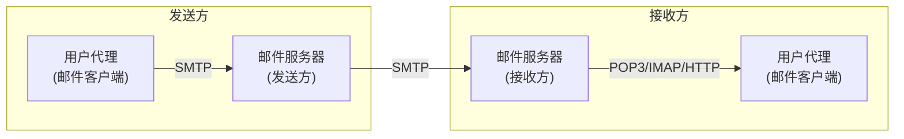

## 目录
- [[#电子邮件系统组成]]
- [[#SMTP 协议]]
- [[#邮件访问协议]]

---

## 电子邮件系统组成



三大核心组件：
1. **用户代理（User Agent）**：撰写、阅读邮件的客户端（如 Outlook、Foxmail、Web 邮箱）
2. **邮件服务器（Mail Server）**：存储和转发邮件，包含邮箱（存放接收的邮件）和报文队列（待发送的邮件）
3. **SMTP 协议**：邮件服务器之间传输邮件的协议

---

## SMTP 协议

**SMTP（Simple Mail Transfer Protocol）** 使用 TCP 端口 25，采用**推（Push）** 模式。

### SMTP 会话过程

```
S: 220 smtp.example.com SMTP Ready
C: HELO client.example.com
S: 250 Hello client.example.com
C: MAIL FROM:<alice@example.com>
S: 250 OK
C: RCPT TO:<bob@another.com>
S: 250 OK
C: DATA
S: 354 Start mail input
C: Subject: Hello!
C: 
C: Hi Bob, how are you?
C: .
S: 250 OK: Message accepted
C: QUIT
S: 221 Bye
```

### SMTP vs HTTP 对比

| 特性 | SMTP | HTTP |
|------|------|------|
| 方向 | **推协议**（发送方主动推送） | **拉协议**（接收方主动获取） |
| 连接 | 持续连接 | 持续连接（HTTP/1.1+） |
| 编码 | 7 位 ASCII（历史限制） | 不限制 |
| 多对象 | 所有对象放在一个报文中 | 每个对象独立的响应 |

> [!note] SMTP 的历史包袱
> SMTP 要求报文体为 **7 位 ASCII**（设计于 1982 年）。
> 发送二进制附件（图片、文件）需要通过 **MIME（Multipurpose Internet Mail Extensions）** 编码为 ASCII（如 Base64），接收方再解码。
>
> 类比：就像你只能用电报（7位ASCII）发消息，想发照片就得先把照片编码成文字描述（Base64），对方收到后再解码还原。
> CS 术语：**MIME** 扩展了 SMTP 的能力，支持多媒体邮件内容

---

## 邮件访问协议

SMTP 只负责**推送**邮件到接收方的邮件服务器。用户从邮件服务器**拉取**邮件需要使用其他协议：

| 协议 | 端口 | 特点 |
|------|------|------|
| **POP3** | 110 | 简单、下载到本地后可删除服务器副本 |
| **IMAP** | 143 | 支持远程管理文件夹、部分下载、服务器端保留 |
| **HTTP** | 80/443 | Web 邮箱（如 Gmail、QQ 邮箱），通过浏览器访问 |

> [!tip] IMAP vs POP3
> - **POP3**：就像去邮局取信，取走就没了（下载并删除模式），换设备看不到旧邮件
> - **IMAP**：就像在线文档，邮件始终在服务器上，任何设备都能看到，支持文件夹管理
>
> 现代邮件服务基本都用 IMAP 或 HTTP（Web 邮箱）

> [!info] 💡 架构师视角映射
> - **消息推送 vs 拉取**：SMTP 的"推"模式 vs HTTP 的"拉"模式，和消息队列中 Push vs Pull 消费模型异曲同工（RocketMQ Push 消费者 vs Pull 消费者）
> - **Base64 编码**：不仅用于邮件附件，在 JWT、HTTP Basic 认证中也广泛使用

> [!abstract] 🔖 Deep Dive
> 关于邮件安全（SPF、DKIM、DMARC），可参阅 RFC 7208（SPF）和 RFC 6376（DKIM）。

---
