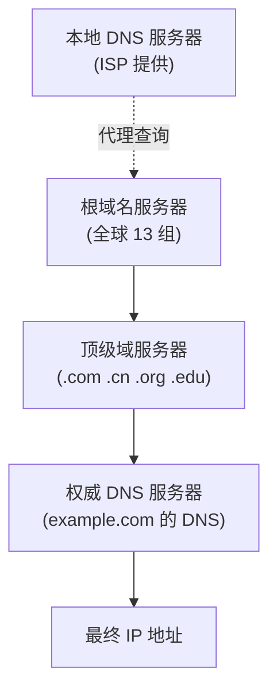
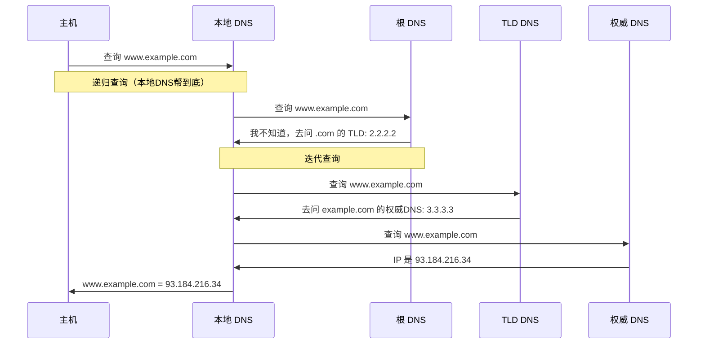

## 目录
- [[#DNS 概述]]
- [[#DNS 工作原理]]
- [[#DNS 记录与报文]]

---

## DNS 概述

**DNS（Domain Name System，域名系统）** 的核心功能：将**域名**（如 `www.baidu.com`）映射为 **IP 地址**（如 `110.242.68.66`）。

> [!tip] 为什么需要 DNS？
> 类比：DNS 就像手机通讯录——你记不住每个人的手机号（IP 地址），但你记得他们的名字（域名）。通讯录帮你把名字翻译成号码。
> CS 术语：DNS 是一个**分布式数据库**系统，运行在 UDP 端口 53 上（也支持TCP），是应用层协议

### DNS 提供的服务

| 服务 | 说明 |
|------|------|
| **域名 → IP 映射** | 核心功能 |
| **主机别名** | 一个主机可以有多个域名（`www.ibm.com` → `servereast.ibm.com`） |
| **邮件服务器别名** | MX 记录（`@qq.com` → 对应的邮件服务器） |
| **负载分配** | 一个域名对应多个 IP，DNS 轮询返回不同的 IP |

---

## DNS 工作原理

### 层次化的 DNS 服务器

> [!note] 三层 DNS 服务器
> | 层级 | 职责 | 类比 |
> |------|------|------|
> | **根 DNS 服务器** | 知道所有顶级域服务器的地址 | 国家邮政总局——知道各省邮局在哪 |
> | **顶级域 DNS 服务器** | 管理 `.com`、`.cn` 等顶级域 | 省邮局——知道省内各市的邮局 |
> | **权威 DNS 服务器** | 存储特定域名的实际 IP 记录 | 市邮局——知道具体地址 |
> | **本地 DNS 服务器** | 代理客户端查询，缓存结果 | 你家小区门卫——帮你问路并记住答案 |

### 递归查询与迭代查询

> [!tip] 递归 vs 迭代
> - **递归查询**：客户端请求本地 DNS → 本地 DNS 帮你查到底，返回最终结果（"你坐着别动，我去帮你问"）
> - **迭代查询**：本地 DNS 问根 DNS → 根 DNS 说"我不知道，你去问 TLD" → 本地 DNS 再去问 TLD...（"我不知道，但你可以去问 xxx"）
>
> 实际中：客户端 → 本地 DNS 是递归；本地 DNS → 其他 DNS 服务器通常是迭代

### DNS 缓存

> [!important] DNS 缓存无处不在
> - **浏览器缓存**：Chrome 先检查自己的 DNS 缓存
> - **操作系统缓存**：检查 OS 的 DNS 缓存（如 Windows 的 `ipconfig /displaydns`）
> - **本地 DNS 服务器缓存**：ISP 的 DNS 服务器缓存近期查询结果
>
> 缓存条目有 **TTL（Time To Live）**，过期后需重新查询

---

## DNS 记录与报文

### 资源记录（RR: Resource Record）

DNS 数据库中存储的条目格式：`(Name, Value, Type, TTL)`

| Type | Name | Value | 用途 |
|------|------|-------|------|
| **A** | 主机名 | IPv4 地址 | `example.com → 93.184.216.34` |
| **AAAA** | 主机名 | IPv6 地址 | IPv6 版本的 A 记录 |
| **NS** | 域名 | 权威 DNS 主机名 | `example.com → ns1.example.com` |
| **CNAME** | 别名 | 规范主机名 | `www.ibm.com → servereast.ibm.com` |
| **MX** | 域名 | 邮件服务器主机名 | `example.com → mail.example.com` |

> [!info] 💡 架构师视角映射
> - **微服务注册发现**：Nacos/Eureka 本质上就是"应用层的 DNS"——把服务名（域名）映射到实例地址（IP:Port）
> - **Kubernetes Service DNS**：K8s 内置 CoreDNS，自动为 Service 创建 DNS 记录（`my-service.namespace.svc.cluster.local`）
> - **CDN 的智能 DNS**：CDN 通过 DNS 将用户请求导向最近的节点（根据用户 IP 的地理位置返回不同的 CDN 节点 IP）
> - **DNS 攻击**：DNS 劫持（篡改 DNS 响应）、DNS 放大攻击（利用 DNS 做 DDoS）是常见的安全威胁

> [!abstract] 🔖 Deep Dive
> 关于 DNS 安全扩展（DNSSEC），推荐阅读 RFC 4035。关于 DNS over HTTPS（DoH），参考 RFC 8484。

---
