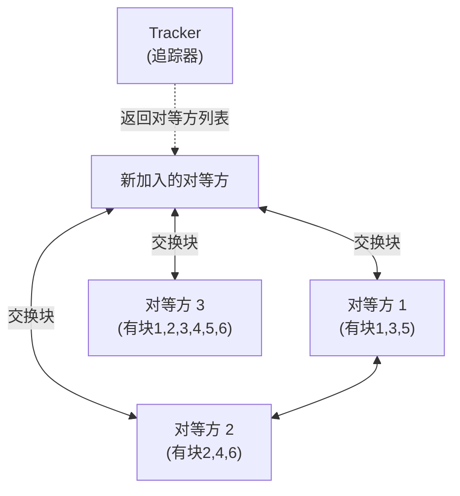

## 目录
- [[#P2P 体系结构的可扩展性]]
- [[#BitTorrent 协议]]

---

## P2P 体系结构的可扩展性

### C/S vs P2P 的分发时间对比

```
假设: 文件大小 F, N 个客户端, 服务器上传带宽 us, 客户端下载带宽 di, 客户端上传带宽 ui

C/S 模式分发时间下界:
  Dcs ≥ max{ NF/us , F/dmin }
       ↑ 服务器要发N份   ↑ 最慢客户端的下载时间
  → 随 N 线性增长！

P2P 模式分发时间下界:
  Dp2p ≥ max{ F/us , F/dmin , NF/(us + Σui) }
         ↑ 服务器至少发1份  ↑ 最慢客户端      ↑ 系统总上传能力
  → 随 N 增长但分母也增长 → 自扩展！
```

```
分发时间对比 (N 增大时):

时间
 ↑
 |     / C/S (线性增长)
 |    /
 |   /       ___________  P2P (趋于平稳)
 |  /     __/
 | /   __/
 |/ __/
 +──────────────────→ N (对等方数量)
```

> [!tip] P2P 的自扩展性
> 类比：C/S 就像一个厨师做 100 份饭——人越多，等越久。P2P 就像"自助火锅"——每个人都带了一道菜来分享，人越多可选菜越丰富、食物"分发"越快。
> CS 术语：P2P 的核心优势是**自扩展性（Self-Scalability）**——新加入的对等方既带来需求，也带来供给

---

## BitTorrent 协议

BitTorrent 是最成功的 P2P 文件分发协议之一。

### 核心概念

| 术语 | 含义 |
|------|------|
| **洪流（Torrent）** | 参与文件分发的所有对等方集合 |
| **块（Chunk）** | 文件被分割成等大的块（通常 256KB） |
| **追踪器（Tracker）** | 维护洪流中对等方列表的服务器 |
| **种子（Seeder）** | 拥有完整文件的对等方 |
| **吸血者（Leecher）** | 还在下载中的对等方 |



### 关键机制

#### 1. 最稀缺优先（Rarest First）

> 优先请求在邻居中**最稀缺的块**，而不是最常见的块。
> 这样可以均衡各块的分布，避免某些块只有少数对等方拥有。

#### 2. 一报还一报（Tit-for-Tat）

> [!note] 激励机制
> - 你给我上传，我给你上传（互惠）
> - "前四"机制：每 10 秒重新评估，优先给传输速率最快的 4 个邻居上传
> - **乐观疏通**：每 30 秒随机选择一个新邻居上传，给新来的对等方一个机会
>
> 类比：这就像社交潜规则——你帮我搬家，我也帮你搬家。不帮忙的人（吸血者）会被"冷落"（限速/不上传）。同时每隔一段时间随机帮一个陌生人（乐观疏通），避免小圈子封闭。
> CS 术语：这是一种基于**博弈论（Game Theory）** 的激励机制，鼓励对等方贡献上传带宽

> [!info] 💡 架构师视角映射
> - **CDN + P2P 混合架构**：一些视频平台（如早期的 PPTV、ChinaCache）结合 CDN 和 P2P，热门内容用 P2P 分发减少 CDN 成本
> - **IPFS（InterPlanetary File System）**：新一代分布式文件系统，融合 BitTorrent、Git、DHT 等技术
> - **区块链的全节点同步**：区块链中新节点加入时同步全部区块数据的过程，类似 P2P 文件分发

> [!abstract] 🔖 Deep Dive
> 关于 DHT（分布式哈希表）实现无 Tracker 的对等方发现，推荐阅读原书 **2.5 节**扩展内容和 Kademlia 协议论文。

---
