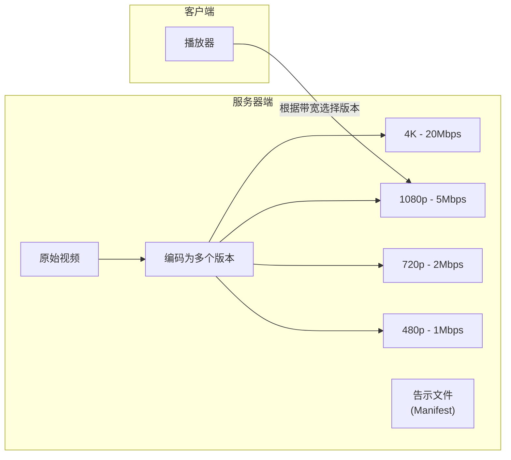
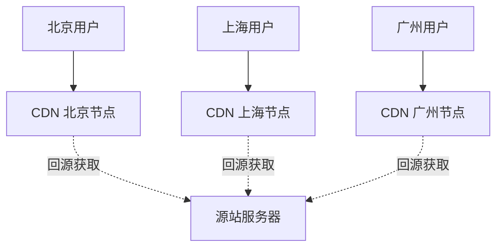
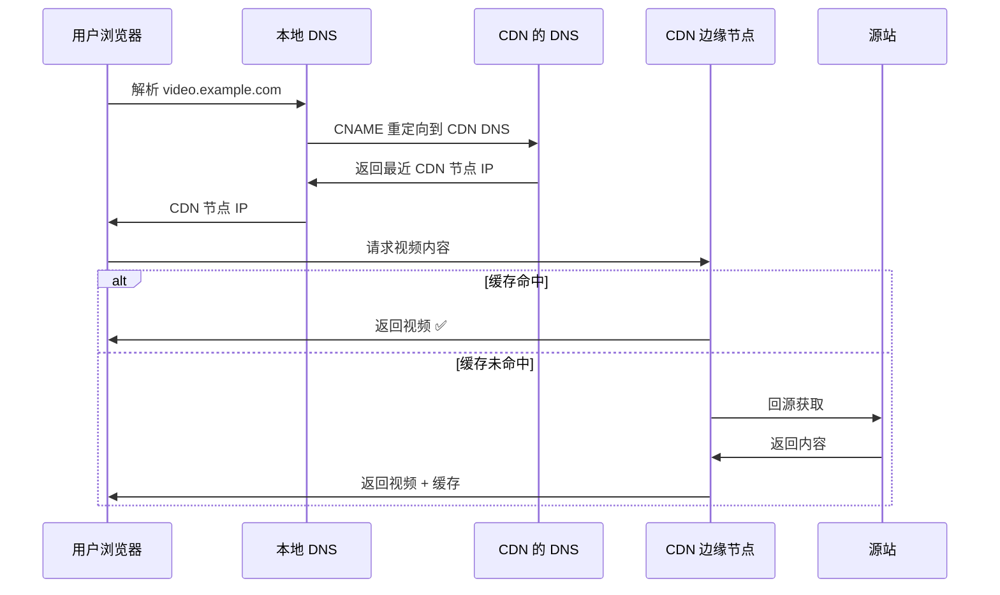

## 目录
- [[#Internet 视频]]
- [[#HTTP 流与 DASH]]
- [[#内容分发网（CDN）]]

---

## Internet 视频

视频是 Internet 流量的最大组成部分（占比超过 80%）。

### 视频的关键特性

| 特性 | 说明 |
|------|------|
| **高码率** | 标清 1Mbps，高清 3-5Mbps，4K 10-20Mbps |
| **可压缩** | 利用时间和空间冗余进行压缩 |
| **可分级** | 可以根据网络状况切换不同质量版本 |

> 类比：视频就像自助餐厅的菜品——有精致版（4K）、普通版（1080p）和简易版（480p）。网络好的时候吃精致版，网络差的时候退而求其次，总比饿着强（卡顿/断流）。
> CS 术语：视频编码支持**可伸缩编码（Scalable Coding）**，允许在质量和带宽之间权衡

---

## HTTP 流与 DASH

### 传统 HTTP 流

客户端通过 HTTP GET 请求下载完整视频文件 → 简单但不灵活（无法自适应网络状况）。

### DASH（Dynamic Adaptive Streaming over HTTP）

**DASH 的核心思想**：
1. 视频被编码为**多个版本**（不同码率/分辨率）
2. 每个版本被切成小**块（Chunk）**（通常几秒钟）
3. 服务器提供**告示文件（Manifest）**，列出各版本的 URL
4. 客户端**动态选择**：根据当前可用带宽，逐块选择合适的版本

> [!tip] DASH 的自适应能力
> 网络好 → 请求 4K 版本的块；网络突然变差 → 下一个块切换到 720p。
> 用户感受：清晰度在变化，但很少卡顿。
>
> CS 术语：**DASH（Dynamic Adaptive Streaming over HTTP）** 将"选择什么质量"的决策权交给了客户端（称为 **ABR 算法: Adaptive Bitrate**）

---

## 内容分发网（CDN）

### 为什么需要 CDN？

单一数据中心分发视频的问题：
1. 远距离用户延迟大
2. 同一视频被多次通过骨干网传输，浪费带宽
3. 单点故障风险

**CDN（Content Delivery Network）**：在全球部署大量缓存服务器，将内容分发到靠近用户的边缘节点。

### CDN 部署策略

| 策略 | 含义 | 特点 |
|------|------|------|
| **深入** | 将 CDN 节点部署在 ISP 网络内部 | 更靠近用户，延迟最低，但节点数量巨大，维护成本高 |
| **邀请做客** | 在 IXP（Internet 交换点）部署 | 节点较少，维护方便，但离用户稍远 |

### CDN 工作流程

> [!info] 💡 架构师视角映射
> - **静态资源 CDN**：前端项目的 JS/CSS/图片通常部署到 CDN（如 阿里云 CDN、Cloudflare），Spring Boot 项目的静态资源也常配置 CDN
> - **动态加速**：CDN 不仅缓存静态内容，还可以优化动态请求的传输路径（如全站加速 DCDN）
> - **边缘计算**：CDN 边缘节点可以运行计算逻辑（如 Cloudflare Workers），是边缘计算的基础设施
> - **视频点播/直播架构**：抖音/B站 的视频分发 = 视频转码 + CDN 分发 + DASH/HLS 自适应流

> [!abstract] 🔖 Deep Dive
> 关于 CDN 的调度算法和智能 DNS，推荐阅读原书 **2.6.3 节**。关于 HLS 和 DASH 的工程实践，可以参考 Apple HLS 文档和 MPEG-DASH 标准。

---
