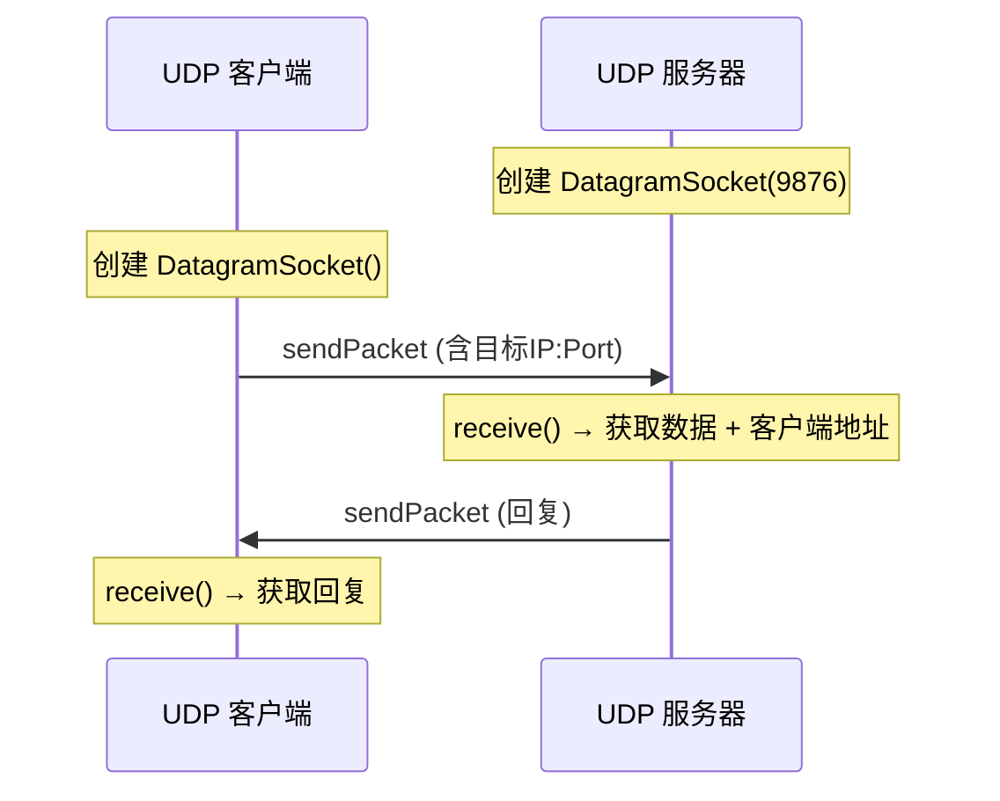
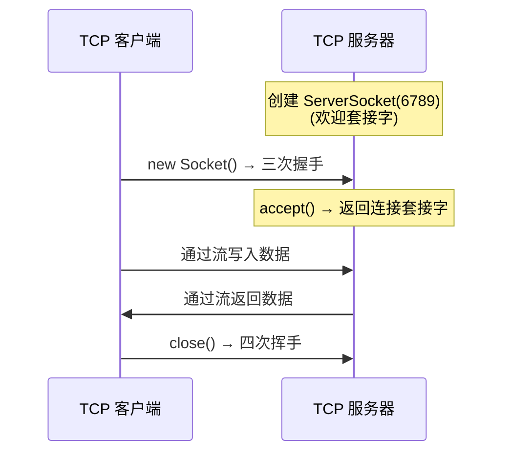
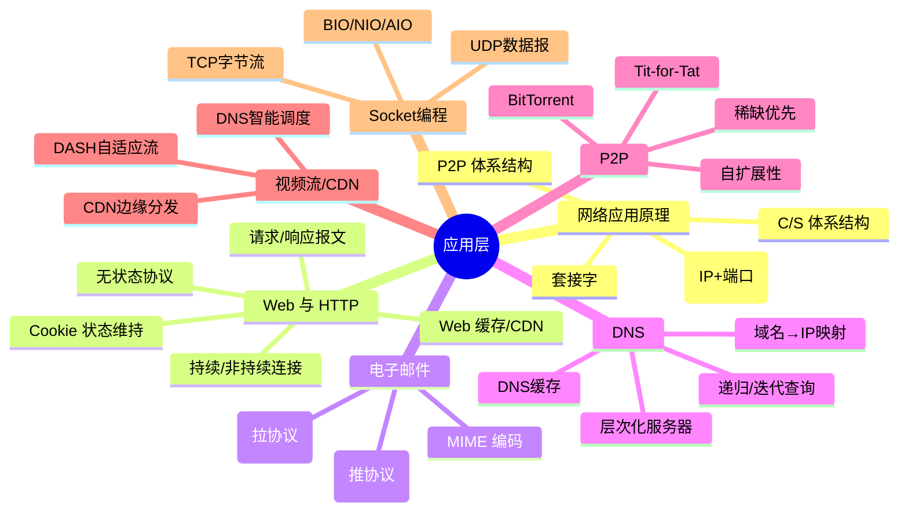

## 目录
- [[#套接字编程基础]]
- [[#UDP 套接字编程]]
- [[#TCP 套接字编程]]
- [[#第二章小结]]

---

## 套接字编程基础

网络应用开发的核心就是编写通过网络通信的程序。这些程序通过**套接字（Socket）** 与网络交互。

```
网络应用的两种类型:

1. 标准协议应用（如 Web 浏览器 → 遵循 HTTP/RFC 文档）
   → 必须严格遵守协议规范

2. 私有协议应用（如自定义聊天程序）
   → 开发者自己定义消息格式和通信规则
```

---

## UDP 套接字编程

UDP 编程的特点：**无需建连，直接发送数据报**。

```java
// UDP 服务器端（Java）
DatagramSocket serverSocket = new DatagramSocket(9876);
byte[] receiveData = new byte[1024];

while (true) {
    // 接收数据报
    DatagramPacket receivePacket = new DatagramPacket(receiveData, receiveData.length);
    serverSocket.receive(receivePacket);  // 阻塞等待
    
    String sentence = new String(receivePacket.getData(), 0, receivePacket.getLength());
    InetAddress clientAddress = receivePacket.getAddress();
    int clientPort = receivePacket.getPort();
    
    // 处理并回复
    String reply = sentence.toUpperCase();
    byte[] sendData = reply.getBytes();
    DatagramPacket sendPacket = new DatagramPacket(
        sendData, sendData.length, clientAddress, clientPort
    );
    serverSocket.send(sendPacket);
}
```

```java
// UDP 客户端（Java）
DatagramSocket clientSocket = new DatagramSocket();
InetAddress serverAddr = InetAddress.getByName("localhost");

String message = "hello server";
byte[] sendData = message.getBytes();
DatagramPacket sendPacket = new DatagramPacket(
    sendData, sendData.length, serverAddr, 9876
);
clientSocket.send(sendPacket);  // 无需建连，直接发送

// 等待回复
byte[] receiveData = new byte[1024];
DatagramPacket receivePacket = new DatagramPacket(receiveData, receiveData.length);
clientSocket.receive(receivePacket);  // 阻塞接收

System.out.println("回复: " + new String(receivePacket.getData(), 0, receivePacket.getLength()));
clientSocket.close();
```



---

## TCP 套接字编程

TCP 编程的特点：**先建立连接，再通过流进行通信**。

```java
// TCP 服务器端（Java）
ServerSocket welcomeSocket = new ServerSocket(6789);  // 欢迎套接字

while (true) {
    Socket connectionSocket = welcomeSocket.accept();  // 阻塞，等待连接
    // accept() 返回新的连接套接字，与该特定客户端通信
    
    BufferedReader inFromClient = new BufferedReader(
        new InputStreamReader(connectionSocket.getInputStream())
    );
    DataOutputStream outToClient = new DataOutputStream(
        connectionSocket.getOutputStream()
    );
    
    String clientSentence = inFromClient.readLine();
    String capitalizedSentence = clientSentence.toUpperCase() + "\n";
    outToClient.writeBytes(capitalizedSentence);
    
    connectionSocket.close();
}
```

```java
// TCP 客户端（Java）
Socket clientSocket = new Socket("localhost", 6789);  // 触发三次握手

DataOutputStream outToServer = new DataOutputStream(
    clientSocket.getOutputStream()
);
BufferedReader inFromServer = new BufferedReader(
    new InputStreamReader(clientSocket.getInputStream())
);

outToServer.writeBytes("hello server\n");
String reply = inFromServer.readLine();
System.out.println("回复: " + reply);

clientSocket.close();  // 触发四次挥手
```



### TCP vs UDP 编程对比

| 特性 | TCP 编程 | UDP 编程 |
|------|---------|---------|
| 连接 | 先 `connect()`/`accept()` | 无需连接 |
| 数据传输 | 字节流（InputStream/OutputStream） | 数据报（DatagramPacket） |
| 地址附带 | 连接建立后无需每次指定地址 | 每个数据报都要指定目标地址 |
| 两种套接字 | `ServerSocket`（欢迎）+ `Socket`（连接） | 只有 `DatagramSocket` |
| 可靠性 | 由 TCP 保证 | 应用自行处理 |

> [!info] 💡 架构师视角映射
> - **Netty 的底层**：Netty 封装了 `java.nio.channels.SocketChannel`（TCP）和 `DatagramChannel`（UDP），提供了高性能的异步网络编程框架
> - **BIO vs NIO vs AIO**：
>   - 上面的例子是 **BIO（阻塞I/O）**——`accept()` 和 `read()` 都会阻塞线程
>   - **NIO**：`Selector` + `Channel` + `Buffer`，一个线程管理多连接
>   - **AIO**：异步回调模式（Java 7+），但 Linux 上实际性能不如 NIO（epoll）
> - **Tomcat 的连接器**：Tomcat 使用 NIO Endpoint（默认）处理 TCP 连接，每个请求最终交给 Servlet 处理

> [!abstract] 🔖 Deep Dive
> 关于 Java NIO 网络编程，推荐《Netty 实战》。关于 Linux 底层的 epoll 机制，推荐《UNIX 网络编程 卷1》第 6 章。

---

## 第二章小结



| 概念 | 核心要点 |
|------|---------|
| 应用体系结构 | C/S（集中式）vs P2P（自扩展） |
| HTTP | 无状态、请求-响应、持续连接、Cookie/缓存补充 |
| SMTP | 推协议、7位ASCII、MIME 扩展 |
| DNS | 分布式数据库、层次服务器、递归+迭代查询、缓存 |
| P2P/BitTorrent | 自扩展、块分发、稀缺优先、Tit-for-Tat 激励机制 |
| CDN | 边缘缓存、DNS 重定向、深入/邀请做客策略 |
| DASH | 多版本编码 + 客户端自适应选择 |
| Socket 编程 | UDP（数据报）vs TCP（字节流），BIO → NIO → Netty |

> [!tip] 面试高频考点
> 1. HTTP 1.0/1.1/2.0/3.0 的区别？→ [[2.2 Web和HTTP#HTTP 版本演进]]
> 2. DNS 的解析过程？→ [[2.4 DNS：因特网的目录服务#DNS 工作原理]]
> 3. Cookie 和 Session 的区别？→ [[2.2 Web和HTTP#Cookie]]
> 4. CDN 的工作原理？→ [[2.6 视频流和内容分发网#CDN 工作流程]]
> 5. TCP 和 UDP 编程的区别？→ [[#TCP vs UDP 编程对比]]

---
