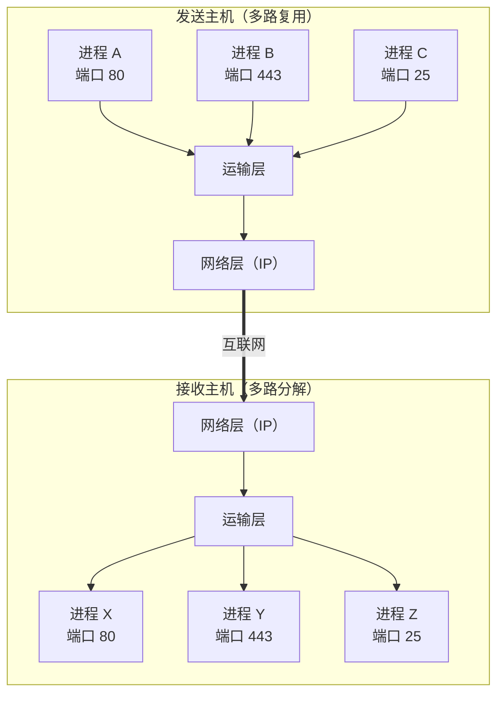

## 目录
- [[#运输层的作用]]
- [[#运输层与网络层的关系]]
- [[#多路复用与多路分解概述]]

---

## 运输层的作用

运输层为运行在不同主机上的**应用进程**之间提供逻辑通信（logical communication）。

> [!tip] 什么是"逻辑通信"？
> 类比：你和朋友分别在北京和上海，你们通过微信聊天。从你们的视角看，消息是"直接"在两个手机之间传递的——这就是"逻辑通信"。但实际上，消息经过了手机基站、核心网、光纤等无数设备的转发。
> CS 术语：**逻辑通信（Logical Communication）** 指的是运输层对上层应用屏蔽了底层网络的复杂细节，使得进程之间看起来像是直接连接的。

### 运输层 vs 网络层

| 层 | 通信对象 | 类比 |
|---|---------|------|
| 网络层（IP） | **主机**之间 | 邮政系统：负责把信件从一栋楼送到另一栋楼 |
| 运输层（TCP/UDP） | **进程**之间 | 楼内的收发室大爷：把信件分发到具体的房间（进程） |

> [!note] 经典类比：家庭信件
> 想象两个大家庭互相通信，每个家庭有多个人（进程）。
> - **网络层**就像邮政系统，负责把信件在两个家庭的地址之间运送
> - **运输层**就像每个家庭里专门负责收发信件的那个人（比如大哥），把信件分拣给家里的每个成员
>
> CS 术语：运输层提供的是**进程间通信**（IPC: Inter-Process Communication），网络层提供的是**主机间路由与转发**

---

## 运输层与网络层的关系

运输层协议的能力受到底层网络层（IP）的限制：

```
运输层能做到的（在IP基础上增强）:
┌──────────────────────────────────────────────┐
│  ✅ 进程到进程的数据交付（多路复用/多路分解） │
│  ✅ 差错检测（校验和）                        │
│  ✅ 可靠数据传输（TCP独有）                   │
│  ✅ 拥塞控制（TCP独有）                       │
└──────────────────────────────────────────────┘

运输层做不到的（IP本身不保证）:
┌──────────────────────────────────────────────┐
│  ❌ 带宽保证                                  │
│  ❌ 时延保证                                  │
└──────────────────────────────────────────────┘
```

> [!important] IP 提供的是"尽力而为"的服务
> IP 协议是 **best-effort delivery**：不保证报文的交付、不保证按序到达、不保证数据完整性。
> TCP 在这个不可靠的基础上，通过确认、重传、排序等机制，构建出了可靠服务。

### Internet 的两个运输层协议

| 协议 | 特点 | 典型应用 |
|------|------|---------|
| **TCP** | 可靠、面向连接、流量控制、拥塞控制 | HTTP、FTP、SMTP、SSH |
| **UDP** | 不可靠、无连接、轻量快速 | DNS、视频流、游戏、VoIP |

---

## 多路复用与多路分解概述

> [!tip] 核心概念
> - **多路复用（Multiplexing）**：发送端——多个应用进程的数据汇聚到运输层，加上头部信息（端口号等），向下传递给网络层
> - **多路分解（Demultiplexing）**：接收端——运输层根据端口号将数据分发给正确的应用进程



> CS 术语：多路复用/多路分解的核心依赖是**端口号（Port Number）**，TCP/UDP 报文段头部都包含**源端口号**和**目的端口号**字段（各 16 位，范围 0~65535）

> [!info] 💡 架构师视角映射
> - **Netty 的 EventLoop 模型**就是一种复用机制：一个 EventLoop 线程处理多个 Channel 的 I/O 事件，本质上就是在应用层做"多路复用"
> - **Java NIO Selector** 的 `select()` 方法监听多个 Channel，和操作系统的 I/O 多路复用（`epoll`/`select`/`kqueue`）一脉相承
> - Redis 单线程高性能的秘密之一：使用 `epoll` 做 I/O 多路复用

> [!abstract] 🔖 Deep Dive
> 多路复用/多路分解的详细机制（TCP 和 UDP 的差异）请参阅原书 **3.2 节**。如果想深入理解操作系统层面的 I/O 多路复用，推荐阅读《UNIX 网络编程》第 6 章。

---
