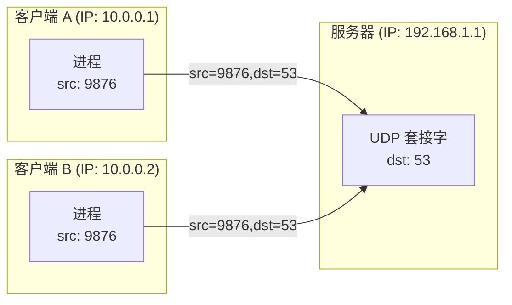
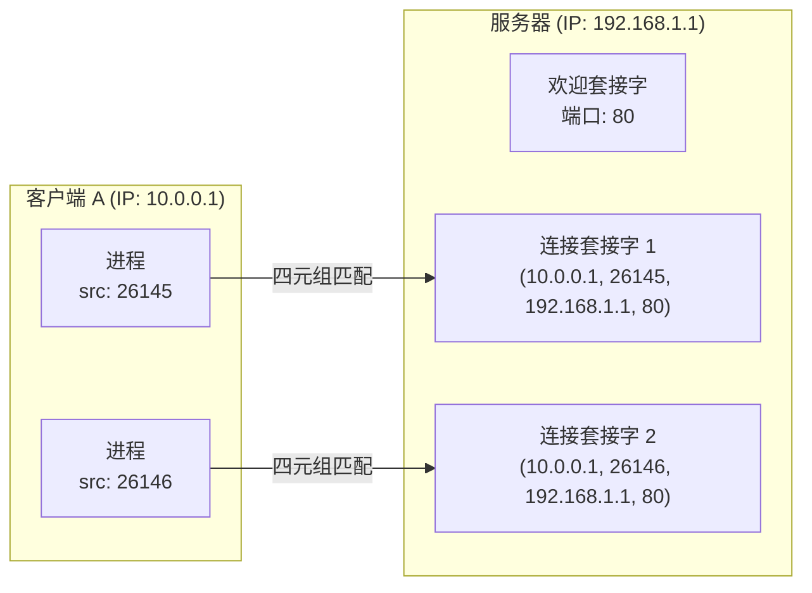

## 目录
- [[#多路分解的工作原理]]
- [[#无连接的多路复用与多路分解（UDP）]]
- [[#面向连接的多路复用与多路分解（TCP）]]

---

## 多路分解的工作原理

运输层报文段的结构中，**源端口号**和**目的端口号**是多路分解的关键：

```
UDP/TCP 报文段头部（简化）:
┌────────────────┬────────────────┐
│   源端口号      │   目的端口号    │  ← 各 16 位
│  (Source Port)  │  (Dest Port)   │
├────────────────┴────────────────┤
│           其他头部字段            │
├─────────────────────────────────┤
│           应用层数据              │
│          (Payload)              │
└─────────────────────────────────┘
```

> [!note] 端口号分类
> | 范围 | 名称 | 说明 |
> |------|------|------|
> | 0 ~ 1023 | **周知端口号（Well-known）** | 保留给标准服务（HTTP=80, HTTPS=443, DNS=53） |
> | 1024 ~ 49151 | **注册端口号** | 已注册但非保留 |
> | 49152 ~ 65535 | **动态/私有端口** | 操作系统自动分配给客户端进程 |

---

## 无连接的多路复用与多路分解（UDP）

UDP 的多路分解仅依靠 **目的 IP + 目的端口号**（二元组）来定位目标套接字。



> [!warning] UDP 的关键特征
> 即使来自不同客户端（不同源 IP），只要目的端口相同，UDP 报文段就会被投递到**同一个套接字**。
> 源端口号的作用仅仅是让服务器知道"回信"时该发往哪里（回送地址）。

> 类比：一个班级的作业收集箱（UDP 套接字）。不管哪个学生（不同源 IP）交上来的作业，只要放进同一个箱子（同一个目的端口），就会被班长（进程）统一收取。
> CS 术语：UDP 使用 **二元组（目的 IP, 目的端口号）** 标识套接字

---

## 面向连接的多路复用与多路分解（TCP）

TCP 套接字由**四元组**唯一标识：`(源IP, 源端口, 目的IP, 目的端口)`



> [!tip] TCP vs UDP 的多路分解差异
> | 协议 | 套接字标识 | 含义 |
> |------|-----------|------|
> | UDP | (目的IP, 目的端口) | 不同客户端的报文可能进入同一个套接字 |
> | TCP | (源IP, 源端口, 目的IP, 目的端口) | 每个连接对应独立的套接字 |
>
> 类比理解：
> - UDP 就像一个公共邮箱，谁寄来的信都放一起
> - TCP 就像每个客户有专属的私人信箱，即使在同一个邮局（同一个目的端口），不同客户的信件互不混淆

> [!note] Web 服务器的多线程处理
> 当一个 Web 服务器接收到 TCP 连接请求时：
> 1. 监听套接字（欢迎套接字）在端口 80 等候
> 2. 客户端发起连接 → 服务器 `accept()` → 创建一个**新的连接套接字**
> 3. 新的连接套接字由四元组唯一标识
> 4. 后续该客户端的所有报文段都被分配到这个专属的连接套接字
>
> 这就是为什么一个 Web 服务器可以同时为成千上万个客户端服务——每个 TCP 连接都有独立的套接字

> [!info] 💡 架构师视角映射
> - **Tomcat/Netty 的连接模型**：Tomcat 的 BIO 模式中，每个 TCP 连接对应一个线程（Thread-per-connection），Netty 用 EventLoop 复用线程处理多连接
> - **Java ServerSocket**：`ServerSocket.accept()` 返回的每个 `Socket` 对象就对应一个四元组标识的连接套接字
> - **连接池（如 HikariCP）**：连接池中缓存的每个 `Connection` 底层就是一个 TCP 连接（四元组）

> [!abstract] 🔖 Deep Dive
> TCP 的连接建立过程（三次握手）是多路分解生效的前提，详见 [[3.5 面向连接的运输：TCP]]。关于套接字编程的实践，推荐原书 **2.7 节**的 Socket 编程实验。

---
