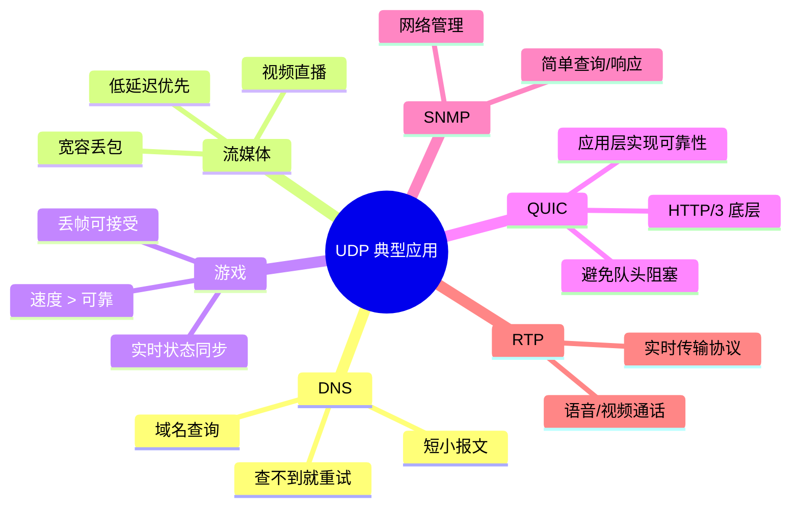

## 目录
- [[#UDP 概述]]
- [[#UDP 报文段结构]]
- [[#UDP 校验和]]
- [[#UDP 的应用场景]]

---

## UDP 概述

UDP（User Datagram Protocol，用户数据报协议）是一种**极简**的运输层协议，几乎只在 IP 之上增加了两个功能：**多路复用/多路分解** 和 **差错检测**。

> [!tip] UDP 的设计哲学
> 类比：UDP 就像发短信（或者发微信消息）——你发了就不管了，不关心对方是否收到、是否按顺序看到。速度快、开销小。
> 相比之下，TCP 就像打电话——先拨号（建立连接），确认对方在线，通话过程中持续确认，挂断时还要告别（断开连接）。
> CS 术语：UDP 是**无连接（Connectionless）** 的运输层协议，不维护连接状态，不做可靠性保证

### 为什么要使用 UDP？

| 优势 | 原因 |
|------|------|
| **无需建连，延迟低** | 没有三次握手的开销，应用层数据直接发送 |
| **无连接状态** | 不维护序号、确认号、窗口等状态 → 服务器可支撑更多并发 |
| **头部开销小** | UDP 头部仅 8 字节；TCP 头部至少 20 字节 |
| **无拥塞控制** | 应用可以按任意速率发送（TCP 会被拥塞控制"减速"） |

> [!warning] 无拥塞控制的双刃剑
> UDP 不做拥塞控制 = 不为其他流量让路 → 如果大量使用 UDP 且不在应用层做控制，可能导致网络拥塞，挤压 TCP 流量
> 这也是为什么 QUIC 协议（基于 UDP）在应用层自主实现了拥塞控制

---

## UDP 报文段结构

```
UDP 报文段格式（共 8 字节头部）:
 0                   1                   2                   3
 0 1 2 3 4 5 6 7 8 9 0 1 2 3 4 5 6 7 8 9 0 1 2 3 4 5 6 7 8 9 0 1
+-+-+-+-+-+-+-+-+-+-+-+-+-+-+-+-+-+-+-+-+-+-+-+-+-+-+-+-+-+-+-+-+
|          源端口号              |          目的端口号            |
+-+-+-+-+-+-+-+-+-+-+-+-+-+-+-+-+-+-+-+-+-+-+-+-+-+-+-+-+-+-+-+-+
|            长度                |           校验和              |
+-+-+-+-+-+-+-+-+-+-+-+-+-+-+-+-+-+-+-+-+-+-+-+-+-+-+-+-+-+-+-+-+
|                                                               |
|                       应用层数据 (Payload)                     |
|                                                               |
+-+-+-+-+-+-+-+-+-+-+-+-+-+-+-+-+-+-+-+-+-+-+-+-+-+-+-+-+-+-+-+-+
```

| 字段 | 大小 | 说明 |
|------|------|------|
| 源端口号 | 16 bit | 发送方端口，可选（若不需回复可填 0） |
| 目的端口号 | 16 bit | 接收方端口 |
| 长度 | 16 bit | UDP 报文段的总长度（头部 + 数据），单位：字节 |
| 校验和 | 16 bit | 差错检测 |

---

## UDP 校验和

> [!note] 校验和计算过程
> 1. 将 UDP 报文段（含伪头部）视为一组 16 位的字
> 2. 将所有 16 位字求和（溢出回卷）
> 3. 对结果取反码 → 就是校验和
> 4. 接收方对所有 16 位字（含校验和）再求和，如果结果全为 1，则无差错

```
校验和计算示例:
  0110 0110 0110 0000    第 1 个 16 位字
+ 0101 0101 0101 0101    第 2 个 16 位字
─────────────────────
  1011 1011 1011 0101    部分和
+ 1000 1111 0000 1100    第 3 个 16 位字
─────────────────────
1 0100 1010 1100 0001    溢出！
         ↓ 回卷
  0100 1010 1100 0010    回卷后的和
         ↓ 取反
  1011 0101 0011 1101    ← 校验和
```

> [!warning] 校验和的局限性
> UDP 校验和只能检测差错，**不能纠错**。如果检测到差错，UDP 的处理方式是**丢弃该报文段**（或者交给应用层并发出警告）。
> 此外，校验和无法检测所有差错（如两个 bit 位互换的情况），只是提供了基本的端到端差错检测。

> 类比：校验和就像你寄快递时在包裹上写了物品数量"共 5 件"。收件人拆开数一下，如果不是 5 件就知道出了问题，但不知道少了哪件。
> CS 术语：这是一种**端到端差错检测（End-to-End Error Detection）** 机制

---

## UDP 的应用场景



> [!info] 💡 架构师视角映射
> - **DNS 使用 UDP**：DNS 查询通常只需要一次请求一次响应，UDP 的无连接特性完美匹配。然而当 DNS 响应超过 512 字节时，会切换到 TCP
> - **Kafka 早期版本**的生产者配置中，`acks=0` 的语义类似 UDP：发了就不管
> - **游戏服务器**（如 Minecraft 服务器的 Bedrock 版使用 RakNet，基于 UDP）在应用层自己实现了可靠性和排序
> - **QUIC 协议**（HTTP/3）基于 UDP 构建，绕过了 TCP 的队头阻塞问题，同时在用户空间实现了拥塞控制和可靠传输

> [!abstract] 🔖 Deep Dive
> 关于 UDP 在实际网络编程中的应用，可以参考原书 **2.7 节**的 UDP 套接字编程实验。如果想了解 QUIC 如何在 UDP 之上构建可靠性，推荐阅读 RFC 9000。

---
