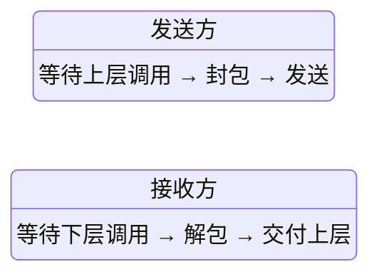
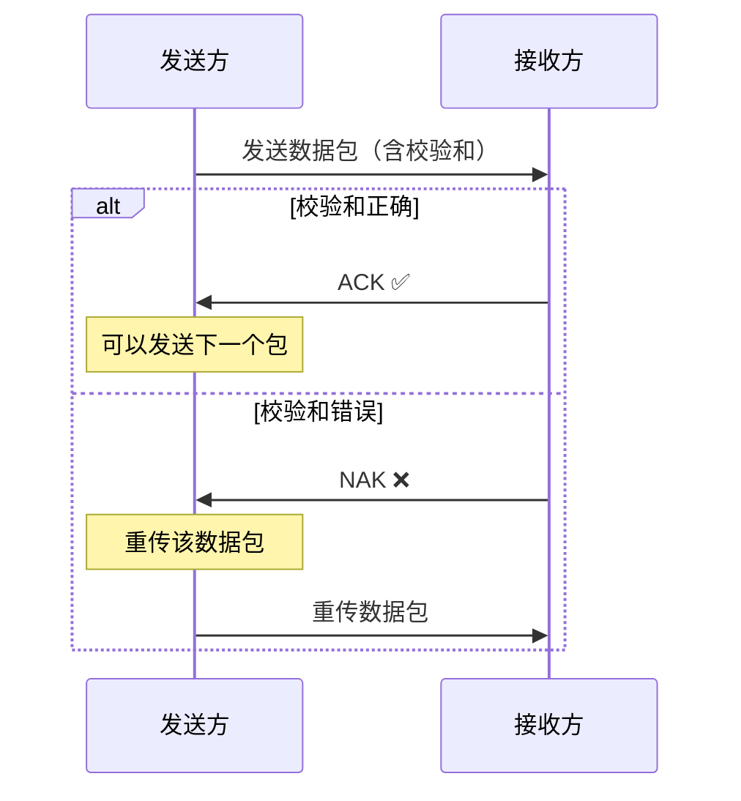
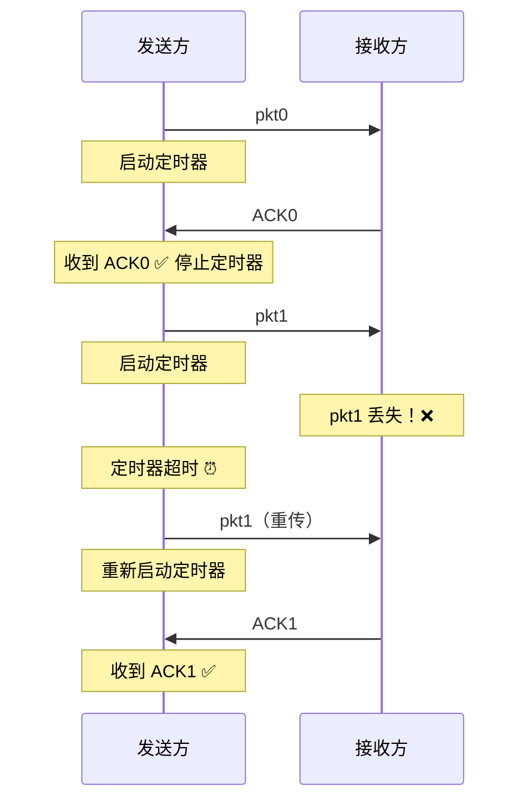
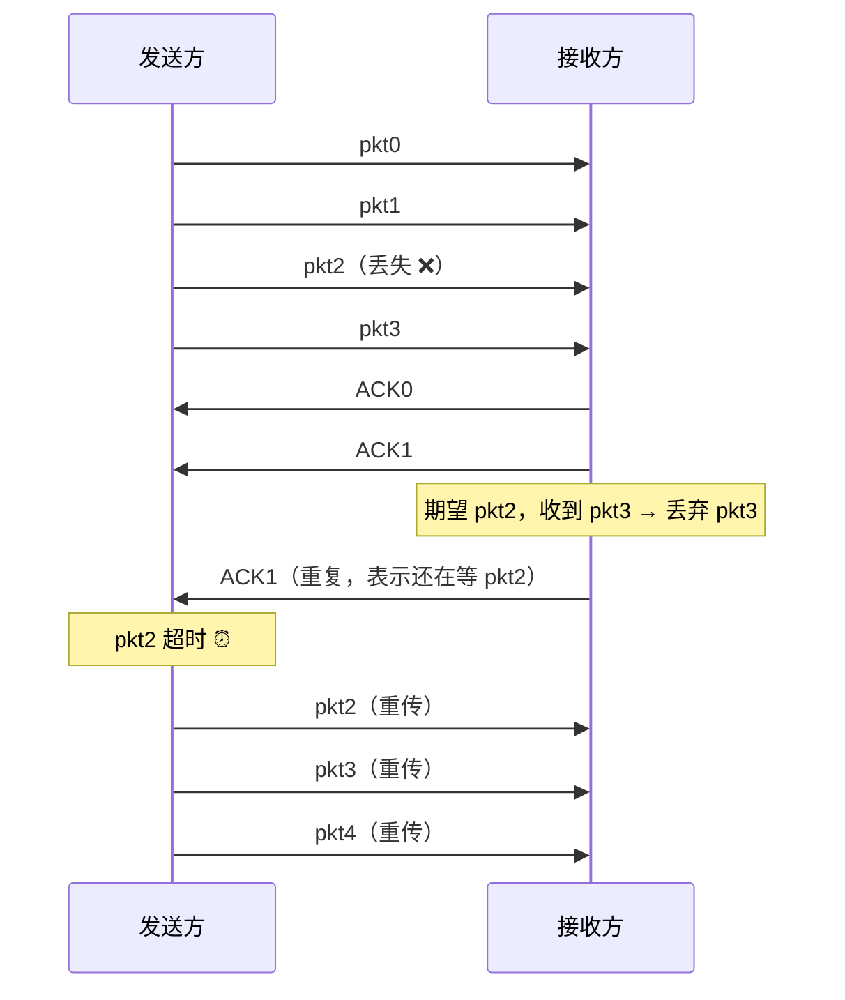
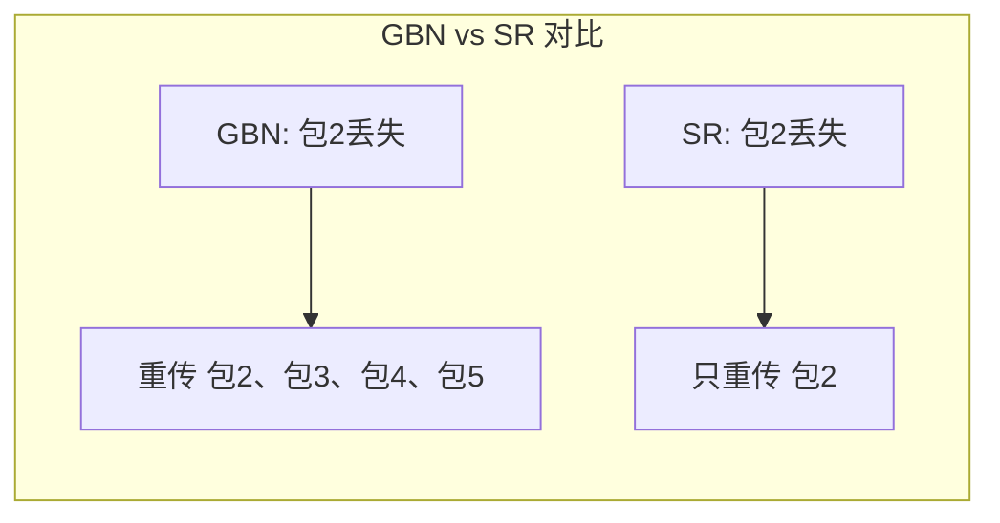

## 目录
- [[#可靠数据传输问题]]
- [[#构造可靠数据传输协议]]
  - [[#rdt 1.0：完美信道]]
  - [[#rdt 2.0：比特差错信道（停等 + ACK/NAK）]]
  - [[#rdt 2.1 / 2.2：处理 ACK/NAK 损坏]]
  - [[#rdt 3.0：丢包信道（超时重传）]]
- [[#流水线可靠数据传输]]
  - [[#回退 N 步（GBN）]]
  - [[#选择重传（SR）]]

---

## 可靠数据传输问题

> [!tip] 核心挑战
> 上层应用期望的是一个**可靠的信道**，但底层（网络层/物理链路）提供的是**不可靠的信道**（会丢包、出错、乱序）。
> 运输层的任务就是：在不可靠信道之上，为应用层构建一个"可靠"的抽象。

```
可靠数据传输的层次关系:

  应用层    →  期望看到可靠信道
  ─────────────────────────────
  运输层    →  实现可靠数据传输协议（rdt）
  ─────────────────────────────
  网络层    →  不可靠信道（可能丢包、出错）
```

> 类比：想象你要在一条经常出故障的传送带上传递瓷器（数据包）。传送带可能会摔碎瓷器（比特差错），也可能丢失瓷器（丢包）。你需要设计一套规则（协议）来确保对方最终完整收到所有瓷器。
> CS 术语：这就是 **可靠数据传输（Reliable Data Transfer, rdt）** 问题

---

## 构造可靠数据传输协议

### rdt 1.0：完美信道

假设底层信道完全可靠（不丢包、不出错），协议极其简单：



> 当然，现实中不存在完美信道，所以 rdt 1.0 只是理论起点。

### rdt 2.0：比特差错信道（停等 + ACK/NAK）

信道可能产生比特差错 → 需要差错检测 + 反馈机制

**核心机制**：
1. **校验和**：检测报文是否在传输中被修改
2. **ACK（肯定确认）**：接收方告诉发送方"我正确收到了"
3. **NAK（否定确认）**：接收方告诉发送方"这个包有错误，重发！"



> [!warning] rdt 2.0 的致命缺陷
> 如果 ACK 或 NAK 本身在传输中损坏了怎么办？
> 发送方收到一个乱码的反馈，不知道对方到底收没收到 → 协议陷入死锁！

### rdt 2.1 / 2.2：处理 ACK/NAK 损坏

**解决方案**：给每个数据包加上**序号（Sequence Number）**

- 发送方收到损坏的 ACK/NAK → 重传当前包
- 接收方通过序号判断是新包还是重复包（如果是重复的，丢弃并重发 ACK）

```
rdt 2.1 的序号机制（停等协议只需 0 和 1）:

发送方:                    接收方:
┌──────────┐              ┌──────────┐
│ 发送 pkt0 │──────────→  │收到 pkt0  │
│ 等待ACK/NAK│←──────────  │ 发送 ACK0 │
│ 发送 pkt1 │──────────→  │收到 pkt1  │
│ 等待ACK/NAK│←──────────  │ 发送 ACK1 │
│ 发送 pkt0 │──────────→  │期望 pkt0  │
│    ...    │             │   ...     │
└──────────┘              └──────────┘
序号在 0 和 1 之间交替（因为停等协议一次只发一个）
```

**rdt 2.2**：进一步取消 NAK，只用 ACK + 序号。接收方对最后正确收到的包发送 ACK。发送方收到重复的 ACK 就知道需要重传。

### rdt 3.0：丢包信道（超时重传）

信道不仅会出错，还可能**丢包**（数据包或 ACK 彻底丢失）。

**解决方案**：**定时器 + 超时重传**



> [!note] 超时时间的选择困境
> - **太短**：正常延迟的包会被误判为丢失 → 不必要的重传 → 浪费带宽
> - **太长**：真正丢包后等待时间过长 → 降低吞吐量
>
> 类比：等外卖。你设了 30 分钟的"超时"。如果外卖实际需要 35 分钟送到，你 30 分钟就催了一单（产生重复订单）；如果外卖已经丢了，你等 30 分钟才反应也确实有点慢。
> CS 术语：这涉及到 **往返时延（RTT: Round-Trip Time）** 的估计问题，TCP 使用自适应的 RTT 估算算法来动态调整超时值

> [!tip] rdt 3.0 就是 TCP 可靠传输的核心骨架
> TCP 的可靠性机制本质上就是 rdt 3.0 的工业级实现：
> - 校验和 → 差错检测
> - 序号 → 去重 + 排序
> - ACK → 确认
> - 定时器 → 超时重传

---

## 流水线可靠数据传输

> [!warning] 停等协议的性能问题
> rdt 3.0 是**停等协议（Stop-and-Wait）**：发送一个包，等收到 ACK 后才发下一个。
> 信道利用率极低！

```
停等协议的信道利用率:

假设: RTT = 30ms, 数据包传输时间 = 0.008ms

信道利用率 = 0.008 / (30 + 0.008) ≈ 0.00027 = 0.027%
              ↑                ↑
          传输时间        等待时间（RTT）

即 99.97% 的时间都在等待！
```

**解决方案**：**流水线（Pipelining）** —— 允许发送方在收到 ACK 之前连续发送多个数据包。

```
效果对比:

停等:    |--pkt1--|........等ACK........|--pkt2--|........等ACK........|
流水线:  |--pkt1--|--pkt2--|--pkt3--|--ACK1--|--pkt4--|--ACK2--|...

时间利用率大幅提升！
```

流水线协议有两种实现：**回退 N 步（GBN）** 和 **选择重传（SR）**

### 回退 N 步（GBN）

**GBN（Go-Back-N）**：发送方维护一个大小为 N 的**滑动窗口**，窗口内的包可以连续发送。

```
GBN 发送方的滑动窗口:

已确认    |   已发送待确认   | 可用未发送 | 不可用
──────────┬────────────────┬──────────┬──────────
  [✅][✅] | [📤][📤][📤][📤] | [  ][  ] | [🔒][🔒]
          ↑ base          ↑ nextseqnum      ↑ base+N
          
窗口大小 N = 已发送待确认 + 可用未发送
```

**GBN 核心规则**：
1. 发送方最多有 N 个待确认包在"飞行中"
2. 接收方使用**累积确认（Cumulative ACK）**：ACK(n) 表示序号 ≤ n 的所有包都已正确收到
3. **超时重传**：如果最早的未确认包超时，**重传窗口内所有已发送的包**



> [!warning] GBN 的缺点
> 一个包丢失 → 窗口内后续所有包都要重传，即使接收方已经正确收到后续的包。当网络差错率较高或窗口较大时，会产生大量不必要的重传。

### 选择重传（SR）

**SR（Selective Repeat）**：只重传丢失/出错的那个包，不影响其他正确收到的包。

**核心改进**：
- 接收方**逐个确认**每个正确收到的包（不是累积确认）
- 接收方有**缓冲区**，可以缓存乱序到达的包
- 发送方为**每个包**维护独立的定时器

```
SR 接收方的窗口:

  [✅][✅][❓][✅][✅][❓][  ][  ]
              ↑              ↑
          pkt2 缺失      pkt5 缺失
          已缓存后续包    等待重传

当缺失的包到达后，按序交付给上层
```



| 特性 | GBN | SR |
|------|-----|-----|
| 确认方式 | 累积确认 | 逐个确认 |
| 接收方缓冲 | 不缓存乱序包 | 缓存乱序包 |
| 重传策略 | 重传窗口内所有包 | 只重传丢失的包 |
| 定时器 | 一个定时器 | 每个包一个定时器 |
| 接收方复杂度 | 简单 | 较复杂 |
| 适用场景 | 差错率低的网络 | 差错率较高的网络 |

> [!info] 💡 架构师视角映射
> - **TCP 实际上是 GBN 和 SR 的混合体**：TCP 使用累积确认（类似 GBN），但也支持 **选择确认（SACK, Selective ACK）** 扩展（类似 SR），现代 TCP 实现通常启用 SACK
> - **消息队列的重试机制**：Kafka consumer 的 offset 提交类似累积确认——提交 offset=5 意味着 0~4 都已处理完成
> - **Redis Cluster 的 Gossip 协议**：节点间的消息同步也涉及类似的重传和确认机制

> [!abstract] 🔖 Deep Dive
> GBN 和 SR 的窗口大小与序号空间的关系是一个经典考点，详见原书 **3.4.4 节**。进一步学习 TCP 的 SACK 机制可参考 RFC 2018。

---
