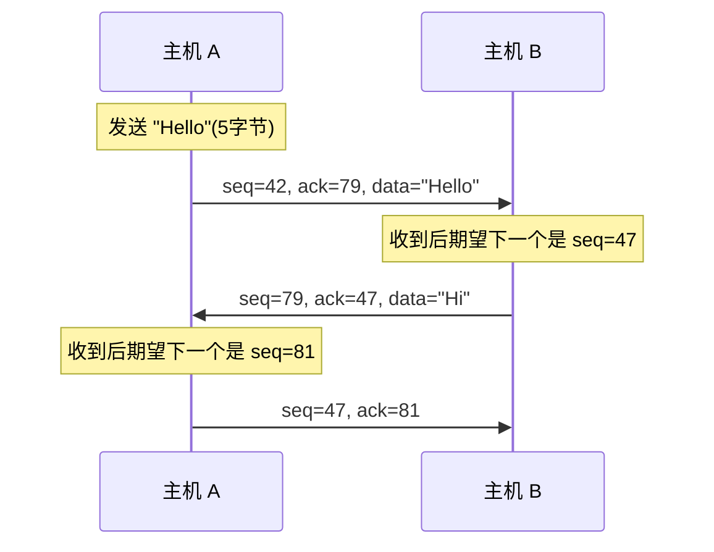
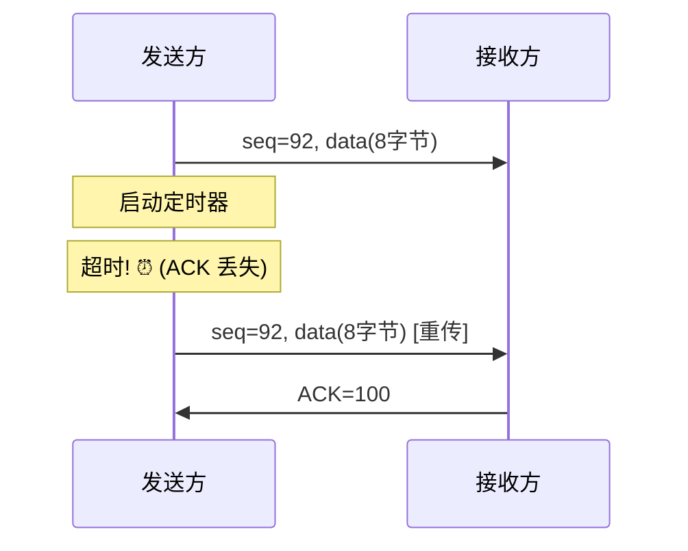
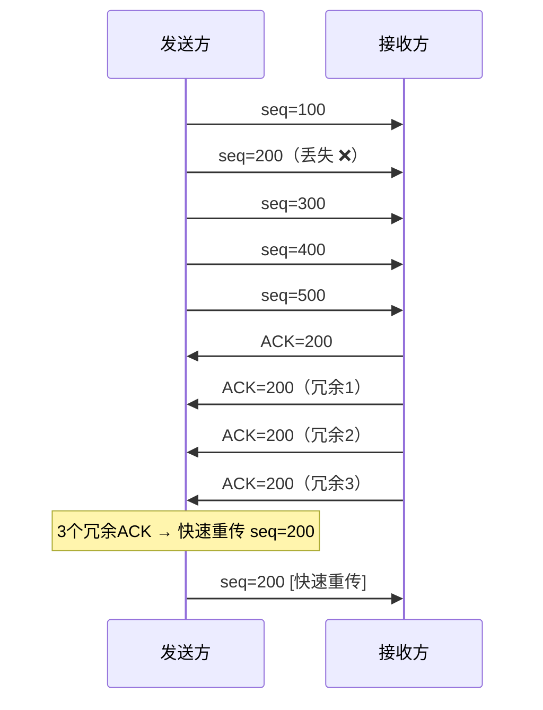
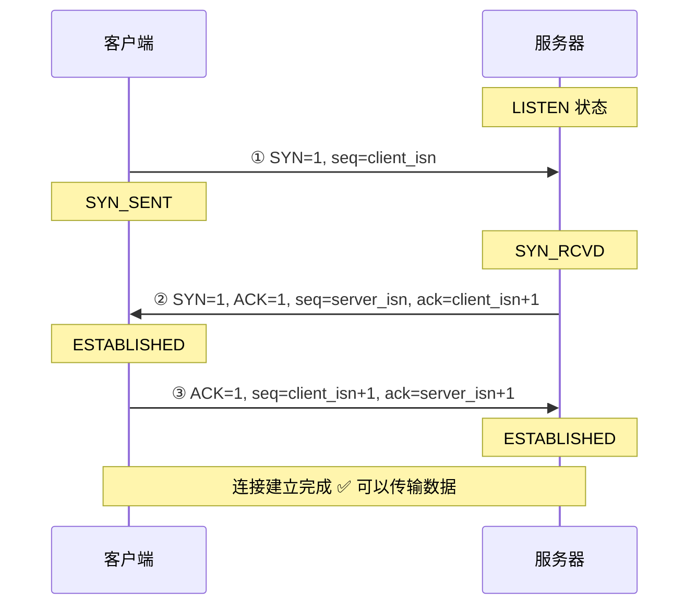
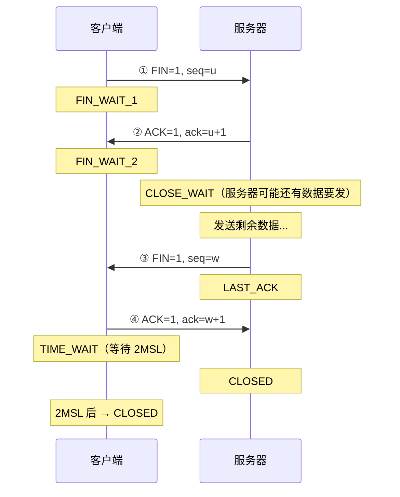

## 目录
- [[#TCP 概述]]
- [[#TCP 报文段结构]]
- [[#序号与确认号]]
- [[#往返时间估计与超时]]
- [[#可靠数据传输机制]]
- [[#TCP 连接管理]]

---

## TCP 概述

TCP（Transmission Control Protocol）是一种**面向连接的、可靠的、字节流**运输层协议。

### TCP 的核心特性

| 特性 | 说明 |
|------|------|
| **面向连接** | 通信前必须建立连接（三次握手），结束后释放连接（四次挥手） |
| **全双工** | 数据可以在两个方向上同时流动 |
| **点对点** | 每条 TCP 连接只有两个端点（不支持多播） |
| **字节流** | TCP 不保留应用层的消息边界，视数据为连续的字节流 |
| **可靠传输** | 确保数据无差错、不丢失、不重复、按序到达 |

> [!tip] TCP 的字节流特性
> 类比：TCP 就像一个水管——你往这头倒水（发送数据），对方从那头接水。你不知道对方每次舀多少水（应用层每次读多少），也不需要关心。TCP 负责的是"水不会漏、不会多、按顺序到"。
> 相比之下，UDP 更像是一个快递公司——每个数据包都是独立的"包裹"，有明确的边界。
> CS 术语：TCP 提供**字节流服务（Byte Stream Service）**，应用层消息的边界由应用协议自行定义（如 HTTP 用 `\r\n\r\n` 分隔头部和正文）

---

## TCP 报文段结构

```
TCP 报文段格式（头部至少 20 字节）:
 0                   1                   2                   3
 0 1 2 3 4 5 6 7 8 9 0 1 2 3 4 5 6 7 8 9 0 1 2 3 4 5 6 7 8 9 0 1
+-+-+-+-+-+-+-+-+-+-+-+-+-+-+-+-+-+-+-+-+-+-+-+-+-+-+-+-+-+-+-+-+
|          源端口号              |          目的端口号            |
+-+-+-+-+-+-+-+-+-+-+-+-+-+-+-+-+-+-+-+-+-+-+-+-+-+-+-+-+-+-+-+-+
|                        序号 (Sequence Number)                 |
+-+-+-+-+-+-+-+-+-+-+-+-+-+-+-+-+-+-+-+-+-+-+-+-+-+-+-+-+-+-+-+-+
|                     确认号 (Acknowledgment Number)            |
+-+-+-+-+-+-+-+-+-+-+-+-+-+-+-+-+-+-+-+-+-+-+-+-+-+-+-+-+-+-+-+-+
| 首部 |      |U|A|P|R|S|F|                                     |
| 长度 |未使用 |R|C|S|S|Y|I|          接收窗口                   |
|      |      |G|K|H|T|N|N|                                     |
+-+-+-+-+-+-+-+-+-+-+-+-+-+-+-+-+-+-+-+-+-+-+-+-+-+-+-+-+-+-+-+-+
|          校验和                |         紧急数据指针           |
+-+-+-+-+-+-+-+-+-+-+-+-+-+-+-+-+-+-+-+-+-+-+-+-+-+-+-+-+-+-+-+-+
|                      选项（可变长）                            |
+-+-+-+-+-+-+-+-+-+-+-+-+-+-+-+-+-+-+-+-+-+-+-+-+-+-+-+-+-+-+-+-+
|                         数据（Payload）                       |
+-+-+-+-+-+-+-+-+-+-+-+-+-+-+-+-+-+-+-+-+-+-+-+-+-+-+-+-+-+-+-+-+
```

### 关键字段解析

| 字段 | 大小 | 作用 |
|------|------|------|
| 序号 | 32 bit | 该报文段数据首字节在字节流中的编号 |
| 确认号 | 32 bit | 期望从对方收到的下一个字节的序号（累积确认） |
| 首部长度 | 4 bit | TCP头部的长度（以 4 字节为单位） |
| 接收窗口 | 16 bit | 接收方愿意接收的字节数（用于流量控制） |
| **SYN** | 1 bit | 连接建立 |
| **FIN** | 1 bit | 连接释放 |
| **ACK** | 1 bit | 确认号字段有效 |
| **RST** | 1 bit | 重置连接 |
| **PSH** | 1 bit | 接收方应尽快交付数据给应用层 |

---

## 序号与确认号

> [!note] TCP 序号的本质
> TCP 的序号不是"第几个包"，而是**字节流中的字节编号**。
> 如果一个报文段的序号是 1000，数据长度是 500 字节，那么下一个报文段的序号就是 1500。

```
TCP 字节流与序号:

数据流:  | H | e | l | l | o | , |   | W | o | r | l | d |
序号:      0   1   2   3   4   5   6   7   8   9  10  11

报文段1: seq=0, data="Hello," (6字节)
报文段2: seq=6, data=" World" (6字节)
```

> [!tip] 确认号的含义
> ACK=536 表示："序号 0~535 的字节我都收到了，下一个期望收到序号 536 的字节"
> 这就是**累积确认（Cumulative Acknowledgment）**



---

## 往返时间估计与超时

TCP 使用**自适应的超时机制**，动态估算 RTT 并设置重传超时值。

### RTT 估算

```
EstimatedRTT = (1 - α) × EstimatedRTT + α × SampleRTT

α 推荐值: 0.125 (即 1/8)

含义: 新的 RTT 估计 = 旧估计的 7/8 + 新采样的 1/8
→ 指数加权移动平均（EWMA），平滑掉瞬时波动
```

### RTT 偏差

```
DevRTT = (1 - β) × DevRTT + β × |SampleRTT - EstimatedRTT|

β 推荐值: 0.25 (即 1/4)
```

### 超时值计算

```
TimeoutInterval = EstimatedRTT + 4 × DevRTT

含义: 超时值 = 平均 RTT + 安全余量（4倍偏差）
```

> 类比：你每天坐地铁上班，正常 40 分钟。你会设"迟到预警"为 40 分钟吗？不会，你会加一个安全余量（比如看天气、看是否高峰期）。TCP 也一样，超时时间 = 平均值 + 波动量的安全系数。
> CS 术语：TCP 使用 **EWMA（Exponentially Weighted Moving Average）** 算法估计 RTT，避免被单次异常值干扰

---

## 可靠数据传输机制

TCP 的可靠传输建立在 [[3.4 可靠数据传输的原理]] 的理论基础上，核心机制包括：

### 1. 超时重传



### 2. 快速重传

> [!tip] 三次冗余ACK触发快速重传
> 不等超时！如果发送方收到**3 个冗余 ACK**（即同一个确认号的第 4 次确认），立即重传。



> 类比：老师点名，连续三个学生说"到了，但李明不在"（3个冗余ACK），老师不用等到放学后（超时），马上就去找李明（快速重传）
> CS 术语：**快速重传（Fast Retransmit）** 通过冗余 ACK 提前发现丢包，无需等待超时，大幅降低延迟

---

## TCP 连接管理

### 三次握手（建立连接）



> [!question] 为什么需要三次握手而不是两次？
> **防止历史连接的初始化**：如果只有两次握手，一个延迟到达的旧 SYN 包可能会让服务器误建立连接。
> 
> 类比：打电话的例子——
> 1. 你："喂，听得到吗？"（SYN）
> 2. 对方："听得到，你呢？"（SYN+ACK）
> 3. 你："我也听得到！"（ACK）
> 
> 如果省略第三步，对方不确定你是否听到了他的回复，可能导致单方面建立连接。
> CS 术语：三次握手确保双方都确认了对方的**初始序号（ISN: Initial Sequence Number）**，防止**历史重复连接（Historical Duplicate）** 的问题

### 四次挥手（释放连接）



> [!warning] TIME_WAIT 状态
> 客户端在发送最后一个 ACK 后，不会立即关闭，而是进入 **TIME_WAIT** 状态，等待 **2MSL**（Maximum Segment Lifetime，通常为 2 分钟）。
> 
> **为什么需要 TIME_WAIT？**
> 1. 确保最后的 ACK 能到达服务器（如果丢失，服务器会重发 FIN，客户端可以重传 ACK）
> 2. 让本次连接的所有残留报文段在网络中消失，避免影响下一次连接

> [!info] 💡 架构师视角映射
> - **Netty 的 Channel 生命周期**：`channelActive()` → `channelRead()` → `channelInactive()` 对应 TCP 的连接建立 → 数据传输 → 连接关闭
> - **TIME_WAIT 的运维影响**：高并发短连接场景（如 HTTP 1.0）下，大量 TIME_WAIT 会耗尽端口资源。解决方案：
>   - 启用 `tcp_tw_reuse`（Linux 内核参数）
>   - 使用连接池（如 HikariCP）复用 TCP 连接
>   - 使用 HTTP Keep-Alive 减少连接建立/释放次数
> - **Spring Boot 的 `server.connection-timeout`**：控制 TCP 连接的超时时间
> - **MySQL 的 `wait_timeout`**：空闲 TCP 连接的超时断开时间

> [!abstract] 🔖 Deep Dive
> TCP 连接管理的状态机是网络面试的高频考点，建议结合原书 **3.5.6 节**的 TCP 状态转换图深入理解。关于 TIME_WAIT 的工程实践，推荐阅读《TCP/IP 详解 卷1》第 18 章。

---
