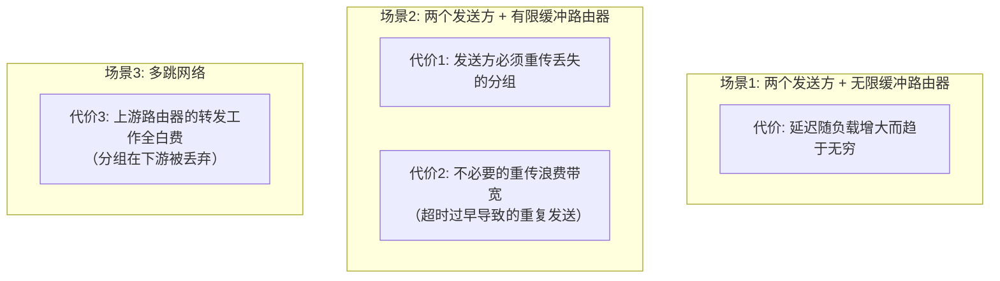
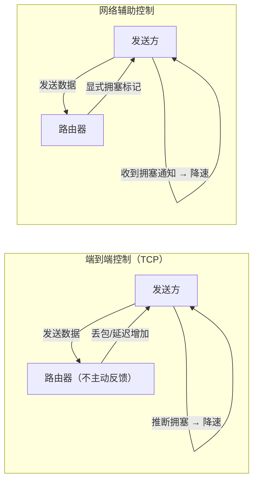

## 目录
- [[#拥塞的成因与代价]]
- [[#拥塞控制方法]]

---

## 拥塞的成因与代价

> [!tip] 什么是拥塞？
> 类比：高速公路的塞车。道路的通行能力（带宽）是有限的，当太多车辆（数据包）同时涌入，就会堵塞。
> 堵塞后：① 车辆行驶变慢（延迟增大）；② 有些车被迫掉头（丢包）；③ 掉头的车重新上路反而加剧拥堵（重传导致恶性循环）。
> CS 术语：**网络拥塞（Network Congestion）** 是指网络中的数据量超过了网络的处理能力，导致路由器缓冲溢出、分组丢失、延迟增大。

### 拥塞的三种场景与代价



> [!warning] 拥塞的恶性循环
> ```
> 丢包 → 重传 → 更多流量 → 更多丢包 → 更多重传 → ...
> ```
> 这就是为什么拥塞控制至关重要：不做控制的话，网络会陷入**拥塞崩溃（Congestion Collapse）**

---

## 拥塞控制方法

| 方法 | 核心思想 | 代表协议 |
|------|---------|---------|
| **端到端拥塞控制** | 发送方通过观察网络行为（丢包、延迟）推断拥塞 | TCP |
| **网络辅助拥塞控制** | 路由器显式反馈网络拥塞信息给发送方 | ATM ABR、ECN |

> [!note] TCP 的选择
> TCP 采用**端到端拥塞控制**：TCP 发送方不从网络层获得拥塞信息，而是通过**丢包事件**（超时或 3 个冗余 ACK）来推断网络拥塞并降低发送速率。
> 
> 现代 TCP 也支持 **ECN（Explicit Congestion Notification）**，由路由器在 IP 头部标记拥塞，属于"网络辅助"方式的补充。



> [!info] 💡 架构师视角映射
> - **微服务中的限流**本质上就是应用层的"拥塞控制"：Sentinel、Resilience4j 等限流组件通过滑动窗口/令牌桶算法控制请求速率
> - **消息队列的背压机制**：当 Kafka 消费者跟不上时，可以通过暂停拉取来实现流量控制，避免"消费拥塞"
> - **Reactor/RxJava 的 Backpressure**：响应式编程中的背压策略，和网络拥塞控制的思想一脉相承

> [!abstract] 🔖 Deep Dive
> 关于拥塞控制的理论模型和 AIMD 的数学证明，可以参阅原书 **3.6 节**的详细分析。如果对 ECN 的工程实践感兴趣，推荐阅读 RFC 3168。

---
