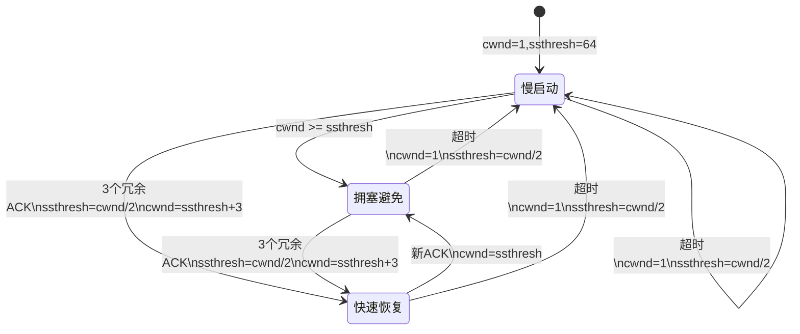
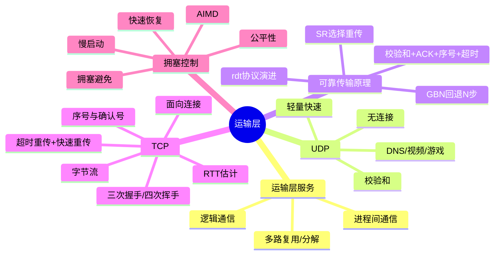

## 目录
- [[#TCP 拥塞控制概述]]
- [[#慢启动（Slow Start）]]
- [[#拥塞避免（Congestion Avoidance）]]
- [[#快速恢复（Fast Recovery）]]
- [[#TCP 拥塞控制的完整状态机]]
- [[#TCP 吞吐量分析]]
- [[#第三章小结]]

---

## TCP 拥塞控制概述

TCP 通过维护一个**拥塞窗口（cwnd: Congestion Window）** 来控制发送速率：

```
发送方实际可发送的数据量 = min(cwnd, rwnd)
                            ↑       ↑
                       拥塞窗口  接收窗口（流量控制）
```

> [!tip] 拥塞控制 vs 流量控制
> | 机制 | 目的 | 控制变量 |
> |------|------|---------|
> | 流量控制 | 防止发送方淹没**接收方** | 接收窗口 rwnd |
> | 拥塞控制 | 防止发送方淹没**网络** | 拥塞窗口 cwnd |
>
> 类比：流量控制 = 餐厅根据客人的胃口上菜（不能撑到客人）；拥塞控制 = 根据厨房的产能上菜（不能让厨房崩溃）
> CS 术语：两者都限制发送速率，但关注的瓶颈不同

TCP 拥塞控制的核心算法包含三个阶段：**慢启动**、**拥塞避免**、**快速恢复**。

---

## 慢启动（Slow Start）

**初始状态**：`cwnd = 1 MSS`（MSS: Maximum Segment Size，最大报文段长度）

**规则**：每收到一个 ACK，`cwnd` 翻倍（指数增长）

```
慢启动阶段的 cwnd 变化:

RTT 轮次:    1    2    3    4    5    ...
cwnd(MSS):   1    2    4    8    16   ...
             ↑                        ↑
           起步慢                   增长快（指数级）
```

> [!note] "慢启动"名字的由来
> 名字叫"慢启动"，但增长速度其实是**指数级**的！它"慢"是相对于一开始就全速发送而言的——从 1 个 MSS 开始，而不是一上来就把窗口开到最大。
>
> 类比：新手司机上高速——先以 20km/h 起步（cwnd=1），确认路况没问题后加速到 40、80、160...（指数增长），直到发现前方开始堵车（丢包），才减速。

**慢启动的终止条件**：
1. `cwnd` 达到**慢启动阈值（ssthresh）** → 切换到拥塞避免
2. 检测到丢包（超时）→ `cwnd=1 MSS`，`ssthresh=cwnd/2`，重新慢启动
3. 收到 3 个冗余 ACK → `ssthresh=cwnd/2`，`cwnd=ssthresh+3`，进入快速恢复

---

## 拥塞避免（Congestion Avoidance）

**规则**：每个 RTT，`cwnd` 增加 1 MSS（线性增长）

```
拥塞避免阶段的 cwnd 变化:

RTT 轮次:    ...  6    7    8    9    10   ...
cwnd(MSS):   ... 16   17   18   19   20   ...
                  ↑                        ↑
              进入拥塞避免              小心翼翼地试探
```

> 类比：车速已经到了 120km/h（ssthresh），不再踩油门猛加速了，改为缓慢提速（120→121→122...），小心翼翼地试探限速。
> CS 术语：这就是 **AIMD（Additive Increase, Multiplicative Decrease）** 中的 **加性增（AI）** 部分

**遇到丢包怎么办？**
- **超时丢包**：`cwnd=1 MSS`，`ssthresh=cwnd/2`，回到慢启动
- **3 个冗余 ACK**：`ssthresh=cwnd/2`，`cwnd=ssthresh+3`，进入快速恢复

---

## 快速恢复（Fast Recovery）

> [!tip] 快速恢复的核心思想
> 收到 3 个冗余 ACK 表示网络没有完全崩溃（至少有些包能到达），不需要像超时那样"重新从头来"

**规则**：
- 每收到一个冗余 ACK：`cwnd = cwnd + 1 MSS`
- 收到新的（非冗余）ACK：`cwnd = ssthresh`，进入拥塞避免

---

## TCP 拥塞控制的完整状态机



### AIMD 的经典锯齿图

```
cwnd
 ↑
 |      /\        /\        /\
 |     /  \      /  \      /  \
 |    /    \    /    \    /    \
 |   /      \  /      \  /      \
 |  /        \/        \/        \
 | /
 +──────────────────────────────→ 时间
       ↑ 加性增   ↑ 乘性减
    （线性增长） （减半）
```

> [!note] AIMD 的公平性
> **AIMD（Additive Increase, Multiplicative Decrease）** 的数学特性保证了多条 TCP 连接共享链路时最终趋向**公平带宽分配**。
> 
> 两条连接会沿着"公平线"上下震荡，最终收敛到各占一半带宽的均衡状态。这是 TCP 拥塞控制设计的精妙之处。

---

## TCP 吞吐量分析

```
TCP 连接的平均吞吐量 ≈ (3/4) × (W/RTT)

其中 W 是丢包时的窗口大小

含义: TCP 的吞吐量在 W/2 和 W 之间波动，平均约为 3W/4
```

> [!info] 💡 架构师视角映射
> - **TCP BBR 算法**：Google 提出的新一代拥塞控制算法，不再依赖丢包作为拥塞信号，而是主动探测带宽和 RTT，在高延迟/高丢包网络中性能远超传统 CUBIC
> - **MySQL 的网络交互**：MySQL 客户端与服务器之间的大量 SQL 查询走 TCP，拥塞控制直接影响查询延迟
> - **Redis Pipeline**：Redis 的 Pipeline 机制——批量发送命令避免逐条请求/响应的 RTT 开销，类似于 TCP 流水线的思想
> - **Netty 写缓冲区**：Netty 的 `ChannelOutboundBuffer` 和 TCP 的 `cwnd` 异曲同工——都在控制"发送但未确认"的数据量

> [!abstract] 🔖 Deep Dive
> 关于 TCP 拥塞控制的完整演进（Tahoe → Reno → NewReno → CUBIC → BBR），推荐阅读《TCP/IP 详解 卷1》第 14 章和 Google BBR 论文。

---

## 第三章小结



| 概念 | 核心要点 |
|------|---------|
| 运输层角色 | 为进程间提供逻辑通信，多路复用/多路分解 |
| UDP | 无连接、不可靠、轻量、校验和差错检测 |
| 可靠传输 | 校验和 + ACK + 序号 + 超时重传 → 从不可靠信道构建可靠服务 |
| GBN vs SR | 累积确认vs逐个确认，窗口内全部重传vs只重传丢失的 |
| TCP 连接管理 | 三次握手建立，四次挥手释放，TIME_WAIT 防止旧报文干扰 |
| TCP 可靠传输 | 超时重传 + 快速重传（3个冗余ACK） |
| 流量控制 | rwnd 控制发送速率，防止淹没接收方 |
| 拥塞控制 | 慢启动（指数增）→ 拥塞避免（线性增）→ 丢包（乘性减），AIMD 保证公平 |

> [!tip] 面试高频考点
> 1. TCP 和 UDP 的区别？→ [[3.3 无连接运输：UDP]] + [[3.5 面向连接的运输：TCP]]
> 2. 三次握手的过程和原因？→ [[3.5 面向连接的运输：TCP#三次握手（建立连接）]]
> 3. TCP 如何保证可靠传输？→ [[3.4 可靠数据传输的原理]] + [[3.5 面向连接的运输：TCP#可靠数据传输机制]]
> 4. TCP 拥塞控制的四个算法？→ 慢启动、拥塞避免、快速重传、快速恢复
> 5. TIME_WAIT 的作用？→ 确保最后 ACK 到达 + 让旧报文消亡

---
