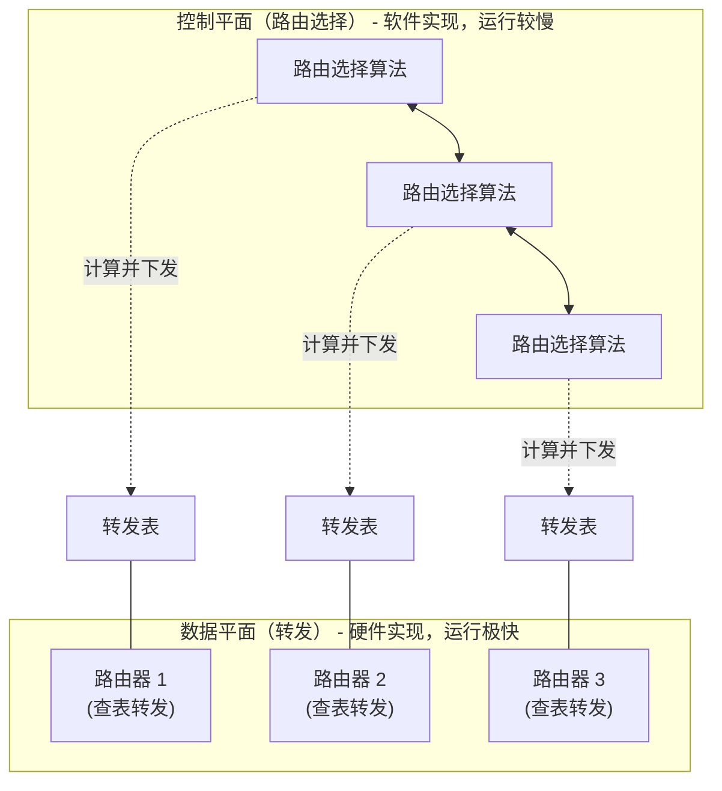

## 目录
- [[#网络层的核心功能]]
- [[#控制平面与数据平面的分离]]
- [[#网络服务模型]]

---

## 网络层的核心功能

网络层的作用是将**分组（Packet，又称数据报 Datagram）**从一台发送主机移动到一台接收主机。为了实现这个功能，网络层需要两种最重要的功能：

1. **转发（Forwarding）**：当一个分组到达路由器的某条输入链路时，路由器必须将它移动到适当的输出链路。
2. **路由选择（Routing）**：当分组从发送方流向接收方时，网络层必须决定这些分组所采用的路由或路径。

> [!tip] 转发与路由选择的区别
> 类比：你开车从北京去上海。
> - **路由选择（Routing）** 就像**出发前用高德地图规划路线**（全双向规划，决定走哪几条高速）。
> - **转发（Forwarding）** 就像**经过每一个十字路口或收费站时看路牌**（此时此刻决定在这个路口该拐向哪个出口）。
> 
> CS 术语：**转发**是路由器本地的动作（时间尺度极短，通常在纳秒级别，由硬件实现）；**路由选择**是网络范围的过程（时间尺度较长，秒级，通常由软件实现）。

---

## 控制平面与数据平面的分离

网络层被划分为两个互相交互的平面：**数据平面（Data Plane）** 和 **控制平面（Control Plane）**。

### 1. 数据平面（Data Plane）
- **核心任务**：本地的、每路由器（per-router）的功能（主要是**转发**）。
- **执行过程**：决定到达路由器输入端口的分组如何转发到输出端口。
- **依据**：查询**转发表（Forwarding Table）**。

### 2. 控制平面（Control Plane）
- **核心任务**：网络范围（network-wide）的逻辑（主要是**路由选择**）。
- **执行过程**：决定分组从源到目的地所采用的端到端路径，并计算出数据平面所需的**转发表**。

> [!note] 两种控制平面方法
> 1. **传统方法（每路由器控制）**：路由选择算法运行在**每台路由器**中，路由器之间互相交换路由信息（如 OSPF/BGP 协议）来计算各自的转发表。
> 2. **SDN（软件定义网络）方法**：一个逻辑上集中的（通常也是远程的）**控制器**计算并分发转发表供各路由器使用，路由器自身只保留最简单的数据面转发功能（“哑路由器”）。

---

## 网络服务模型

网络层提供怎样的服务模型（Service Model），决定了底层网络对运输层做出怎样的承诺。

可能的网络服务要求：
- **确保交付**：保证分组一定能到达目的地。
- **具有时延上界的确保交付**：保证不仅能到达，而且在特定的主机到主机时延范围内到达。
- **有序分组交付**：按照发送顺序到达目的地。
- **确保最小带宽**：只要发送速率低于指定速率，吞吐量就不会被影响。
- **安全性**：加密、认证等。

> [!important] Internet 的网络服务模型：尽力而为（Best-Effort）
> Internet 的网络层 IP 协议提供的是一种**尽力而为服务（Best-Effort Service）**模型。
> 它**不保证交付，不保证延迟，不保证顺序，不保证带宽**。甚至可以说，“尽力而为”的意思是“根本不提供任何服务保证”。
>
> 相比之下，ATM（异步传输模式）网络架构提供了强大的保证（如 CBR 固定比特率服务等），但 Internet 的简单架构最终胜出，因为其极大的简化了路由器的设计，并将复杂的功能（如保证可靠性、顺序）推到了网络边缘（即终端主机的运输层 TCP 等）。

> [!info] 💡 架构师视角映射
> - **微服务网关 (API Gateway / Envoy)**：微服务体系中的网关就像应用层的路由器。“数据平面”负责接收 HTTP请求并代理转发给后端服务；“控制平面”（如 Istio / Nacos）负责监控服务状态、下发路由规则、限流打点策略等。服务网格（Service Mesh）的设计思想和 SDN 里的数据面/控制面分离如出一辙。
> - **容错设计**：网络底层没有提供任何可靠性保证（Best-Effort），这启示架构师：在构建大型分布式系统时，永远要假设**网络是不可靠的（Fallacies of Distributed Computing 的第一条）**，必须在应用层/框架层做好重试、超时、幂等和补偿机制。

> [!abstract] 🔖 Deep Dive
> 关于 SDN 的控制平面工作机制将在第 5 章详细阐述。如果不了解 ATM 网络，可回顾网络层体系结构的演变史，这有助于理解 IP “尽力而为”哲学的伟大之处。

---
