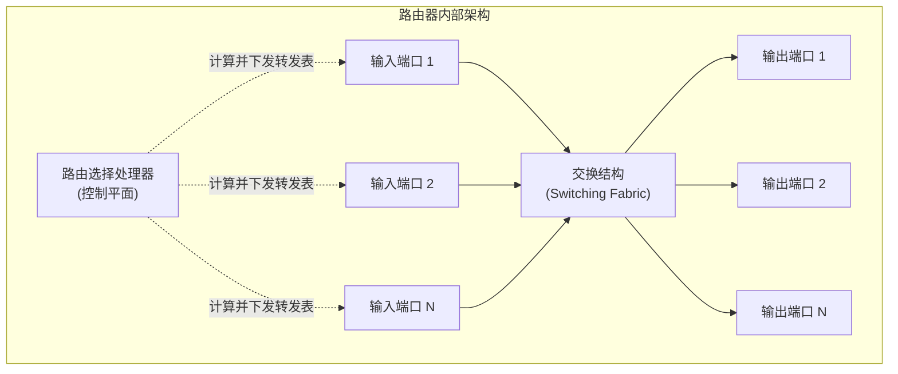
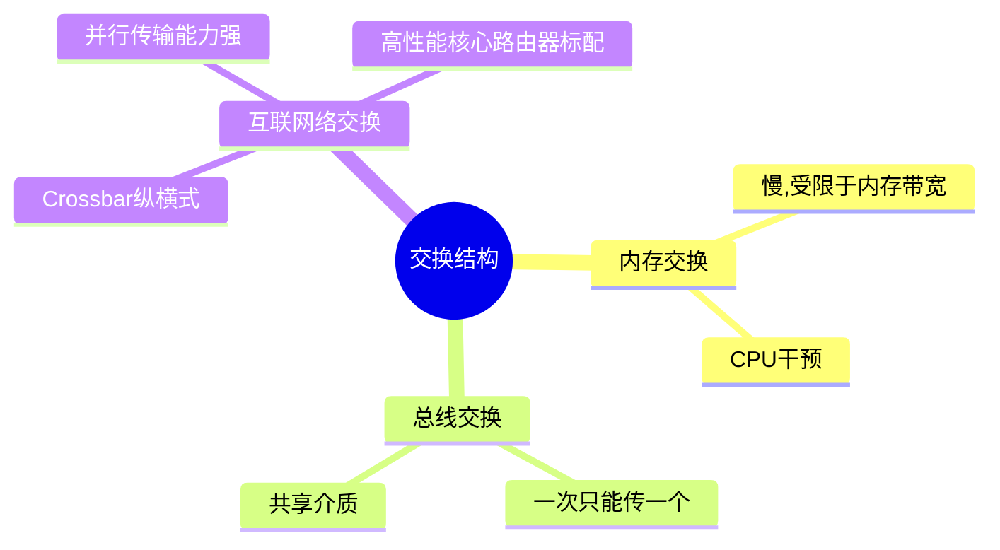

## 目录
- [[#路由器架构概述]]
- [[#输入端口处理与基于目的地的转发]]
- [[#交换结构 (Switching Fabric)]]
- [[#输出端口处理]]
- [[#排队与丢包：哪里会发生？]]

---

## 路由器架构概述

一台路由器主要包含四个核心组件：



| 组件 | 层级 | 功能说明 |
|------|------|----------|
| **输入端口 (Input Ports)** | 数据平面 (硬件) | 终结物理链路、数据链路层处理、**查表转发计算与排队** |
| **交换结构 (Switching Fabric)** | 数据平面 (硬件) | 将路由器的输入连到它的输出，是路由器的**核心枢纽** |
| **输出端口 (Output Ports)** | 数据平面 (硬件) | 存储从交换结构发来的分组，并在输出链路上发送 |
| **路由选择处理器 (Routing Processor)** | 控制平面 (软件) | 执行路由协议、维护路由表/连通性、下发转发表 |

> [!tip] 硬件 vs 软件时间线
> **数据平面**（输入、交换、输出）必须处理高达数十到数百 Gbps 的流量，它的操作必须以**纳秒级别**执行，因此全由**定制硬件（如 ASIC 芯片）**实现。
> **控制平面**（路由处理器）处理路由协议交互报文，通常在**毫秒或秒级**，因此在通用 CPU 上以**软件**实现。

---

## 输入端口处理与基于目的地的转发

输入端口最核心的任务是**查表和转发（Lookup and Forwarding）**，即使用转发表查找输出端口，使分组能被重定向到交换结构。

### 转发表中的最长前缀匹配

在传统的 IPv4 转发中，如果路由表记录每一个可能的目的 IP 地址（2^32 个），表将大到无法放入高速缓存。因此，转发表根据**前缀**（Prefix）而不是精确地址进行匹配。

**最长前缀匹配规则（Longest Prefix Matching）**：
当转发表中存在多个匹配目的地 IP 地址的前缀时，路由器将使用**匹配项中最长的一个**。

```
转发表前缀示例：
0:  11001000 00010111 00010          -> 链路接口 0
1:  11001000 00010111 00011000       -> 链路接口 1
2:  11001000 00010111 00011          -> 链路接口 2
3:  否则（缺省默认）                   -> 链路接口 3

假设目的地 IP 为：11001000 00010111 00011000 10101010
解析：
它与 前缀1 和 前缀2 都匹配。
但 前缀1（24位匹配）长于 前缀2（21位匹配）。
因此：路由器会将其通过 链路接口1 转发。
```

> [!note] 硬件支持 (TCAM)
> 软件级的最长前缀匹配搜索会相对较慢。在高性能路由器中，这种匹配借助**三态内容可寻址存储器（TCAM）**在硬件级以极低时间（通常单个时钟周期，即纳秒级）并行完成。给定一个 32 位 IP 地址，TCAM 会同时搜索所有条目并返回最佳匹配接口。

---

## 交换结构 (Switching Fabric)

交换结构是路由器的“心脏”，通过它，分组真正地从一个输入端口被移动到一个输出端口。常见的交换技术有三种：

1. **经内存交换 (Switching via Memory)**：
   - 最早期的路由器。分组到达输入端口，以中断方式把分组拷贝到系统内存（CPU）。
   - 现代也有一部分是输入端口卡将分组先读入自身内存，然后再传到输出端口。
   - **瓶颈**：受到内存带宽限制，无法同时转发多个分组。
2. **经总线交换 (Switching via a Bus)**：
   - 输入端口直接将分组发送给共享总线。
   - 分组头上带有一个内部标记指示输出端口，所有输出端口都收听，但只有匹配的输出端口保留该分组。
   - **瓶颈**：总线是共享的，一次只能传输一个分组。适合小型或中型路由器（如内部企业网）。
3. **经互联网络交换 (Switching via an Interconnection Network)**：
   - 比如纵横式交换机（Crossbar Switch），多条总线交错形成网格。
   - **优点**：能够克服单一共享总线的带宽限制。它可以**并行传输多个分组**（只要这些分组的目标输出端口不同）。



---

## 输出端口处理

- 将数据暂存（Buffering）：当交换结构传递分组的速度 > 输出链路链路发送速度时，会在输出端口排队。
- 链路层/物理层处理：加上对应的链路层协议头（如以太网头），发往传输介质。
- **分组调度（Packet Scheduling）**：决定队列中哪个分组被优先传送。（例如 FIFO，优先级排队，加权公平排队 WFQ 等）。

---

## 排队与丢包：哪里会发生？

> [!tip] 为什么要排队？
> 排队的原因只有一个：**接收方处理/转发请求的速度，赶不上到达的速度**。
> 当排队的缓冲满了，新的分组无法存入缓冲，就会发生**丢包（Packet Loss / Drop）**。

### 1. 输入排队 与 队头阻塞 (HOL Blocking)
如果交换结构比输入端口的处理速度慢（比如总线拥堵了），分组必须在**输入端**排队。
- **队头阻塞 (Head-of-the-Line Blocking, HOL)**：队列排在第一位的分组正在等待交换网络可用，导致队列后面本来可以被转发到空闲输出端口的分组也被阻塞！

### 2. 输出排队
如果交换结构极快，把大量分组瞬时堆到某一个输出端口，但该输出端口的链路带宽有限，分组必须在**输出端**排队等待链路空闲。如果堆积过多，同样导致缓冲区溢出并丢包。

> [!info] 💡 架构师视角映射
> - **队头阻塞（HOL Blocking）**：不仅出现在路由器输入端，也出现在 **HTTP/1.1 协议**中（如果一个长连接上前面的请求慢了，后面请求只能干等）以及 **TCP协议**中（前面的序号没收到，后面的序号收到了必须放缓冲区等，导致应用层迟迟拿不到后续完整数据，这就是为什么要发明基于UDP的**QUIC / HTTP3**的原因）。
> - **微服务消息队列与缓冲满溢**：当 Kafka Topic 消费者消费速度小于生产速度时会发生消息积压；当系统处理线程的核心队列满溢时（如 `RejectedExecutionException`），系统相当于“丢包”或“拒绝服务”。限流降级本质上就是在软体层面做缓冲池的管理，决定是 Drop（拒绝请求）还是排队等待。
> - **路由匹配算法与前缀树**：最长前缀匹配在软件层面最经典的数据结构是**字典树（Trie树）**。

> [!abstract] 🔖 Deep Dive
> 从数据结构与算法的角度如果想深钻路由查表的实现机制，可以参考“分步Trie”和由 TCAM 主导的高速查表硬件实现，推荐《计算机网络：系统方法》。

---
