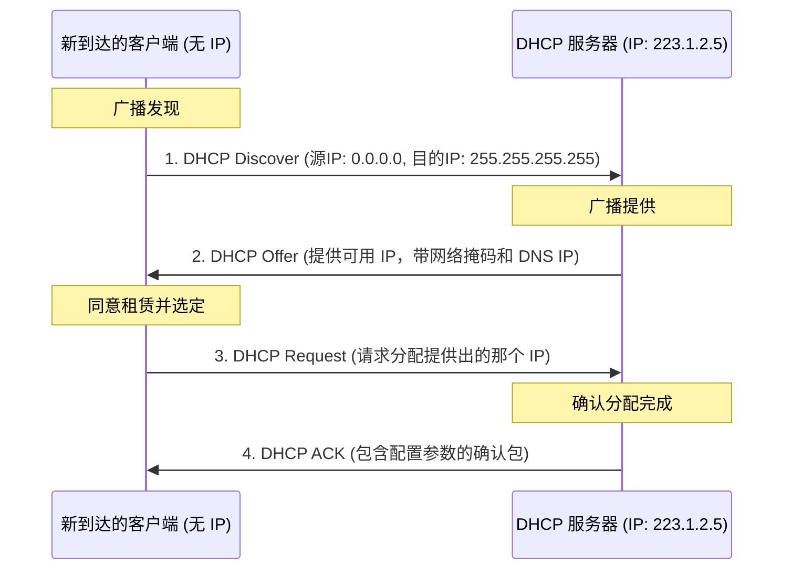

## 目录
- [[#IPv4 数据报格式]]
- [[#IPv4 编址 (Addressing)]]
  - [[#子网与 CIDR]]
  - [[#获取主机地址：DHCP]]
- [[#网络地址转换 (NAT)]]
- [[#IPv6 简介]]

---

## IPv4 数据报格式

IP 数据报由两部分组成：首部（Header）和数据有效载荷（Payload/Data）。

```
IPv4 数据报格式 (标准20字节首部):
 0                   1                   2                   3
 0 1 2 3 4 5 6 7 8 9 0 1 2 3 4 5 6 7 8 9 0 1 2 3 4 5 6 7 8 9 0 1
+-+-+-+-+-+-+-+-+-+-+-+-+-+-+-+-+-+-+-+-+-+-+-+-+-+-+-+-+-+-+-+-+
|版本号 |首部长度|服务类型(TOS)|          数据报总长度           |
+-+-+-+-+-+-+-+-+-+-+-+-+-+-+-+-+-+-+-+-+-+-+-+-+-+-+-+-+-+-+-+-+
|       16位标识(标识符)        | 标志位|      13位片偏移        |
+-+-+-+-+-+-+-+-+-+-+-+-+-+-+-+-+-+-+-+-+-+-+-+-+-+-+-+-+-+-+-+-+
|  寿命 (TTL)   |  上层协议      |        首部检验和             |
+-+-+-+-+-+-+-+-+-+-+-+-+-+-+-+-+-+-+-+-+-+-+-+-+-+-+-+-+-+-+-+-+
|                       32位 源 IP 地址                         |
+-+-+-+-+-+-+-+-+-+-+-+-+-+-+-+-+-+-+-+-+-+-+-+-+-+-+-+-+-+-+-+-+
|                       32位 目的 IP 地址                       |
+-+-+-+-+-+-+-+-+-+-+-+-+-+-+-+-+-+-+-+-+-+-+-+-+-+-+-+-+-+-+-+-+
|                       可选字段（很少使用）                    |
+-+-+-+-+-+-+-+-+-+-+-+-+-+-+-+-+-+-+-+-+-+-+-+-+-+-+-+-+-+-+-+-+
|                                                               |
|                        数据 (Data / Payload)                  |
|                                                               |
+-+-+-+-+-+-+-+-+-+-+-+-+-+-+-+-+-+-+-+-+-+-+-+-+-+-+-+-+-+-+-+-+
```

### 关键字段说明
- **版本号 (Version)**：4 位长。规定了数据报的 IP 协议版本号 (IPv4)。路由器据此决定如何解析首部。
- **寿命 (Time-to-Live, TTL)**：用来确保数据报不会在网络中永远循环（防止路由环路）。**每当一台路由器处理该数据报，TTL 减 1**。若 TTL 减为 0，数据报被丢弃。
- **上层协议 (Protocol)**：指示接收方的网络层应将有效载荷传给哪个上层协议。比如：`6` 表示 TCP，`17` 表示 UDP。它就相当于公路货车上标明包裹要送往哪个部门，将网络层与运输层**绑定**在一起。
- **源和目的 IP 地址**：发送方和接收方的 32 位 IP 地址。

> [!tip] 为什么要“首部检验和（Header Checksum）”？
> 注意，IP 层的检验和**仅检查 IP 首部区域的差错，不管数据区域（Payload）。**这是因为运输层（TCP/UDP）已有自身的检验和用于检查数据损坏，避免重复劳作。同时，由于数据报的 `TTL` 每过一跳都会变，所以**首部检验和每过一台路由器都必须重新计算。**这就体现了设计的权衡性能与有效性。

---

## IPv4 编址 (Addressing)

一台主机通常只有一条物理链路连入网络；但一台路由器必须有两条以上的链路连入网络。
主机或路由器与其所连的物理链路之间的边界称为**接口（Interface）**。
IP 要求**每个主机和路由器的每个接口都拥有自己的 IP 地址**。因此，IP 地址技术上不仅关联到主机，更是关联到**具体接口**。

### 子网与 CIDR

一个 IP 地址（32 bit，通常以点分十进制表示 `192.168.1.1`）可逻辑上被划分为两个部分：
- **网络部分（前缀 / 子网部分）**
- **主机部分**

**子网（Subnet）** 的定义：如果主机接口的网络部分（IP 前缀）相同，它们之间通信就能仅依靠数据链路层直接交付（如通过以太网交换机直接通信），这一块岛屿区域就是一个子网。

> [!note] CIDR (无类别域间路由选择)
> **CIDR（Classless Inter-Domain Routing）** 突破了传统的 A、B、C 类固定长度网络地址（如定死了网络前缀前 8、16、24位）的限制。
> 形式是：`a.b.c.d/x`
> - `x` 代表地址的前 x 个 bits 是**网络前缀（Subnet Mask / 网络掩码）**。
> - 剩下的 `32-x` 个 bits 用于标识子网内的具体主机接口。
> 
> 例如 `200.23.16.0/23`，该子网包含了 $2^{32-23} = 512$ 个可能分配的主机地址组合。

### 获取主机地址：DHCP

**DHCP（动态主机配置协议，Dynamic Host Configuration Protocol）** 是一个**即插即用（Plug-and-play）协议**。它能自动为主机分配一个 IP 地址。

DHCP 的 4 步经典交互过程（**D-O-R-A**，全都是基于 UDP（端口67/68）进行广播）：


> [!tip] 为什么要用 255.255.255.255 广播？
> 因为新加入网络的机器如同新生儿，它连自己是谁（无源 IP 地址）和周围服务器在哪个地址（不知道 DHCP Server 的地址）都不知道。只能像在大厅大喊：“我是新人，谁能给我分个地址？”

---

## 网络地址转换 (NAT)

IPv4 地址总共大约有 $2^{32}$ 个（约43亿），早已耗尽。但今天全球几十亿设备都能连网，解决短缺问题的最大功臣之一就是 **NAT（网络地址转换，Network Address Translation）**。

### NAT 的核心思路
局域网内所有设备使用**私有 IP 地址（如 `10.0.0.0/8`, `192.168.0.0/16`）**；对外部 Internet，整个局域网被封装成一个单一的**公共 IP 地址**。

**当数据包穿过 NAT 路由器时：**
- **外出访问**：NAT 路由器把数据报的 （<私有源 IP>, <内部端口号>）替换成 （<单一公共 NAT IP>, <NAT重新分配的新端口号>），并在内部生成一个**NAT转换表（NAT Translation Table）**记下这个映射法则。
- **返回数据**：外网回应发到 NAT 路由器（发给刚生成的端口号），路由器查映射表，把发件人修改回复成内部的那台指定机器的（<私有源IP>, <内部端口号>），并送回到局域网内。

> [!warning] NAT 遭受的批评与争议
> 1. **违反了网络架构的端到端（End-to-End）核心原则**：路由器应该只管转发网络层。NAT强行修改了 IP 地址并且还“窥探”并修改了运输层的端口号。
> 2. **使得 P2P 难以为继**：如果服务器和客户端都在不同的 NAT 后面（局域网内机器没有公网 IP 无法被外网直接发起连接连接，即俗称的“打洞难”问题）。

---

## IPv6 简介

因为 IPv4 空间的耗尽，IETF 提出了 IPv6。

### IPv6数据报格式的重要变化
- **扩充的地址容量**：从 32 位扩展到了 **128 位**。
- **简化高效的 40 字节定长首部**：IPv4 首部的许多部分被丢弃或成为了可选部分，这极大加速了路由器的处理和转发。
- **流标签（Flow Label）**：新增了流标签使得发送方可以要求给特殊的流（比如音视频）特定的服务质量。
- **去掉了首部检验和**：因为运输层及链路层已经有检验，IP层重新计算代价高，直接丢弃了。
- **去掉了分片机制（Fragmentation）**：不允许在这个版本中间路由器上发生分片。若包太大，路由器返回 ICMP 错误，强迫发送方端系统切小了重发。减少路由器工作量。

### 向 IPv6 过渡的方法：建隧道
因为不能要求全世界的 IPv4 路由器一夜之间换代，必须平滑过渡，核心手段是**建隧道（Tunneling）**。
- 假如两个 IPv6 节点想要通信，但它们之间有一个 IPv4 路由器组成的大网（就像一座海）。
- 发送方把整个 IPv6 报文**塞进一个传统的 IPv4 报文的数据部分（Payload）**，伪装成普通 IPv4 通信传递过去。
- 对岸拿到后再解封装剥离出 IPv6 报文继续传递。

> [!info] 💡 架构师视角映射
> - **NAT 的类比 —— 公司前台电话总机**：公司有一百名员工分机（内网局域网短号 101, 102），但对外公开发布只有总机号码（全球统一公网地址 8888-8888）。外面人打电话只能打给总机，并且报出工号转机（端口号 Mapping机制），这是解决并发容量复用最好的手段。
> - **Snowflake 算法与 UUID 分配机制**：DHCP 可以看作网络中的“分布式 IP ID 发号器”。系统架构里发号器通常也需要提供 Lease 续约机制的租赁保证，防止节点下线带来的发号浪费。
> - **CIDR 中的子网划分规划**：在配置阿里云 VPC 或 AWS VPC等云网络时建立子网块，理解 CIDR `/24` 或 `/16` 到底代表包含多少个实例，这是规划 Kubernetes Pod 容器集群、LoadBalancer IP池 等底层架构师的基础本领。

> [!abstract] 🔖 Deep Dive
> 想更深入理解 NAT 穿透/打洞技术是如何拯救多人联机游戏和 P2P 的，推荐搜索 `STUN / TURN / ICE` 协议的工作原理；以及 RFC 1918 (私有 IP 地址保留标准)。

---
