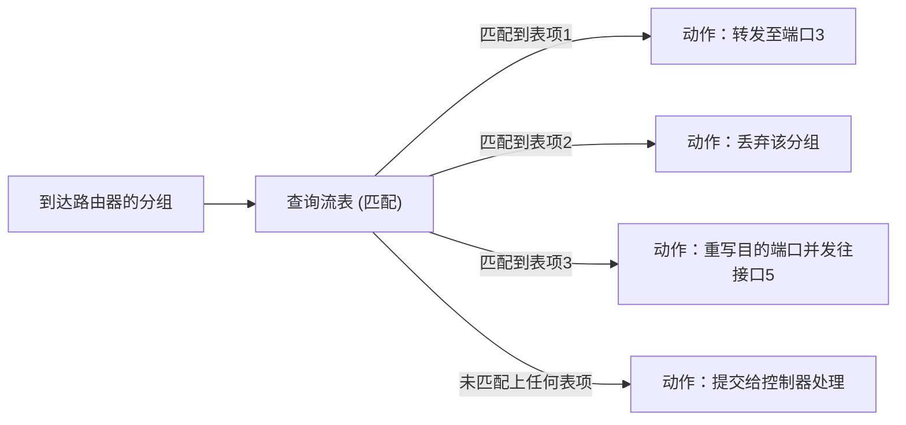

## 目录
- [[#基于目的地的转发的局限性]]
- [[#通用转发：匹配加动作]]
- [[#OpenFlow 协议与流表]]
- [[#第四章小结]]

---

## 基于目的地的转发的局限性

传统的路由器（如 4.2 节所述）是“基于目的地的转发” —— 也就是路由器查看数据报内的**目的 IP 地址**，然后根据**最长前缀匹配原则**决定把它送到哪条输出链路上。

> [!warning] 传统路由转发的死板
> - **无法做到基于源的路由**：就算目的地一样，能不能因为发信人不同而走另一条路？（传统 IP 不行）
> - **无法做到负载均衡**：能不能 50% 的流量走链路 A，50% 走链路 B？（传统 IP OSPF 等非常难调节权重）
> - **无法做到防火墙功能（动作太少）**：能不能不仅转发，还可以选择“丢弃”（Drop）来自某个 IP 段的包含指定端口的危险包？（这需要单独部署一个防火墙设备，非常昂贵繁琐）
>
> 类比：传统邮局只看信封上的**收件人**，并盲目投递。哪怕信封是某个著名骗局公司寄来的（源IP）。哪怕这条路上全是车（无法负载均衡）。

这就是为什么引入 **SDN（Software-Defined Networking，软件定义网络）** 及其基石——**通用转发（Generalized Forwarding）** 的原因。

---

## 通用转发：匹配加动作

在通用转发架构下，路由器内部**没有**传统的基于目的地的“转发表”，取而代之的是一张更强大、更通用的——**流表（Flow Table）**。

通用转发的核心范式是：**匹配加动作（Match-plus-Action）**

1. **匹配（Match）**：不仅可以匹配目的 IP，可以匹配多个协议层的首部字段。包括不限于：源 IP，目的 IP，TCP/UDP 源/目的端口，甚至 MAC 地址（链路层）。
2. **动作（Action）**：不但可以“转发到指定输出端口”，还可以修改首部的值，或者直接将包阻挡（丢弃/Drop），甚至克隆复制分组发给控制器查验。



> [!tip] 什么是“流（Flow）”？
> 流就是**具有一组共同首部字段特征的分组集合**。
> 例如：“所有 TCP 80 端口进入，且源地址为 10.0.0.0/24 的数据报” 就是一条逻辑“流”。

---

## OpenFlow 协议与流表

**OpenFlow** 是一种最著名的 SDN 协议和 API 开放标准。它定义了流表的结构：

| 匹配字段集合 (Match) | 计数器集合 (Counters) | 动作集合 (Actions) |
|----------------------|-----------------------|--------------------|
| 入口端口、源/目的MAC地址、以太网类型... | 已匹配的分组数量（供计费或监控用） | 转发（Forwarding） |
| 源/目的IP地址、IP协议、IP服务类型... | 该表项最后更新时间（供表项老化淘汰） | 丢弃（Dropping） |
| 源/目的 TCP/UDP 端口...  | （用于计算出网络拥塞统计） | 修改字段（Modify-Field） |

### OpenFlow 带来的“设备合并”超能力
凭借其极其丰富的匹配与动作组合，**一台 OpenFlow（SDN）交换机可以瞬间扮演多种传统网络设备的角色**：

1. **变身路由器（Router）**：只匹配“目的 IP 地址”，动作设置为“转发”，这就是传统路由器。
2. **变身防火墙（Firewall）**：匹配特定“源 IP 地址及特定 TCP 端口”，动作设置为“丢弃（Drop）”，它就是一台网络层/传输层的包过滤防火墙。
3. **变身交换机（Switch）**：只匹配“目的 MAC 地址”，动作设置为“转发”，它就是链路层的二层交换机。
4. **变身 NAT 网关（NAT Gateway）**：不仅匹配目的 IP，还得匹配端口，动作设置为“重写（Rewrite）目的IP地址和目的端口号”，这就是一台 NAT 设备。

> [!info] 💡 架构师视角映射
> - **微服务云原生中的 Service Mesh 控制面 (Istio)** 最早在设计理念上大量借用了 SDN 的思想。控制平面的 Pilot、Mixer (老版本) 计算出复杂的治理规则，并将其下发推给分布在每一个 Pod 边上的 **Envoy（Sidecar 数据平面）**去执行精确的负载均衡、限流熔断、金丝雀发布等动作。
> - **Open vSwitch (OVS)**：在当今云计算数据中心架构（比如 OpenStack，KVM 虚拟化服务器内），物理机内部用来联通多台虚拟机的就是基于虚拟化的 OVS 软件交换机，它正是通过 OpenFlow 协议由 SDN 控制器统一指挥控制流表，形成了弹性极强的 VPC（私有云网络隔离）体系。

---

## 第四章小结

```mermaid
mindmap
  root((网络层(数据平面)))
    总览
      转发 vs 路由选择
      数据平面与控制平面分离
      Best-Effort 尽力而为模型
    路由器内部
      输入输出端口(硬件)
      交换结构(内存/总线/互联)
      排队丢包(HOL阻塞)
      TCAM高速匹配
    IP 协议
      IPv4 首部(20字节)
      TTL / 数据报分片(IPv4)
      子网划分与 CIDR (前缀路由)
      DHCP 广播四步曲 (DORA)
      NAT 地址转换 (公私换绑)
      IPv6 (128位地址/简化首部/隧道过渡)
    通用转发流表(SDN)
      基于目的地(死板)
      匹配加动作 Match+Action
      OpenFlow 协议
      一机多用(路由/交换/防火墙/NAT)
```

| 概念 | 核心要点 |
|------|---------|
| 转发 (Forwarding) | 本地路由器内部根据转发表，将分组从入端口移动到出端口的极短时间行为（硬件面）。 |
| 尽力而为模型 | IP 协议不保证交付成果，无性能下限保证（无拥塞、延时、顺序保证）。 |
| HOL 阻塞 | 队首阻塞：队列后方分组哪怕目标出口空闲，也跟着前方等待的分组被堵塞，损失通过效率。 |
| CIDR 与前缀匹配 | 打破传统 A/B/C 类限制；路由器转发按照最长前缀去转发表做 Match 优先级。 |
| DHCP 与 NAT | DHCP 负责零配置内网动态分配 IP 地址租约（UDP）；NAT 负责隐蔽内网，合并多个私有请求到唯一公网 IP 外出并发，利用端口建立映射关系表。 |
| 通用转发 / SDN | 抛弃了传统硬烧录代码的目的地匹配，取而代之为可编程的、可被控制器下发统领控制的流表规则匹配。 |

> [!tip] 面试高频考点
> 1. 数据平面与控制平面的区别，以及 SDN 的核心理念是什么？→ [[#控制平面与数据平面的分离]] 和 [[#通用转发：匹配加动作]]
> 2. 什么是路由表最长前缀匹配？→ [[4.2 路由器工作原理#转发表中的最长前缀匹配]]
> 3. 详细说明 DHCP 的 DORA 获取流程。→ [[4.3 网际协议（IP）#获取主机地址：DHCP]]
> 4. NAT 的工作机制，以及它改变了 TCP Header 和 IP Header 的哪些内容？→ [[4.3 网际协议（IP）#网络地址转换 (NAT)]]

---
