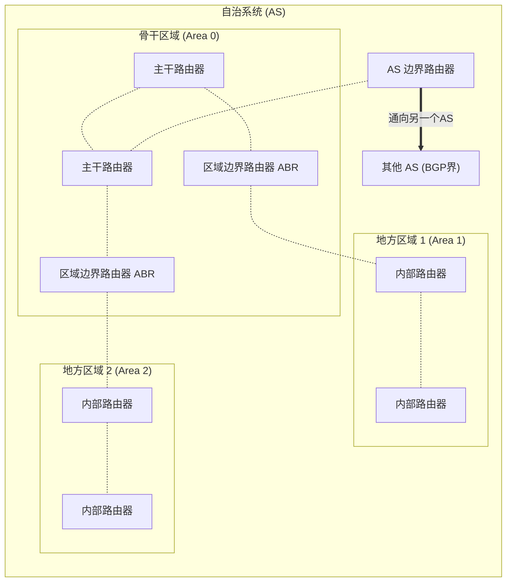

## 目录
- [[#自治系统（AS）的概念]]
- [[#内部网关协议（IGP）概述]]
- [[#开放最短路径优先（OSPF）]]
- [[#OSPF 的进阶特性：层次化区域]]

---

## 自治系统（AS）的概念

在前面的路由选择算法（LS、DV）中，我们将网络视为一个由同样级别的独立路由器连接而成的扁平化系统。但互联网极其庞大（数十亿主机、百万级路由器），将整个互联网扁平化执行单一路由计算存在两大根本难题：

1. **规模极其巨大（Scale）**：如果用路由表记录全网数以亿计的目的地，路由器的内存将被撑爆；如果每次链路断开都需要向几百万台路由器发广播（哪怕用性能较好的 LS 算法），庞大的控制报文就能完全吞没所有的数据链路带宽。
2. **管理自治（Administrative Autonomy）**：全球不同国家和公司的网络（如中国电信的骨干网、阿里云的机房网络、大学的校园网），每个组织都希望按**自己的意愿、策略**去运行配置内部网络，不仅可能不愿对外公开详细内部拓扑，而且彼此不能越俎代庖。

> [!tip] 互联网其实是“网络的网络”
> 解决方案是将路由器组织进**自治系统（Autonomous Systems, AS）** 中。
> 一个 AS 由同一在组织控制下的**一组路由器和链路组成**，它们运行着共同的路由协议。
>
> 就像跨国物流：
> - **内部路由（AS 内）**：菜鸟中国大陆区总部的内部流转，随便他们是用高铁还是货车（自治独立决定内部算法）。
> - **外部路由（跨 AS）**：从中国运往美国，必须走国际标准海关协议（大家坐下来商量一个统一标准交换）。

---

## 内部网关协议（IGP）概述

在**一个 AS 内部**运行的路由选择算法，称为**自治系统内部路由选择协议（Intra-AS Routing Protocol）**，有时更常被称为 **内部网关协议（IGP: Interior Gateway Protocol）**。

历史上两种最著名的 IGP 协议：
- **RIP（Routing Information Protocol）**：基于**距离向量（DV）**算法。因为存在无穷计算和 16 跳上限问题，目前基本被淘汰退出大型现代网络。
- **OSPF（Open Shortest Path First）**：基于**链路状态（LS）**算法。它是目前最被广泛使用的互联网内部路由协议。

---

## 开放最短路径优先（OSPF）

**OSPF（Open Shortest Path First）** 是一种应用极为广泛的**链路状态（LS）**路由协议。

### OSPF 的核心机制
1. **洪泛模型**：每台 OSPF 路由器都会向 AS 内的全网**洪泛（Flooding）**链路状态通告（LSA）。只要它的一条附属链路发生了状态变化（如断开，或者开销变更），立刻向全网广播。就算没有变化，也会至少每过大约 30 分钟周期性地向全网洪泛一次自己健康。
2. **Dijkstra 算法**：各路由收集到全网传来的通告，在内存中拼凑出整个 AS的全局有向拓扑图。然后在本地运行 Dijkstra 最短路径算法求出转发表。
3. **开销自定义**：网络管理员可以通过调整配置，将特定链路开销设大（如对卫星跨洋缓慢链路加高惩罚权重），或者将所有链路设为 1（用来获取最少跳数的路径）。

> [!note] OSPF 直接运行在 IP 层之上
> OSPF 通告不由 TCP 或 UDP 进行封装承载！而是直接在 **IP 数据报** 中作为一个直接的高层协议载荷传递（其中上层协议标识字段的值为 `89`）。因为没有底下的 TCP 帮它保证送达，OSPF 协议**自己必须在内部**实现确认与可靠数据传输机制。

### OSPF 相较于遗留 RIP 的巨大优势
| 特性 | OSPF | 优势解释 |
|------|------|----------|
| **安全性** | 支持认证配置 | 必须通过 MD5 密钥鉴权配置身份，防止野鸡路由器被接入网络注入瞎编的虚假链路表 |
| **多条等价路径** | 支持 ECMP (Equal Cost Multi-Path) | 当存在多条开销相同的路径时，可以同时使用它们实现**负载均衡**（RIP只有一条路） |
| **对单播 / 多播的统合支持** | 支持 MOSPF 扩展 | 可以为特定的多播数据分组计算多播树 |
| **单 AS 下支持层次化区域结构** | 可划分骨干与非骨干区域 | 在极其庞大的 AS内部做进一步局部阻隔与切分，这也是它能统治中大型企业网络的核心（见下文）|

---

## OSPF 的进阶特性：层次化区域

在大规模公司的超大规模网段中（如拥有几千台核心路由的大 AS），每次链路闪断都要产生几千份洪泛报文也是巨大的负担。
OSPF 允许将一个极其庞大的 AS **再次切分成更小的片区**，这些分区被称为 **区域（Area）**。每个区域的洪泛报文绝不能越过自身区域边界。

### 基本架构
一台 AS 内部被划分为：
1. **一个主要的骨干区域（Backbone Area, 一定是 0.0.0.0 区域）**
2. **若干个周边的地方区域（Local Areas）**

### 路由器角色
- **内部路由器（Internal Router）**：位于非骨干的地方区域，只参与本区域 OSPF 计算。
- **区域边界路由器（Area Border Router, ABR）**：一只脚踩在骨干区域内部，另一只脚踩在地方区域内。它们向其他区域**总结并播报**本区域内到达各网段的最短距离，实现了压缩状态控制与路由汇总功能。
- **主干路由器（Backbone Router）**：在核心骨干区域的内部只负责中转。
- **AS 边界路由器（AS Boundary Router, ASBR）**：它兼顾 OSPF 协议和外部 BGP 协议，是该 AS 出口去全球 Internet 其他 AS 的桥接“海关站”。

> [!info] 💡 架构师视角映射
> - **微服务集群跨可用区网关**：OSPF 中的骨干区和分区域，就像是公有云中多可用区（Multi-AZ部署）的核心网络隔离思路；ABR（区域边界路由）就像是数据中心内部，不同大集群之间的统一汇总代理网关，在保证模块内部微服务灵活调用的同时切断了雪崩式风暴扩容对外产生的负面影响。
> - **数据库分库分表的“汇总键”**：由于超大表（超大 AS 拓扑）在一次扫描（Dijkstra）中过于缓慢，通过分库分片（地方区域）并建立特定的 Proxy/汇聚表路由键（ABR边界总结）来保证检索速度与系统横向延伸。这也是计算机科学中化大为小（Divide and Conquer）与模块化（Modularity）真理的体现。

> [!abstract] 🔖 Deep Dive
> 想了解内部以 DV 为基础改进的现代变种协议以及各厂商私有技术，推荐阅读思科专有的 EIGRP 协议以及 IS-IS （和 OSPF 也是竞争关系）在中大型数据中心应用的书籍。

---
