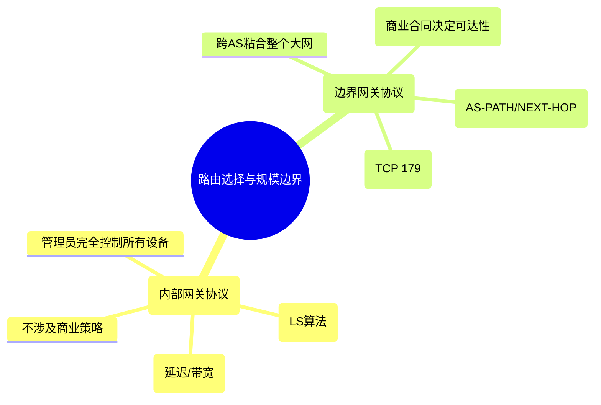

## 目录
- [[#自治系统间路由选择协议：BGP]]
- [[#BGP 的基本流程]]
- [[#BGP 属性与路由选择]]
- [[#热土豆路由选择]]
- [[#IP 任意播（Anycast）]]
- [[#策略重于性能]]

---

## 自治系统间路由选择协议：BGP

当一个目的 IP 地址位于与自己自治系统（AS）相同的 AS 时，我们用 **OSPF（内部网关协议）** 来转发。
当目的地在自己 AS 之外时，我们需要一种**自治系统间路由选择协议（Inter-AS Routing Protocol）**，它也被称为**外部网关协议（EGP）**。

今天，互联网上唯一在用的标准化外部网关路由协议就是：
**BGP（Border Gateway Protocol，边界网关协议）**

> [!important] BGP 是将整个互联网“粘合”在一起的协议！
> 如果没有 OSPF，每个公司（AS）内部就无法通信。
> **如果没有 BGP，所有的公司（AS）都只是一座座孤岛，不存在“互联网”。**

### BGP 的核心功能
对于每个 AS 而言，BGP 必须提供三种手段：
1. 从相邻的 AS 那里获取网段**可达性信息**。
2. 向本 AS 内部的**所有路由器**（不仅仅是边界路由）传播这些外网可达性信息。
3. 基于可达性信息和 **AS 的策略（Policy）**，决定该走哪条“好”路由。

---

## BGP 的基本流程

在 BGP 中，路由器之间通过建立**半永久的 TCP 连接（端口 179）** 来强行绑定，互相交换路由报文。这种基于 TCP 连接的交互称为**BGP 会话（BGP Session）**。

| 会话类型 | 说明 | 目的 |
|----------|------|------|
| **eBGP (外部 BGP)** | 两个**位于不同 AS** 的边界路由器之间的 BGP 连接 | 把外面的世界告诉边界网关 |
| **iBGP (内部 BGP)** | 同一个 AS 内部**边界路由器与内部路由器**之间的连接 | 边界网关把外面的世界通告给本 AS 所有骨干 |

```mermaid
flowchart LR
    subgraph "AS 1 (比如: 中国联通)"
        1A["路由器 1A"] <-->|"OSPF + iBGP"| 1B["边界路由器 1B"]
        1C["边界路由器 1C"] <-->|"OSPF + iBGP"| 1B
        1A <-->|"OSPF + iBGP"| 1C
    end
    
    subgraph "AS 2 (比如: 阿里云)"
        2A["边界路由器 2A"] <-->|"OSPF + iBGP"| 2B["边界路由器 2B"]
    end
    
    1B <===>|"eBGP"| 2A
    1C <===>|"eBGP\n另一条公网光纤"| 2B

    Note over 1B,2A: 跨国/跨ISP对等互联
```

---

## BGP 属性与路由选择

BGP 传递的不仅仅是目标 IP 前缀（如 `192.168.1.0/24`），它传递的是带有属性的**路由项（Route）**。
BGP 可以看作是一种**高级的距离向量（Path Vector）协议**。

两项最重要的 BGP 属性：
1. **AS-PATH（AS 路径）**：记录该前缀通告**经过的所有 AS 的编号列表**（如：`AS 3 -> AS 2 -> AS 1`）。这使得 BGP 自身极易检测并避免**无穷计数环路**（如果在 AS-PATH 发现了自己，立刻丢弃！）。
2. **NEXT-HOP（下一跳）**：这是一个极其隐蔽但关键的概念。这是指向**开始宣告这条链路的直接相连的下一个 AS 的边界接口 IP 地址**。这是决定应该由我这台边界设备哪个物理网卡去发往下一个 AS 的关键。

### BGP 选路规则
如果 AS 多处都能达到目标前缀，需要在这多条 BGP 路由中选出最好的一条发进转发表。顺序如下（淘汰制，只要前面分出胜负就不看后面的了）：

1. **本地偏好值属性（Local Preference）**：网络管理员手工配置的政策。比如我就是偏爱从网通走，哪怕稍微远点。
2. **最短 AS-PATH**：如果没有管理员偏好，我们就选中间跨越 AS 最少（最短路径）的那条（把 AS 看成本地局域网中的“跳数”）。
3. **最靠近的 NEXT-HOP 路由器（热土豆路由）**：如果 AS-PATH 一样长，选那条**在自己局域网络内（用 OSPF 测）跑得最快**，能最快把包扔给其他 AS 的那条。
4. 其它 BGP 标识符 tie-breaker （比如比 BGP 路由器 ID 大小分配）。

---

## 热土豆路由选择

**热土豆路由选择（Hot Potato Routing）** 是一个非常形象生动的策略。

> [!tip] 什么是“热土豆”？
> 类比：数据包就像一个极其烫手的“热土豆”。既然要交给别的组织（AS），我当然不想它长时间在我的网络里耗着（占用我本 AS 的内网带宽）。所以，**把它烫手似地尽快扔给能接收外网目的地的最近的那个大门接口！**
>
> 假设我的 AS 有两个边界路由通向同一目的地。本地路由器会计算自己到这两个边界网关的 OSPF 代价，**选择内部开销最小**的边界大门把土豆扔出去，哪怕过了大门后在别人家 AS 里它还要走很远（不管了，我只管本 AS 开销最小）。

---

## IP 任意播（Anycast）

BGP 还导致了今天 CDN 广泛使用的 **Anycast（任意播）** 技术被发扬光大。

**原理**：CDN 服务商（如 1.1.1.1 DNS，或者 Cloudflare 服务器）把遍布全球一千个不同城市的节点，配置为**同一个目标 IP 地址（1.1.1.1）**，并让这一千个月节点**全部向 BGP 发出 eBGP 通告声称“我是 1.1.1.1 的归属”**。
由于 BGP 路由器总是选择“最短 AS-PATH”或“内部最新的一跳”路由（热土豆）。于是，全球来自不同地区的客户端，将会**不知不觉中由 BGP 自动牵引到离他最近的那个真实的物理节点！**

> [!important] 这就是为什么全世界 Ping 1.1.1.1 都那么快
> 因为你在北美，BGP 把你引导向北美的 1.1.1.1；你在中国，BGP 把你引导向中国香港的 1.1.1.1 节点。看似 IP 相同，物理机器不同。

---

## 策略重于性能

**为什么不用 OSPF 管理全网，而必须使用 BGP？**
因为外部路由（AS 间路由）的第一要务根本不是“性能最早、延迟最低”，而是**商业策略（Policy）！**

在商业互联网中：
- 桩 AS（Stub AS，如某个终端客户）：如果客户不付过路费，是不希望来自 ISP A 的流量穿透自己的公司机房直接送往 ISP B 的。
- 多宿主客户：通过 BGP `Local Preference` 配置，人为压倒 OSPF OSPF 最短路径，人为设定流量比例分摊，这是买卖！



> [!info] 💡 架构师视角映射
> - **K8s (Kubernetes) 中的 Calico 与 BGP**：Calico 是一款极强的微服务扁平化网络CNI插件。它在宿主机上模拟了一台小型的 BGP 路由器！你的各个主机 Node 就像是一个个微型 AS。Calico 监听 K8s 中 Pod 动态销毁带来的 IP 变化，再通过 BGP 将可达性信息传给整个内网（甚至企业内部数据中心真实的交换机网络）。
> - **微服务灰度发布和蓝绿部署**：可以看成通过 Nginx (类比软 BGP Router) 或 Istio 进行权重的动态修改与强商用“策略调整”——我希望 V2 服务能收十分之一流量这种带商业意图的分岔，而不是为了缩短代码毫秒开销盲目全部把请求打给 V1（OSPF最短）。

> [!abstract] 🔖 Deep Dive
> 想了解轰动全世界的 BGP 安全事件或互联网大崩溃，请直接搜索 **“BGP 路由劫持攻击 (BGP Hijacking)”** （如 2008年巴基斯坦屏蔽YouTube时，BGP声明的更精细的 `/24` 前缀意外使得全球所有的 YouTube 流量打给了一个黑洞服务器，造成 YouTube 全球阻断数小时）。

---
