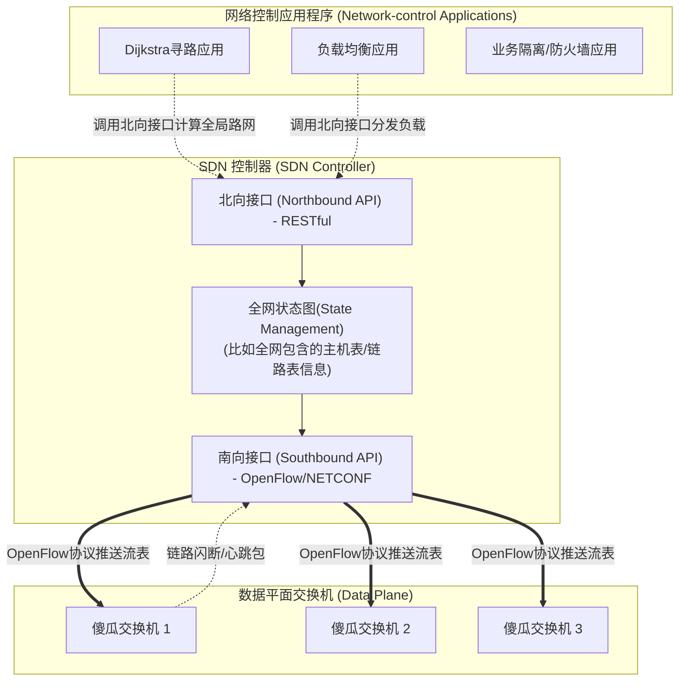

## 目录
- [[#前置回顾：SDN 数据平面]]
- [[#SDN 控制平面的三个主要组件]]
- [[#SDN 控制器层的核心功能]]
- [[#微核心：网络控制应用层]]
- [[#SDN 的前景及遗留的挑战]]

---

## 前置回顾：SDN 数据平面

我们先回忆第 4 章中提到的 **SDN 数据平面技术（通用转发，4.4节）**。在那一节，我们将传统的查目的地 IP 的死板转发表，升级为了“Match 加 Action”的极强 **流表（Flow Table）** 控制，使一台路由器同时成为了 NAT、防火墙、交换机和路由器。

但是：**流表从哪里来？** 谁来通过全网的统计和需求，计算出每一台底下交换机的具体控制下发逻辑？
负责运算这层大局观大脑思维的，就是——**SDN 控制平面（Software-Defined Networking Control Plane）**。

> [!tip] SDN 的核心：“分离” 与 “外包”
>
> 传统网络中：每一台路由器的机箱里既有处理转发用的定制硅片（数据面设备），也有上面跑着 OSPF 和 BGP 操作系统的专用 CPU（控制面设备），这两套软硬件被思科、华为等厂商**死死捆绑（垂直集成），用户无法自行修改和扩容优化**。
>
> SDN 中：底下的硬件铁盒统统变成了“只会听指挥干粗活的傻瓜交换机/OpenFlow交换机（数据面）”；上面运行 OSPF，BGP 和业务逻辑的所谓“路由器操作系统”，统统被提取**外包**出来放到了用户可以自己用 Java、C++ 和 Python 编程掌控的远端通用服务器里，这就是**控制平面（SDN 控制器）**！

---

## SDN 控制平面的三个主要组件

从结构体来看，控制器处于**中间件（Middleware）**的位置：
- **向北**面对高级网络应用 —— 提供一种可编程的 RESTful API：告诉应用当下的网络总拓扑长什么样子（应用层根本不用去跟硬件打交道，不用会协议）。
- **向南**面对各种不同厂商五花八面的硬件服务器 —— 取代厂商驱动协议：接收底下硬件上报闪断日志，下发流表更新。

---

## SDN 控制器层的核心功能

控制器自身是**逻辑上集中**的。但你如果只放一台机器，全国几万台交换机的探活请求一秒就把它压崩溃了，而且也是单点故障。
所以实际上 SDN 控制器实现必然是一个**高可用分布式的微服务集群**（比如基于 Paxos 协议去备份全局状态拓扑）。

一个成熟的控制器（如 ODL - OpenDaylight 或 ONOS）主要包含：
1. **网络状态管理层**：在控制器的内存或数据库里维持**全网所有链路的状态和转发表实时镜像**。它必须要和所有交换机底层保证状态一致性。
2. **通信层（南向协议，Southbound API）**：最著名的是 **OpenFlow 协议**。这也是一台物理交换机证明“老子支持 SDN，请拿走我的控制权”的基础规范。
3. **给应用提供接口通信层（北向 API，Northbound API）**：供程序猿开发、操控、改变网络现状用的各种组件方法（比如通知控制器将 10.1.1.0/24 地址的 HTTP 流量全部阻塞的方法 `Controller.blockPort(80, subnet)`）。

---

## 微核心：网络控制应用层

这就是网络工程师能够**使用真正的编程语言参与并颠覆网络的地方**。
原来你想配置 OSPF，你要对着华为设备敲三天的丑陋命令行（CLI），每台去敲一遍，生怕敲错一个命令全网崩溃。现在你可以编写一段 Java 程序，运行一个定制的 Dijkstra 扩展算法（可以带上任何业务偏好！比如晚上七点钟避开某段去腾讯视频极度拥堵的大促链路），运行在控制器上，它几毫秒就替你下发出去了！

它在很大程度上：
- 代替了原本存在于机器内部深层无法碰触到的“控制平面固件路由协议”。
- 可以随时动态上线新代码，“热修改”底层千百台路由器的行为。（今天做路由、明天做防 DDoS 防火墙、后天做流量负载分摊器）。

> [!info] 💡 架构师视角映射
> - **微服务容器编排控制面**：K8s的 Kubernetes Master Node，简直就是一个极度完美的 SDN Controller 哲学映照！Kube-apiserver 作为核心总线（中间南向北向控制器），它下面的所有 Worker Node 的 Kubelet 就是傻瓜端（Data Plane 数据面负责接纳指令跑容器），它上面面向开发的 YAML 就类似于 北向应用层的可编程接口（App层）。
> - **硬件剥离利润之争：为什么大厂强推 SDN**？过去思科交换机卖天价，因为软硬件绑死！现在谷歌微软等云大厂纷纷引入 SDN，去富士康采购超级便宜的“无牌傻汉白板交换机（White-box Switch）”（这就只需要付纯硬件材料费），软件通过自研控制器去支配底层（纯软件不花钱复制部署）。这属于**软件侵吞世界的又一经典代表：软件化解离了传统的硬件垄断门槛。**

> [!abstract] 🔖 Deep Dive
> 当代云计算和金融数据中心广泛应用的架构已变成虚拟 SDN 专网。如果有志于加入阿里云、腾讯云的网络核心部（做 VPC，SLB，等核心云计算基础设施开发），必须深入了解 ONOS 与 ODL (OpenDaylight Framework)，并系统性学习《网工也得学 Python / 网络可编程实战》。

---
