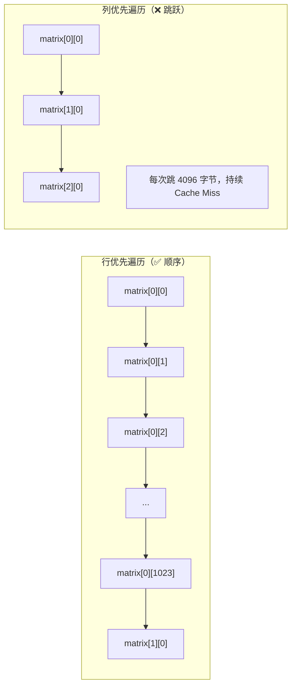

## 目录
- [[#什么是局部性原理]]
- [[#时间局部性（Temporal Locality）]]
- [[#空间局部性（Spatial Locality）]]
- [[#代码示例：局部性分析]]
	- [[#矩阵遍历：行优先 vs 列优先]]
	- [[#步长（Stride）对局部性的影响]]
- [[#💡 架构师视角映射]]
- [[#🔭 深挖指南]]

---

## 什么是局部性原理

**局部性原理（Principle of Locality）**：现实世界的程序，在任意短的时间窗口内，都倾向于访问**一小部分地址连续的存储器区域**。

> 类比：你在图书馆查资料。你不会每次都跑去不同的书架——你往往会反复翻看同一本书（时间局部性），或者同时取拿同一书架上相邻的几本（空间局部性）。程序访问内存的行为和人类的阅读习惯惊人地相似。

> CS 术语：CPU 设计者利用局部性原理，在 CPU 内部放置 **高速缓存（Cache）**，假设"近期访问过的数据不久后还会再次访问（时间局部性）"且"访问某地址时顺便预取其附近数据（空间局部性）"。

---

## 时间局部性（Temporal Locality）

> **定义**：被引用过一次的存储器位置，在不远的将来很可能再次被引用。

```java
// Java 示例：时间局部性
int sum = 0;
for (int i = 0; i < n; i++) {
    sum += arr[i];  // ← sum 变量在每次循环都被读写，高度时间局部性
}
// "sum" 会被缓存在寄存器或 L1 Cache 中常驻
```

```
时间局部性示意:

时间轴 ──────────────────────────────────────────▶
         t1        t2        t3        t4
         │         │         │         │
访问地址  A    B    A    C    A    D    A
         ↑         ↑         ↑         ↑
         └─────────┴─────────┴─────────┘
              A 被反复访问 → 留在 Cache 中命中！
```

---

## 空间局部性（Spatial Locality）

> **定义**：如果一个存储器位置被引用了一次，那么它附近的存储器位置很可能在不远的将来也被引用。

```java
// Java 示例：空间局部性（数组访问）
int[] arr = new int[1000];
for (int i = 0; i < 1000; i++) {
    arr[i] += 1;  // 按顺序访问，空间局部性极好
}
// CPU 读取 arr[0] 时，Cache 预取整个 Cache Line（64B），
// arr[1]~arr[15] 已经在 Cache 里了，后续访问直接命中！
```

```
空间局部性示意（Cache Line = 64 字节 = 16 个 int）:

内存布局: [arr[0]][arr[1]][arr[2]]...[arr[15]] [arr[16]]...
           |←──────── 1 个 Cache Line ────────→|

访问 arr[0] → Cache Miss → 整个 Cache Line 被装入 Cache
访问 arr[1] → Cache HIT! ✅（已在 Cache Line 中）
访问 arr[2] → Cache HIT! ✅
         ...
访问 arr[15]→ Cache HIT! ✅
访问 arr[16]→ Cache Miss（新的 Cache Line）→ 再次装入
```

---

## 代码示例：局部性分析

### 矩阵遍历：行优先 vs 列优先

> 类比：C 语言（和 Java）的二维数组在内存里按**行优先**存储，就像书是一行一行写的。你**按行读**（左→右，行→行）很自然；但**按列读**（跳着跳着读），每读一个字都要翻到不同的页，效率极低。

```java
int[][] matrix = new int[1024][1024];

// ✅ 行优先遍历（顺序访问内存，空间局部性好）
for (int i = 0; i < 1024; i++) {
    for (int j = 0; j < 1024; j++) {
        matrix[i][j] += 1;  // 步长 = 1 int = 4 字节，顺序访问
    }
}

// ❌ 列优先遍历（跳跃访问内存，空间局部性差）
for (int j = 0; j < 1024; j++) {
    for (int i = 0; i < 1024; i++) {
        matrix[i][j] += 1;  // 步长 = 1024 int = 4096 字节，跨 Cache Line 访问
    }
}
```



**实际性能差异**：对 1024×1024 矩阵，列优先遍历比行优先慢 **10~100 倍**（具体取决于 Cache 大小）。

---

### 步长（Stride）对局部性的影响

**步长（Stride）**：两次连续内存访问之间的字节距离。

> CS 术语：步长越小（尤其是步长=1，即顺序访问），空间局部性越好，Cache 命中率越高，性能越佳。

```
步长 vs Cache 命中率:

步长 1 (顺序) : ████████████████████  命中率 ~99%  🚀
步长 2         : ████████░░░░░░░░░░░░  命中率 ~50%
步长 4         : ████░░░░░░░░░░░░░░░░  命中率 ~25%
步长 64 字节   : █░░░░░░░░░░░░░░░░░░░  命中率 ~6%   (正好跨 Cache Line)
步长 > 64 字节 : █░░░░░░░░░░░░░░░░░░░  每次必 Miss  🐢
                 └───────── 命中率 ─────────┘
```

> [!tip] 步长 = Cache Line 大小 时最糟糕
> 如果步长恰好等于 Cache Line 大小（通常 64 字节），每次访问都落在不同的 Cache Line 上，会触发**持续的 Cache Miss**，性能骤降。
> 多维数组列优先遍历就是这种情况的典型场景。

---

## 💡 架构师视角映射

> [!info] 与 Java 后端的联系

**JVM GC 的局部性影响**：
- 对象在堆中分配，年轻代（Eden）是连续内存 → GC 时扫描活跃对象有良好空间局部性
- 但经过多次 GC 后，老年代的对象分布碎片化 → 访问局部性降低，Cache 命中率下降 → Full GC 更慢
- 这也是为什么 G1/ZGC 的**内存整理（Compaction）** 能改善性能：让对象重新连续，恢复局部性

**Java 数据结构的局部性**：
- `ArrayList`（数组实现）：连续内存，空间局部性优秀，适合遍历 ✅
- `LinkedList`（链表实现）：节点散落在堆中，每次 `next` 都是指针跳转，局部性极差 ❌
  - 这也是为什么绝大多数场景推荐 `ArrayList` 而非 `LinkedList`

**MySQL 的局部性应用**：
- InnoDB 的 **B+ Tree 叶子节点** 按顺序链接，范围查询（`BETWEEN`, `ORDER BY`）能利用空间局部性，顺序 I/O  
- InnoDB **预读机制（Read-Ahead）**：检测到顺序访问模式后，提前将后续页载入 Buffer Pool，这正是空间局部性的工程应用

**Redis 的数据结构局部性**：
- `ziplist`（压缩列表）/ `listpack`：将小 list/hash/zset 存储为连续内存 → 高空间局部性
- 这是 Redis 在数据量小时使用紧凑编码的核心原因之一

---

## 🔭 深挖指南

> [!tip] 核心知识点与延伸阅读
>
> **本节最重要的两点**：
> 1. **局部性原理是 Cache 存在合理性的基石**——没有局部性，Cache 就是个随机命中的浪费
> 2. **行优先遍历 vs 列优先遍历** 的性能差异是局部性原理最直观的工程体现，Java/C 面试中必须掌握
>
> **深挖路径**：
> - 对局部性的数学量化分析（步长模型）→ 原书 **6.2.1 和 6.2.2 节**
> - 如何用局部性原理分析复杂循环 → 原书 **6.2 节习题**（强烈推荐亲手做）
> - Java ArrayList vs LinkedList 性能对比测试 → JMH Benchmark 实测
> - 矩阵乘法的 Cache 优化（循环交换 + 分块）→ 参考原书 **6.5 节** 和 《深入理解程序》
