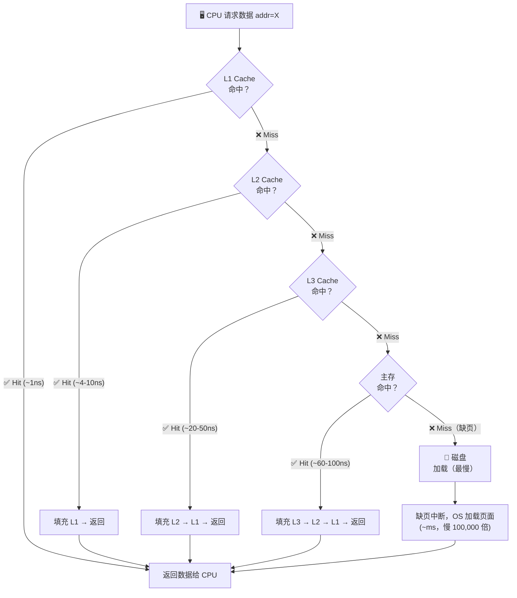

## 目录
- [[#存储器层次结构的完整视图]]
- [[#缓存（Cache）的通用概念]]
	- [[#什么是缓存]]
	- [[#命中（Hit）与缺失（Miss）]]
	- [[#缺失的三种类型]]
- [[#层次结构的运作原理]]
- [[#💡 架构师视角映射]]
- [[#🔭 深挖指南]]

---

## 存储器层次结构的完整视图

```
存储器层次结构（速度越快 → 越靠近 CPU，容量越小、价格越贵）:

                     ┌──────────────┐
                     │  寄存器（Registers）│  ← L0，由编译器管理
                     │  ~0.25 ns    │     容量：几十个，几百字节
                     └──────┬───────┘
                            │
                     ┌──────┴───────┐
                     │  L1 Cache    │  ← SRAM（片上），指令Cache + 数据Cache 分开
                     │  ~1 ns       │     容量：32KB ~ 64KB
                     └──────┬───────┘
                            │
                     ┌──────┴───────┐
                     │  L2 Cache    │  ← SRAM（片上或片外），统一 Cache
                     │  ~4-10 ns    │     容量：256KB ~ 4MB
                     └──────┬───────┘
                            │
                     ┌──────┴───────┐
                     │  L3 Cache    │  ← SRAM（片外，多核共享）
                     │  ~20-50 ns   │     容量：8MB ~ 64MB
                     └──────┬───────┘
                            │
              ┌─────────────┴──────────────┐
              │  主存（Main Memory，DRAM）    │  ← 内存条
              │  ~60-100 ns                │     容量：8GB ~ 256GB
              └─────────────┬──────────────┘
                            │
              ┌─────────────┴──────────────┐
              │  本地二级存储（SSD / HDD）    │  ← 磁盘 / 固态硬盘
              │  SSD: ~50-100 μs           │     容量：256GB ~ 4TB
              │  HDD: ~5-10 ms             │
              └─────────────┬──────────────┘
                            │
              ┌─────────────┴──────────────┐
              │  远程存储（分布式 / 网络存储）│  ← 对象存储、NAS、云存储
              │  ~ms ~ 秒                  │     容量：EB 级
              └────────────────────────────┘
```

> [!info] 关键规律
> - **越靠近 CPU**：速度越快，容量越小，每字节价格越高
> - **层次结构的本质**：用小而快的存储器，缓存大而慢的存储器中的热点数据
> - 每相邻两层之间都是一个**缓存关系**：上层是下层的缓存

---

## 缓存（Cache）的通用概念

### 什么是缓存

在层次结构中，**k 层**是 **k+1 层**的缓存。

> 类比：公司的**领导层结构**。CEO（L1）保留最重要的决策（热数据），需要更多信息时去找副总（L2），再往下才到部门经理（主存）、员工（磁盘）。每一层都暂存着下一层最近用到的"工作材料"。

```
通用缓存模型:

     ┌─────────────────────────────────────────────┐
     │           k+1 层（慢速、大容量）               │
     │  ┌───┐ ┌───┐ ┌───┐ ┌───┐ ┌───┐ ┌───┐ ┌───┐  │
     │  │ 0 │ │ 1 │ │ 2 │ │ 3 │ │ 4 │ │ 5 │ │ 6 │  │  ← 数据块（Block/Line）
     │  └───┘ └───┘ └───┘ └───┘ └───┘ └───┘ └───┘  │
     └──────────────────────────────────────────────┘
                 ↑ 从下层加载   ↓ 写回下层
     ┌─────────────────────────────────────────────┐
     │           k 层（快速、小容量）                 │
     │  ┌─────┐ ┌─────┐ ┌─────┐ ┌─────┐           │
     │  │ 1   │ │ 4   │ │     │ │     │           │  ← 已缓存 block 1 和 block 4
     │  └─────┘ └─────┘ └─────┘ └─────┘           │
     └──────────────────────────────────────────────┘
                 ↑ CPU 访问
```

**数据以块（Block/Cache Line）为单位**在层间传输。CPU Cache 中，一个 Cache Line 通常为 **64 字节**。

---

### 命中（Hit）与缺失（Miss）

> 类比：你去图书馆查资料，分两种情况：
> - **命中（Hit）**：你昨天借的书还在你桌上（Cache），直接拿来用。
> - **缺失（Miss）**：书不在桌上，你得去书架（主存或磁盘）取，再搬到桌上才能读。

**命中**：CPU 请求的数据恰好在 k 层缓存中 → 直接返回，速度极快。

**缺失**：数据不在 k 层 → 需要从 k+1 层加载，称为 **缺失惩罚（Miss Penalty）**。

---

### 缺失的三种类型

| 类型 | 英文 | 触发时机 | 说明 |
|------|------|----------|------|
| 冷缺失 | Cold Miss / Compulsory Miss | 第一次访问某数据时 | Cache 为空或从未加载过该数据，不可避免 |
| 容量缺失 | Capacity Miss | 工作集 > Cache 容量 | 活跃数据集超过 Cache 大小，数据被迫频繁换出换入 |
| 冲突缺失 | Conflict Miss | 多个数据竞争同一 Cache 组 | 仅在组相联/直接映射 Cache 中出现，数据互相驱逐 |

> [!tip] 三种缺失的类比
> - **冷缺失**：搬进新家，家里什么都没有，第一次买什么都要出门
> - **容量缺失**：家太小，买了新东西就得扔旧的——总缺货
> - **冲突缺失**：家很大，但只有一个特定抽屉能放锅，两口锅抢一个抽屉

---

## 层次结构的运作原理



**关键现象**：每次缺失都会将完整的 **Cache Line（64字节）** 从下层拉到上层（而不是仅加载你请求的那 4 字节），这正是空间局部性的工程利用。

---

## 💡 架构师视角映射

> [!info] 与 Java 后端的联系

**JVM 内存模型（JMM）即层次结构的抽象**：
- JMM 的"工作内存（本地内存）"本质上是 CPU 的寄存器 + Cache 的抽象
- `volatile` / `synchronized` 强制从**主存**（层次结构的主存层）刷新数据，就是从"下层缓存"强制同步
- `happens-before` 规则保证了缓存一致性语义

**MySQL 的 Buffer Pool = 主存的 Page Cache**：
- MySQL InnoDB 的 Buffer Pool 就是为了缓存磁盘上的数据页，在 MySQL 层重建了一套存储层次：
  - **磁盘（.ibd 文件）** → 对应 L3/主存层次中的磁盘
  - **Buffer Pool** → 对应主存层（DRAM）
  - **自适应哈希索引（AHI）** → 类似于 L1/L2 Cache 对热点页的加速
- LRU 替换算法（MySQL 改良版）= Cache 中的驱逐策略

**Redis 在层次结构中的位置**：
- Redis 整个数据库在 **主存（DRAM）** 中 → 比 MySQL 的磁盘 I/O 快 5 个数量级
- Redis Cluster 之于单节点 Redis = 分布式"下层缓存"
- 本地 Caffeine Cache（进程内）→ Redis（分布式） → MySQL（持久化）本质上构成了一个**三层存储层次结构**！

---

## 🔭 深挖指南

> [!tip] 核心知识点与延伸阅读
>
> **本节最重要的两点**：
> 1. 存储器层次结构的**每相邻两层都是缓存关系**，这个"缓存"概念比 CPU Cache 更普适
> 2. 三种缺失（冷/容量/冲突）的分类帮助我们诊断性能问题，在不同业务场景中有精准对应
>
> **深挖路径**：
> - 层次结构的完整介绍 → 原书 **6.3.1 节**
> - 三种缺失类型的详细分析 → 原书 **6.3.2 节**
> - 存储器层次结构对程序性能影响的量化 → 原书 **6.6 节**（存储器山）
> - 分布式系统的缓存设计 → 《设计数据密集型应用》第 10-12 章
