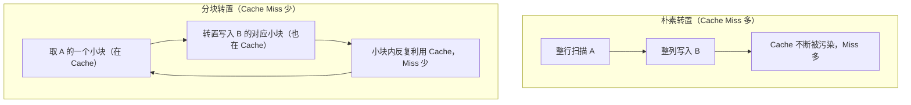

## 目录
- [[#Cache 友好代码的核心原则]]
- [[#原则一：让常用变量保持在寄存器或 L1 Cache 中]]
- [[#原则二：将步长最小化（顺序访问）]]
- [[#案例：矩阵转置的 Cache 优化]]
	- [[#朴素矩阵转置]]
	- [[#分块矩阵转置（Blocking / Tiling）]]
- [[#案例：矩阵乘法优化]]
- [[#循环重排（Loop Reordering）]]
- [[#💡 架构师视角映射]]
- [[#🔭 深挖指南]]

---

## Cache 友好代码的核心原则

> 类比：你的工作桌（L1 Cache）很小，书架（L2 Cache）稍大，但每次去书架都要花时间。Cache 友好的代码就是**合理规划工作节奏**，让你在一段时间内只需要同一批书（良好局部性），而不是每次都跑来跑去。

**两条核心原则**：
1. **最大化时间局部性**：让频繁使用的变量/数据尽可能"留"在 Cache 中（减少被驱逐后重新加载）
2. **最大化空间局部性**：让数据访问步长尽可能小（顺序访问，每次加载都充分利用 Cache Line 中的所有数据）

---

## 原则一：让常用变量保持在寄存器或 L1 Cache 中

```java
// ❌ 不友好：每次循环都反复读写 result 数组中的不同元素
int[] result = new int[N];
for (int i = 0; i < N; i++) {
    result[i] = heavyCalc(i);
    result[i] += offset;         // result[i] 被读了两次，中间有别的操作可能把它驱逐
    result[i] *= factor;
}

// ✅ 友好：用局部变量（寄存器级）暂存，只在最后写回数组
for (int i = 0; i < N; i++) {
    int tmp = heavyCalc(i);      // tmp 在寄存器中
    tmp += offset;               // 寄存器操作，极快
    tmp *= factor;
    result[i] = tmp;             // 最后写一次
}
```

> [!tip] 编译器的自动优化
> 现代 JIT 编译器（如 JVM 的 C2 编译器）通常能自动将频繁读写的局部变量提升到寄存器（**标量替换 / 寄存器分配**）。但理解这一原理能帮你避免写出让 JIT 无法优化的模式，比如在循环中频繁通过指针间接访问。

---

## 原则二：将步长最小化（顺序访问）

**黄金规则**：让内层循环（执行次数最多的）以步长 1 访问数组（按行访问二维数组）。

```java
// ❌ 步长 = N（列优先，Cache 不友好）
for (int j = 0; j < N; j++) {          // 外层：列
    for (int i = 0; i < N; i++) {      // 内层：行（每次跳 N 个元素）
        sum += matrix[i][j];           // 步长 = N，每次可能 Cache Miss
    }
}

// ✅ 步长 = 1（行优先，Cache 友好）
for (int i = 0; i < N; i++) {          // 外层：行
    for (int j = 0; j < N; j++) {      // 内层：列（每次步长 1）
        sum += matrix[i][j];           // 顺序访问，每个 Cache Line 充分利用
    }
}
```

```
步长影响示意（Cache Line = 64B = 16 int）:

行优先访问（✅）:
matrix[0][0] → [0][1] → [0][2] → ... → [0][15]  ← 1次Miss，15次Hit
                                                     Cache Line 利用率 100%

列优先访问（❌，N=1024）:
matrix[0][0] → [1][0] → [2][0] → ...             ← 每次跨 4096B，每次都 Miss！
                                                     Cache Line 利用率 ~0.4%
```

---

## 案例：矩阵转置的 Cache 优化

### 朴素矩阵转置

```java
// 将 N×N 矩阵 A 转置到 B
// ❌ 朴素实现：B 的写是列方向（步长 N），Cache 不友好
void transpose_naive(int[][] A, int[][] B, int N) {
    for (int i = 0; i < N; i++) {
        for (int j = 0; j < N; j++) {
            B[j][i] = A[i][j];  // A 读：步长 1 ✅；B 写：步长 N ❌
        }
    }
}
```

```
朴素转置的 Cache 行为（A 是 4096×4096，Cache 只有 4MB）:

A 的读：顺序    A[0][0..4095]  ✅ 空间局部性好
B 的写：跳跃    B[0][0], B[1][0], B[2][0]...  ❌ 步长=4096，持续 Cache Miss
```

---

### 分块矩阵转置（Blocking / Tiling）

> 类比：整理一个大仓库时，与其在整个仓库里翻来翻去，不如把仓库划分为**小格间（Block）**，每次专心整理一个格间内部——一个格间的所有物品都能放进"工作台"（Cache），整理效率大幅提升。

> CS 术语：**分块（Blocking/Tiling）** 技术将大矩阵操作分解为小的子矩阵块，确保每个块能完整放入 Cache，最大化 Cache 利用率，减少缺失次数。

```java
// ✅ 分块矩阵转置（Blocked Transpose）
void transpose_blocked(int[][] A, int[][] B, int N, int blockSize) {
    for (int i = 0; i < N; i += blockSize) {
        for (int j = 0; j < N; j += blockSize) {
            // 对每个 blockSize × blockSize 的小块进行转置
            for (int ii = i; ii < Math.min(i + blockSize, N); ii++) {
                for (int jj = j; jj < Math.min(j + blockSize, N); jj++) {
                    B[jj][ii] = A[ii][jj];  // 小块内，A 和 B 都在 Cache 中 ✅
                }
            }
        }
    }
}
// blockSize 选择：让 blockSize × blockSize × 2 ≤ Cache 大小（留给 A 和 B 各一份）
```



**实测效果**：对 512×512 矩阵，分块（blockSize=8）比朴素转置快 **2~5 倍**，大矩阵差距更大。

---

## 案例：矩阵乘法优化

矩阵乘法 C = A × B，有 6 种循环排列（ijk, ikj, jik, jki, kij, kji）：

```java
// ijk 顺序（最常见写法）
for (int i = 0; i < N; i++) {
    for (int j = 0; j < N; j++) {      // ← 内层：j 变化，步长1访问 B[k][j] ✅，但 C[i][j] 每次 j++ 也步长1 ✅
        for (int k = 0; k < N; k++) {
            C[i][j] += A[i][k] * B[k][j];  // A 步长1 ✅, B 步长N ❌
        }
    }
}
```

| 循环顺序 | A 步长 | B 步长 | C 步长 | 总体性能 |
|---------|--------|--------|--------|---------|
| **ijk** | 1 ✅ | N ❌ | 1 ✅ | 中等 |
| **ikj** | 1 ✅ | 1 ✅ | 1 ✅ | **最好** 🏆 |
| **jik** | 1 ✅ | N ❌ | N ❌ | 中等 |
| **jki** | N ❌ | 1 ✅ | N ❌ | 最差 |
| **kij** | 1 ✅ | 1 ✅ | 1 ✅ | **最好** 🏆 |
| **kji** | N ❌ | 1 ✅ | N ❌ | 差 |

> [!tip] 结论
> **ikj 和 kij 顺序** 对三个矩阵都有步长 1 的访问，Cache 友好性最佳。
> 实际工程中还会叠加**分块（Tiling）**，这是 BLAS 和 MKL 等高性能数值计算库的核心优化之一。

---

## 循环重排（Loop Reordering）

> 类比：生产流水线的排工序。改变工序执行顺序（在不改变最终结果的前提下），可以让每道工序的物料都整批到位，减少中途取材的等待时间。

```java
// 原始：j 内层，B 按列访问（步长 N）
for (int i = 0; i < N; i++)
    for (int j = 0; j < N; j++)
        for (int k = 0; k < N; k++)
            C[i][j] += A[i][k] * B[k][j];  // B：步长 N ❌

// 优化：交换 j 和 k 的循环顺序（ikj）
for (int i = 0; i < N; i++)
    for (int k = 0; k < N; k++) {
        int aik = A[i][k];                  // 提前缓存到寄存器 (时间局部性)
        for (int j = 0; j < N; j++)
            C[i][j] += aik * B[k][j];       // B：步长 1 ✅，C：步长 1 ✅
    }
```

---

## 💡 架构师视角映射

> [!info] 与 Java 后端的联系

**JVM JIT 的 Cache 优化**：
- JVM C2 编译器会自动做**循环展开（Loop Unrolling）**，减少分支预测缺失和循环控制开销
- **自动向量化（Auto-Vectorization）**：将步长 1 的循环编译为 SIMD 指令（SSE/AVX），一次处理 4~16 个元素 → 充分利用 Cache Line 的宽度
- 这也是为什么 `Arrays.fill()` 和 `System.arraycopy()` 比手写循环快：JVM 底层调用 intrinsics，利用向量化指令

**数据库 ORM 的查询模式**：
- "N+1 查询问题"本质上是**步长极大的内存访问模式**：每次 SQL 都触发磁盘 I/O，且每次只取一行，完全放弃了 InnoDB 预读取（空间局部性）的优势
- **批量查询（IN 语句）** = 提高局部性，减少 I/O 次数，类比于"分块访问"

**Netty 的 ByteBuf**：
- Netty 的 `PooledByteBuf` 使用内存池（类似 Cache 的分块思想），避免频繁 GC 和内存碎片化
- `directBuffer`（堆外内存）减少 Java 堆 GC 对 Socket 缓冲区的影响，本质是减少 JVM GC 对 Cache 的污染

**算法竞赛中的 Cache 优化**：
- 树状数组（BIT）、线段树等数据结构的**内存布局优化**（如 DFS 序列化）能显著提升 Cache 命中率
- 对连续数组的二分搜索（顺序局部性）比跳表（随机访问）在 Cache 层面更友好

---

## 🔭 深挖指南

> [!tip] 核心知识点与延伸阅读
>
> **本节最重要的三点**：
> 1. **步长是关键**：Cache 友好代码的核心是让内层循环以步长 1 顺序访问数组
> 2. **分块（Tiling）** 是解决矩阵转置/乘法 Cache 问题的通用思路，也是高性能计算库的基础技术
> 3. **循环重排（ikj vs ijk）** 展示了在不改变算法逻辑的前提下，单纯调整代码结构带来的数量级性能差异
>
> **深挖路径**：
> - 矩阵访问步长的量化分析（步长模型）→ 原书 **6.5.3 节**
> - 分块矩阵乘法的完整分析 → 原书 **6.5.4 节** 和 《并行程序设计》第 4 章
> - JVM JIT 的自动向量化 → JVM 参数 `-XX:+PrintCompilation -XX:+TraceLoopOpts`
> - Intel Memory Access Patterns → Intel VTune Profiler 的 Memory Access 分析模式
