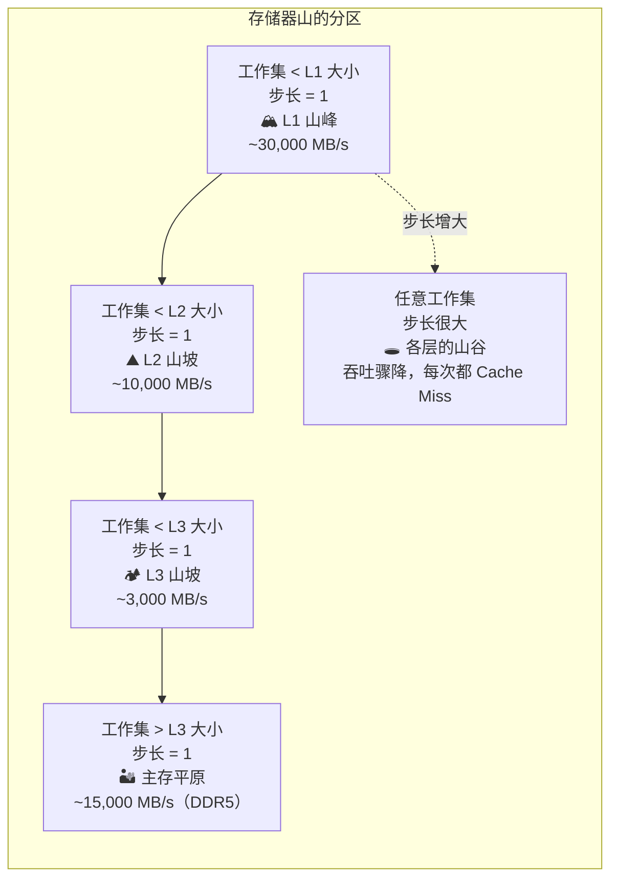
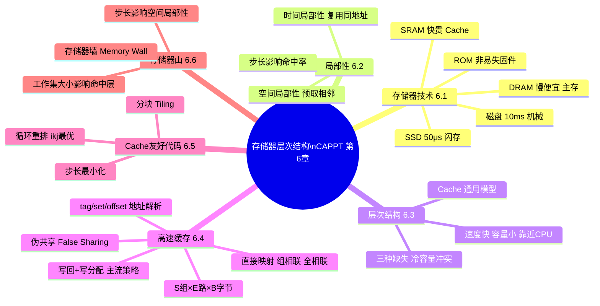

## 目录
- [[#存储器山（Memory Mountain）]]
	- [[#什么是存储器山]]
	- [[#解读存储器山的山峰与山谷]]
- [[#程序性能的存储器视角]]
- [[#第六章小结]]
	- [[#核心概念总结]]
	- [[#层次结构全景图]]
- [[#💡 架构师视角映射]]
- [[#🔭 深挖指南]]

---

## 存储器山（Memory Mountain）

### 什么是存储器山

**存储器山**是一个以"**工作集大小（Working Set Size）**" 和 "**步长（Stride）**" 为两个维度，以"**读吞吐量（MB/s）**"为高度的三维性能图像。

> 类比：把不同的"工作效率"画成一座山的地形图——你站在山顶（L1 Cache 全命中、步长=1）时工作效率最高，越往山下走（工作集超出Cache、步长越大），效率就越低。

```
存储器山示意（俯视等高线图）:

         ← 步长（Stride, 字节）→
  ┌──1──4──8──16──32──64──128──256─┐
  │  ████████████████████████████  │ ← 山顶（L1全命中，高吞吐）
 L│  ████████████████████████████  │
 1│  ████████████████████████████  │
  ├─────────────────────────────── ┤ ← L1 吞吐率突降
 L│  ██████████████████████████   │
 2│  ████████████████████████     │
  ├─────────────────────────────── ┤ ← L2 吞吐率突降
  │  ██████████████████████       │
 L│  ████████████████████         │
 3│  ██████████████████           │
  ├─────────────────────────────── ┤ ← L3 吞吐率突降
  │  ████████████████             │
 M│  ██████████████               │
 e│  ████████████                 │
 m│  ██████████                   │ ← 主存区域（低吞吐）
  └──────────────────────────────  ┘
  ↑                                ↑
工作集小（全在L1）              工作集大（超出L3）

```

**坐标含义**：
- **X 轴**：步长（1~512 字节），越小空间局部性越好
- **Y 轴**：工作集大小（1KB~512MB），决定数据在哪一层Cache中
- **Z（高度）**：读吞吐量（MB/s），越高越好

---

### 解读存储器山的山峰与山谷



**关键规律**：
1. **工作集越小（纵向降低维度）**：数据完全在更快的 Cache 中，吞吐率越高
2. **步长越小（横向降低维度）**：空间局部性越好，Cache Line 利用率越高，吞吐率越高
3. **"步长悬崖"**：当步长 ≥ Cache Line 大小（64字节）时，每次访问都触发新的 Cache Miss，吞吐率骤降到"山谷"
4. **"工作集悬崖"**：当工作集超过某层 Cache 大小时，出现容量缺失，吞吐率台阶式下降

> [!warning] 步长=64字节是最危险的陷阱
> 步长恰好等于 Cache Line 大小（64字节, 即 16 个 int）时，每次访问都落在不同的 Cache Line 上，
> 命中率接近 0，这是 Cache 性能最差的枪口位置。
> 对 Java 程序员：访问 `int[]` 时步长超过 16，或 `long[]` 步长超过 8，就进入危险区。

---

## 程序性能的存储器视角

存储器层次结构决定了程序性能的**天花板**。

```
程序执行时间的成分分析:

总时间 = 计算时间 + 存储器等待时间

实际情况:
┌─────────────────────────────────────────────────────────────────┐
│ 计算 │██░░░░░░░░░░░░░░░░░░░░░░░░░░░░░░░░░░░░░░░░░░░░░░░░░ Cache等待│
└─────────────────────────────────────────────────────────────────┘
         ↑                                               ↑
       ~10%                                           ~90%
  （现代 CPU 计算极快）                  （存储器访问成为主要瓶颈）

这就是为什么：
- 优化算法：从 O(n²) → O(n log n)，节省 10× 计算
- 优化 Cache：从 Cache Miss 到 HIT，节省 100× 内存访问等待
→ 实践中 Cache 优化的效果往往比算法优化更立竿见影！
```

> [!important] 存储器是现代程序的真正瓶颈
> 现代 CPU 时钟频率 ~3-4 GHz，一个时钟周期 ~0.25 ns。
> - L1 Cache 命中：~4 周期 → ~1 ns
> - 主存访问：~200 周期 → ~50 ns
> - **在等待主存的 200 个周期里，CPU 本可以执行 200 条指令**！
>
> 这被称为 **"存储器墙"（Memory Wall）**，是当代计算机体系结构最核心的矛盾之一。

---

## 第六章小结

### 核心概念总结

| 概念 | 核心要点 | 与 Java 后端的关联 |
|------|----------|-----------------|
| **存储器技术** | SRAM（快）→ Cache，DRAM（慢）→ 主存，NAND Flash → SSD | JVM 堆在 DRAM，GC 性能受 DRAM 带宽限制 |
| **局部性原理** | 时间局部性（复用同一数据）+ 空间局部性（顺序访问） | ArrayList 优于 LinkedList；行优先遍历 |
| **存储器层次结构** | 每相邻两层是缓存关系；数据以 Cache Line 为单位传输 | 本地 Cache → Redis → MySQL 是应用层的层次结构 |
| **高速缓存** | 组织：S 组 × E 路 × B 字节；读：tag/set/offset 三段解析 | 伪共享（False Sharing）是 JUC 的 Cache 级陷阱 |
| **写策略** | 写回+写分配（现代主流）；写透+非写分配（简单系统） | volatile 写 ≈ 写透；MySQL redo log fsync 策略 |
| **Cache 友好代码** | 步长最小化；分块（Tiling）；循环重排 | N+1 查询 = 糟糕的访问模式；批量查询 = 分块思想 |
| **存储器山** | 吞吐率由工作集大小和步长双重决定 | 性能 Profiling 时需关注 Cache Miss 率 |

---

### 层次结构全景图



> [!tip] 第六章的三条学习主线
> 1. **是什么（What）**：6.1 存储器技术 → 6.3 层次结构 → 6.4 Cache 组织
> 2. **为什么（Why）**：6.2 局部性原理 → 解释了 Cache 为什么有效
> 3. **怎么用（How）**：6.5 Cache 友好代码 → 6.6 存储器山（性能量化工具）

---

## 💡 架构师视角映射

> [!info] 存储器山对 Java 后端的启示

**性能分析工具**：
- `perf stat -e cache-misses,cache-references ./myprogram`：Linux 性能计数器，直接测量 Cache 缺失率
- **JMH（Java Microbenchmark Harness）**：配合 `-prof perfnorm` 可以输出每次操作的 Cache Miss 次数
- **Intel VTune**：图形化展示 Cache 命中/缺失热点，定位 "Memory Bound" 代码段

**架构设计中的存储器山思维**：
- 选择数据结构时，除了算法复杂度，还需考虑 **内存访问模式**：
  - 频繁遍历 → 选择数组基（连续内存）> 链表基
  - 频繁点查 → 选择 HashMap（O(1) 但可能 Cache Miss）vs 有序数组+二分（O(log n) 但顺序预取好）
- 服务吞吐量瓶颈分析：如果 CPU 使用率低但响应慢，很可能是 **IO 密集型**（等待磁盘/网络），等价于存储器山中工作集在"磁盘"层

**微服务架构中的"层次结构"**：
```
进程内缓存（Caffeine）  ← L1 Cache 类比  ~ns 级
     ↓ Miss
Redis 分布式缓存        ← L3/主存 类比   ~ms 级  
     ↓ Miss
数据库（MySQL）         ← 磁盘 类比      ~10ms 级
     ↓ Miss
对象存储/归档           ← 磁带/远程存储   秒级
```
每一层都是下一层的"Cache"，与 CPU 存储器层次结构是同样的设计模式！

---

## 🔭 深挖指南

> [!tip] 核心知识点与延伸阅读
>
> **本节最重要的三点**：
> 1. **存储器山**是量化 Cache 性能的最直观工具，理解其两个维度（工作集大小 + 步长）是分析性能问题的基础
> 2. **存储器墙（Memory Wall）** 是现代计算机体系结构的核心矛盾——CPU 速度的增长远超内存带宽，Cache 是弥补这一鸿沟的关键
> 3. Cache 层次结构思想已升华为分布式系统的核心设计模式（多级缓存架构）
>
> **深挖路径**：
> - 存储器山的实验测量 → 原书 **6.6.1 节**（附带代码，强烈建议亲自实测）
> - 存储器墙问题的历史与解决方案 → Martin Reddy《API Design for C++》附录 A
> - 现代 CPU 的硬件预取器（Hardware Prefetcher）→ Intel Software Developer's Manual Vol.1 第 9 章
> - 多级缓存设计模式（应用层面）→ 《设计数据密集型应用》Martin Kleppmann 第 11-12 章
> - JVM 与 CPU Cache 的交互分析 → Aleksey Shipilëv 博客（shipilev.net）
