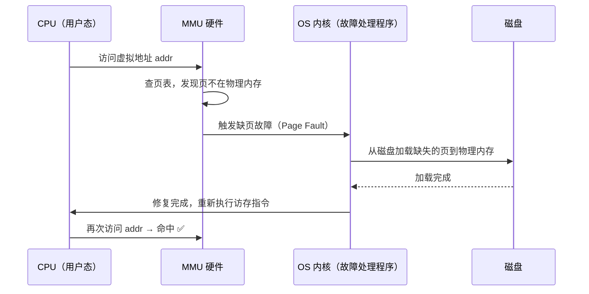

## 目录
- [[#什么是异常控制流（ECF）]]
- [[#异常的本质]]
- [[#异常的四种类型]]
	- [[#中断（Interrupt）]]
	- [[#陷阱（Trap）]]
	- [[#故障（Fault）]]
	- [[#终止（Abort）]]
	- [[#四类异常对比]]
- [[#异常表与异常号]]
- [[#💡 架构师视角映射]]
- [[#🔭 深挖指南]]

---

## 什么是异常控制流（ECF）

程序正常运行时，CPU 按照指令顺序、分支、循环的方式执行，这叫**平滑的控制流（Smooth Control Flow）**。

但现实中，计算机需要对"意外事件"做出反应——比如网卡收到数据包、用户按下 Ctrl+C、程序访问非法地址……这些事件需要打断正常流程，进行特殊处理，这就是**异常控制流（Exceptional Control Flow, ECF）**。

> 类比：你正在专心写代码（正常控制流）。突然手机响了（中断），你接完电话回来继续写（中断返回）。或者你主动问同事一个问题（陷阱/系统调用），得到答案后继续。或者你突然发现显示器断电了（故障/终止）。

> CS 术语：**ECF 是操作系统与硬件协同处理"意外事件"的机制**，是进程、线程、信号、虚拟内存等一切高级抽象的基础。

---

## 异常的本质

```
异常处理的完整流程:

  当前程序执行到指令 Icurr
          │
          ▼
  ┌───────────────────┐
  │  事件发生          │  ← 硬件事件 or 软件请求
  └─────────┬─────────┘
            │
            ▼
  硬件查询【异常表（Exception Table）】
  根据异常号 k 找到对应的处理程序地址
            │
            ▼
  保存现场（部分寄存器 + 返回地址 压入内核栈）
            │
            ▼
  跳转到【异常处理程序（Exception Handler）】运行
            │
            ▼
  ┌──────────────────────┐
  │ 处理完后的三种去向:    │
  │ ① 返回 Icurr         │  ← 重新执行当前指令（故障恢复）
  │ ② 返回 Inext         │  ← 执行下一条指令（正常中断返回）
  │ ③ 终止进程           │  ← 无法恢复（终止类异常）
  └──────────────────────┘
```

> [!important] 异常是内核与用户程序的切换入口
> 异常发生时，CPU 从**用户态（User Mode）** 切换到**内核态（Kernel Mode）**，执行操作系统的处理代码，这是所有系统调用、I/O 操作、进程调度的基本入口机制。

---

## 异常的四种类型

### 中断（Interrupt）

**触发方式**：来自 **CPU 外部** 的硬件信号（如 I/O 设备）

**特点**：
- **异步**（与当前执行的指令无关）
- 处理完后返回下一条指令（`Inext`）
- 对用户程序**透明**（程序感知不到中断发生过）

> 类比：你在专心打代码，手机来消息了（I/O 设备触发中断）。你回复完消息，**从刚才停下的地方继续往后**写代码，就好像什么也没发生。

**典型场景**：
- 网卡收到数据包 → 触发网络中断
- 硬盘 DMA 传输完成 → 触发磁盘中断
- 时钟每隔固定时间触发 → **时钟中断**（操作系统调度的心跳）

---

### 陷阱（Trap）

**触发方式**：由程序**主动执行**特定指令（如 `syscall`、`int 0x80`）触发

**特点**：
- **同步**（由当前指令主动触发）
- 处理完后返回下一条指令（`Inext`）
- **本质是系统调用（System Call）的实现机制**

> 类比：你需要打印一份文件，你主动走到打印机旁（执行 syscall），等打印完了，你再回到桌子上**继续干下一件事**。

```
系统调用的实现（以 Linux x86-64 为例）:

用户代码:
    mov rax, 1     ; 系统调用号 1 = write
    mov rdi, 1     ; fd = stdout
    mov rsi, buf   ; 缓冲区地址
    mov rdx, len   ; 长度
    syscall        ; ← 触发陷阱, 进入内核

内核:
    根据 rax=1 → 调用 sys_write()
    执行完毕后 → iretq 返回用户空间

用户代码（继续执行 syscall 后的下一条指令）:
    ...
```

---

### 故障（Fault）

**触发方式**：执行当前指令时，遇到**可能被修复**的错误

**特点**：
- **同步**（由当前指令触发）
- 处理完后：
  - 如果成功修复 → **重新执行当前指令（`Icurr`）**
  - 如果无法修复 → 终止进程（abort）

> 类比：你在翻书（执行指令），发现要查的那一页被撕了（缺页故障）。你跑去图书馆复印那页再放回来（OS 加载内存页），然后**重新翻到那页**（重新执行指令）。如果找不到原书（段错误），只能放弃（进程终止）。

**最重要的故障案例——缺页故障（Page Fault）**：



---

### 终止（Abort）

**触发方式**：不可恢复的严重硬件错误（如 ECC 内存校验错误、CPU 过热）

**特点**：
- **同步**
- 直接终止进程，不返回用户程序

> 类比：机器彻底坏了，修不了，只能关机。

---

### 四类异常对比

| 类型 | 触发来源 | 同步/异步 | 返回行为 | 典型例子 |
|------|---------|---------|---------|---------|
| **中断**（Interrupt） | 外部 I/O 硬件 | 异步 | `Inext` | 网卡、键盘、时钟中断 |
| **陷阱**（Trap） | 用户程序主动 | 同步 | `Inext` | 系统调用（`syscall`） |
| **故障**（Fault） | 当前指令执行出错 | 同步 | `Icurr`（若修复）or 终止 | 缺页故障、除零故障 |
| **终止**（Abort） | 硬件严重错误 | 同步 | 终止进程 | ECC 错误、机器检查异常 |

---

## 异常表与异常号

```
异常表（Exception Table）结构:

异常号 k    处理程序入口地址
  0    →  "除法错误" 处理程序
  1    →  "调试陷阱" 处理程序
  ...
  13   →  "通用保护故障" 处理程序
  14   →  "缺页故障（Page Fault）" 处理程序  ← 最重要
  ...
  128  →  "系统调用（Linux int 0x80）" 处理程序
  ...
  255  →  处理程序

异常表基地址寄存器：IDTR（Interrupt Descriptor Table Register）
```

> [!info] 异常号是硬软件之间的"协议"
> 异常号（0~255）是 CPU 硬件规范（如 x86-64 ISA）定义的。操作系统在启动时按照这个规范填充异常表，然后把表的基地址写入 IDTR 寄存器。CPU 发生异常时自动查表，跳转到对应处理程序。

---

## 💡 架构师视角映射

> [!info] 与 Java 后端的联系

**系统调用是 Java I/O 的底层**：
- `FileInputStream.read()` 最终调用 `read()` 系统调用 → 触发**陷阱** → 内核执行磁盘 I/O → 返回用户态
- Netty 的 `epoll_wait()` 也是系统调用 → 内核在 I/O 就绪时通过**中断**唤醒，再返回用户态通知

**缺页故障是 JVM 的幕后英雄**：
- JVM 启动时用 `mmap` 映射大段虚拟内存，但真正的物理内存按需分配
- 第一次访问某个 Java 对象/数组元素 → 触发**缺页故障** → OS 分配物理页 → 透明完成
- 这也是为什么 JVM 的 `-Xmx` 设置比实际 RSS（Resident Set Size）大——虚拟内存 vs 物理内存的区别

**JVM 的 SIGSEGV（段错误）**：
- 访问 `null` 对象 → 底层是访问地址 0x0 → 触发**故障** → OS 发送 `SIGSEGV` 信号 → JVM 捕获后抛出 `NullPointerException`
- JVM 利用了故障机制把硬件级错误转化为 Java 异常！

**时钟中断是线程调度的驱动力**：
- OS 的进程/线程调度依赖**时钟中断**（通常每 10ms 触发一次）
- 时钟中断处理程序检查是否需要切换进程 → 这是 Java 线程（JUC）时间片调度的底层机制

---

## 🔭 深挖指南

> [!tip] 核心知识点与延伸阅读
>
> **本节最重要的三点**：
> 1. 四种异常类型（中断/陷阱/故障/终止）及其返回行为的区别——是操作系统面试常考点
> 2. **陷阱 = 系统调用的实现机制**——理解了这个就理解了用户态/内核态切换的本质
> 3. **缺页故障（Page Fault）** 是虚拟内存（[[6.3 存储器层次结构]]、[[9.3 虚拟内存作为缓存的工具]]）最关键的支撑机制
>
> **深挖路径**：
> - x86-64 异常处理的完整硬件机制 → 原书 **8.1.1~8.1.3 节**
> - Linux 系统调用完整列表 → `man 2 syscalls` 或 [syscall.sh](https://syscall.sh)
> - JVM 如何用 SIGSEGV 实现 NullPointerException → JVM 源码 `os_linux.cpp` 的 `signalHandler`
> - 深入理解 x86 中断机制 → 《操作系统导论》(OSTEP) 第 6 章（免费在线）
