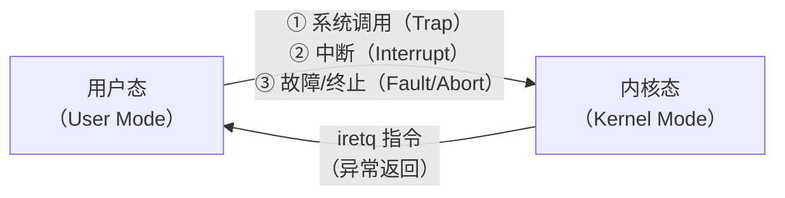
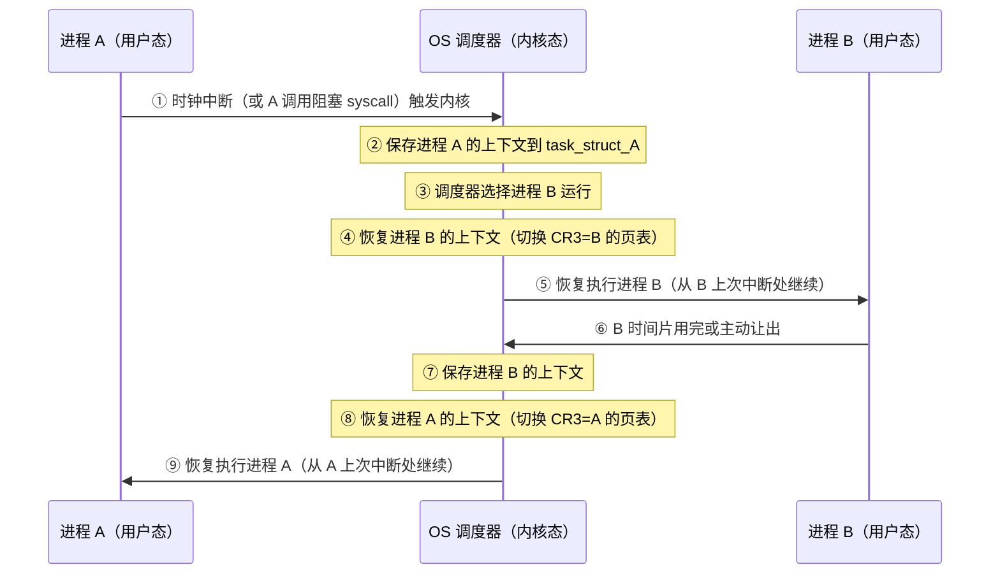

## 目录
- [[#进程的两个关键抽象]]
- [[#逻辑控制流与并发]]
- [[#私有地址空间]]
- [[#用户态与内核态]]
	- [[#模式切换的触发时机]]
- [[#上下文切换（Context Switch）]]
	- [[#上下文的组成]]
	- [[#上下文切换过程]]
- [[#💡 架构师视角映射]]
- [[#🔭 深挖指南]]

---

## 进程的两个关键抽象

**进程（Process）**：一个正在运行的程序的**实例**。

操作系统通过进程为每个程序提供两个核心的幻觉（抽象）：

> 类比：就像一个人专用的**豪华单间酒店房**——
> 1. **独占 CPU 的幻觉**：好像 CPU 只为我一个程序服务，从不停歇
> 2. **独占内存的幻觉**：好像整个地址空间（64 位系统虚拟地址空间高达 2⁶⁴ 字节）都是我一个人的

> CS 术语：
> 1. **逻辑控制流**：每个进程都感觉自己独占 CPU，通过时间片轮转实现
> 2. **私有地址空间**：每个进程都有自己独立的虚拟地址空间，由 MMU + 页表隔离

---

## 逻辑控制流与并发

```
多进程共享 CPU 的时间轴:

时间 ──────────────────────────────────────────────────▶
     ┌────────┐     ┌──────────┐     ┌───────────────┐
     │ 进程 A  │     │  进程 A  │     │    进程 A     │   ← A 感觉自己一直在跑
     └────────┘     └──────────┘     └───────────────┘
              ┌────┐           ┌────┐
              │ B  │           │ B  │                      ← B 感觉自己一直在跑
              └────┘           └────┘
                    ┌──────────┐
                    │    C     │                            ← C 感觉自己一直在跑
                    └──────────┘
     ↑              ↑           ↑              ↑
  上下文切换      上下文切换   上下文切换     上下文切换
```

**并发（Concurrency）**：在同一时间段内，多个逻辑控制流**交替执行**。

> [!info] 并发 vs 并行
> - **并发（Concurrent）**：多个流在时间段内**交替**执行（单核也可以并发，通过时间片）
> - **并行（Parallel）**：多个流在同一**时刻**同时执行（需要多核）
> - 并行是并发的子集：并行一定是并发，并发不一定是并行

---

## 私有地址空间

每个进程都有自己独立的**虚拟地址空间（Virtual Address Space）**，互相不可见、不干扰。

```
Linux 进程地址空间布局（x86-64，简化）:

0xFFFFFFFF_FFFFFFFF ─────────────────────────────────
                        内核虚拟地址空间
                        （所有进程共享内核代码+数据）
0x00007FFF_FFFFFFFF ─────────────────────────────────
                              ↑
                              │ 用户栈（向下增长）
                              │ [%rsp 当前栈顶]
                              ↓
                         ─ ─ ─ ─ ─ ─ ─ ─ ─ ─
                          共享库 / mmap 区域
                         ─ ─ ─ ─ ─ ─ ─ ─ ─ ─
                              ↑
                              │ 堆（向上增长）
                              │ [brk 当前堆顶]
                              ↓
                          .bss（未初始化全局变量）
                          .data（已初始化全局变量）
                          .text（代码段）
                          .rodata（只读数据）
0x0000000000400000 ─────────────────────────────────
                             （不可用区域）
0x0000000000000000 ─────────────────────────────────
```

> [!tip] 地址空间独立性的实现
> 每个进程有自己的**页表（Page Table）**，页表记录了虚拟地址 → 物理地址的映射。
> 不同进程的相同虚拟地址，映射到不同的物理页，从而实现隔离。
> 这是 [[9.4 虚拟内存作为内存管理的工具]] 的核心。

---

## 用户态与内核态

CPU 用一个**模式位（Mode Bit）** 区分当前运行在哪层权限：

| 模式 | 可执行的操作 | 典型执行内容 |
|------|-----------|------------|
| **用户态（User Mode）** | 受限指令集，无法直接访问硬件 | 用户应用程序 |
| **内核态（Kernel Mode）** | 全部指令集，可访问任意内存和 I/O | OS 内核代码 |

> 类比：
> - **用户态**：你是一名普通员工，只能用分配给你的工位和设备，不能随便进服务器机房。
> - **内核态**：你是 IT 管理员，有一把**万能钥匙**，可以进任何地方、操作任何设备。

### 模式切换的触发时机



> [!warning] 用户态 → 内核态切换有代价
> 每次切换需要保存用户寄存器、切换页表（TLB 可能失效）、执行内核代码，大约几百至几千个 CPU 周期。
> 这也是为什么高性能系统要尽量减少系统调用次数（如 `read` 大 Buffer 而非多次小 `read`，如 *零拷贝*（mmap/sendfile））。

---

## 上下文切换（Context Switch）

**上下文切换**是操作系统在多个进程间切换 CPU 的核心机制，由内核中的**调度器（Scheduler）** 决定何时切换。

### 上下文的组成

```
进程上下文（Context）= 进程恢复执行所需的全部状态:

┌─────────────────────────────────────────────────────────┐
│                     进程上下文                           │
├─────────────────────────────────────────────────────────┤
│  通用寄存器（RAX, RBX, ...RDI, RSI, RSP, RBP ...）       │
│  程序计数器（RIP，记录下一条指令地址）                      │
│  状态标志寄存器（EFLAGS）                                 │
│  浮点寄存器（XMM, YMM...）                               │
│  页表基地址寄存器（CR3，切换时更换页表）                    │
│  内核栈（当前进程的内核态调用栈）                          │
│  进程描述符（task_struct）：打开的文件、信号状态、PID...   │
└─────────────────────────────────────────────────────────┘
```

---

### 上下文切换过程



**切换代价**：
1. **直接代价**：保存/恢复寄存器、切换页表 → 几百个 CPU 周期
2. **间接代价**：切换页表 → TLB 全部失效（虚拟地址缓存失效）→ 后续内存访问大量缺失 → 可能损失 **数千个 CPU 周期**

> [!tip] 这就是为什么线程比进程轻量
> 同一进程内的线程切换**不需要切换页表**（共享地址空间），TLB 不失效，切换代价更低。
> 这是 Java 多线程（JUC）比多进程更常用的底层原因。

---

## 💡 架构师视角映射

> [!info] 与 Java 后端的联系

**JVM 与进程概念**：
- 一个 JVM 实例就是一个操作系统进程，它在自己独立的虚拟地址空间中管理 Java 堆、方法区、栈
- JVM 的 `-Xmx / -Xms` 本质上是在预约虚拟地址空间（调用 `mmap`），真实物理内存按需分配（缺页故障触发）

**上下文切换与 Java 并发**：
- Java `synchronized` / `ReentrantLock` 在竞争时会导致线程阻塞 → OS 级**上下文切换**
- 这就是为什么 JUC 推崇**无锁（CAS）**：避免线程阻塞，避免上下文切换的开销
- `LockSupport.park()` → 线程挂起 → 内核将其移出 CPU 调度队列（上下文切换）
- `LockSupport.unpark()` → 内核将其加回就绪队列（再次上下文切换）

**内核态切换与 I/O 模型**：
- 传统阻塞 I/O（BIO）：每次 `read()` 都可能触发内核等待 → 频繁上下文切换 → 高并发时线程数暴涨
- NIO / Netty 的 `epoll`：少量线程监控大量连接，减少线程数 → 减少上下文切换次数 → 高并发利器
- 这本质上是 **减少进入内核态的频率** 和 **减少因阻塞导致的上下文切换**

**Kubernetes / Docker 容器**：
- 容器 ≠ 虚拟机：容器内进程仍是宿主机的普通进程，共享同一个 OS 内核
- 容器的隔离靠 **Namespace**（隔离 PID、网络、文件系统）和 **Cgroups**（限制 CPU/内存）实现，而非独立内核
- 虚拟机才有真正独立的内核（更强隔离但更重）

---

## 🔭 深挖指南

> [!tip] 核心知识点与延伸阅读
>
> **本节最重要的三点**：
> 1. 进程的两个核心抽象（独占 CPU + 独占地址空间）是所有操作系统设计的起点
> 2. **上下文切换的代价**（直接 + TLB 失效的间接代价）是理解线程 vs 进程、BIO vs NIO 性能差异的底层原因
> 3. 用户态 → 内核态切换是系统调用的必经之路，理解其开销对后端性能调优至关重要
>
> **深挖路径**：
> - 进程地址空间的详细布局 → 原书 **8.2.3 节** 和 [[9.7 案例研究：Intel Core i7和Linux地址翻译]]
> - Linux 进程调度器（CFS）原理 → 《深入 Linux 内核》第 4 章
> - Java 线程与 OS 线程的映射关系 → JVM 规范中的 Thread 实现（Linux 上是 1:1 映射 pthread）
> - 容器与虚拟机的隔离原理 → 《Docker 容器与容器云》第 3 章
