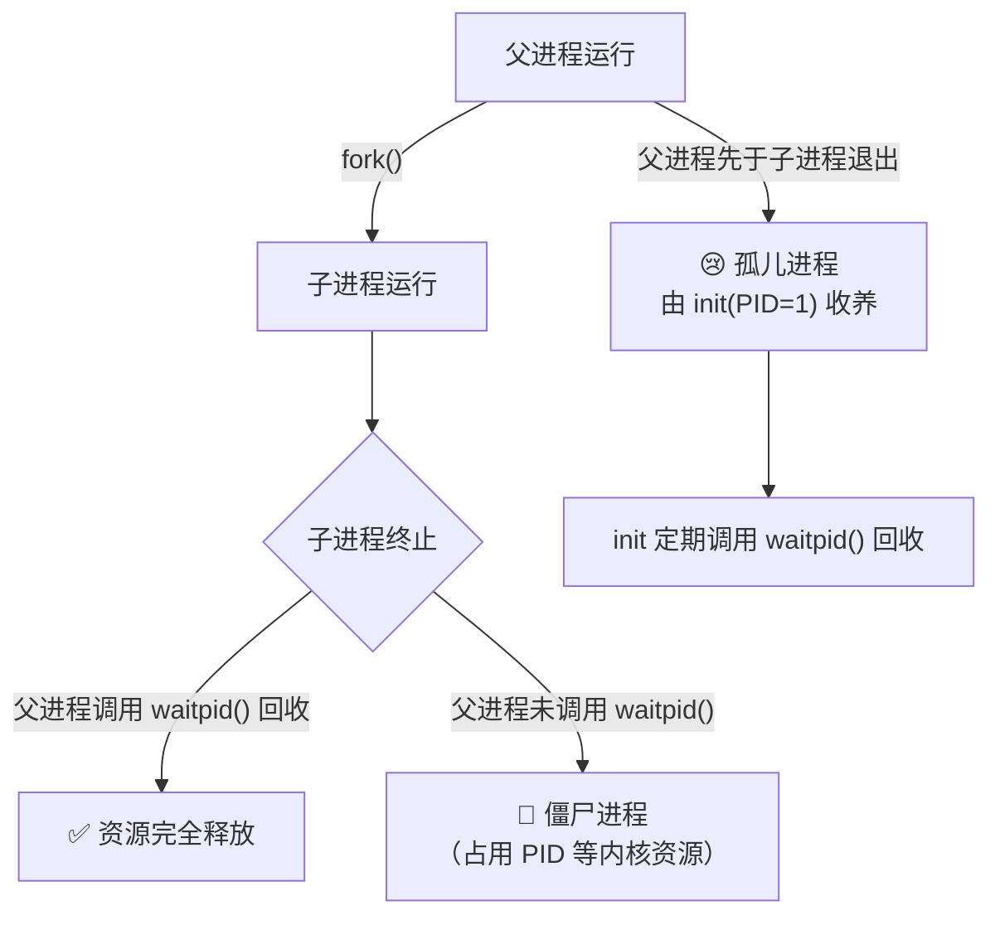
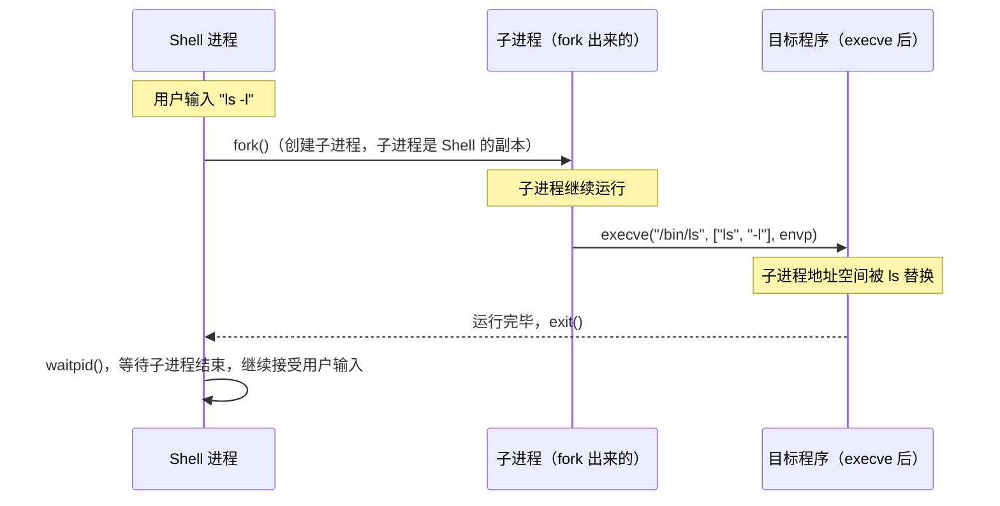

## 目录
- [[#进程标识：PID]]
- [[#创建进程：fork()]]
	- [[#fork 执行后的两个世界]]
	- [[#fork 的关键特性]]
- [[#终止进程：exit() 与 kill()]]
- [[#回收子进程：waitpid()]]
	- [[#僵尸进程与孤儿进程]]
- [[#加载并运行程序：execve()]]
- [[#fork + execve 的组合模式]]
- [[#💡 架构师视角映射]]
- [[#🔭 深挖指南]]

---

## 进程标识：PID

每个进程都有一个非负整数的**进程 ID（PID, Process ID）**。

```c
#include <unistd.h>
pid_t getpid(void);    // 返回当前进程的 PID
pid_t getppid(void);   // 返回父进程的 PID（Parent PID）
```

---

## 创建进程：fork()

**`fork()`** 是 Unix/Linux 创建新进程的唯一方式——它创建当前进程的一个**完整副本**（子进程）。

```c
#include <unistd.h>
pid_t fork(void);
// 父进程中：返回子进程的 PID（正整数）
// 子进程中：返回 0
// 失败时：返回 -1
```

### fork 执行后的两个世界

> 类比：`fork()` 就像《雪崩》中的"分叉时间线"——执行到 `fork()` 那一刻，宇宙分裂成两条平行线，父进程继续在一条线上，子进程在另一条完全独立的线上，各自运行。

```
fork() 执行后的进程树:

调用 fork() 前:
    │
    │  int x = 1;
    │  pid_t pid = fork();  ← ──► 分叉点
    │

fork() 后的两条执行流:

父进程（返回值 pid > 0）:         子进程（返回值 pid == 0）:
    │                                     │
    │  printf("parent: pid=%d", pid);     │  printf("child: pid=%d", getpid());
    │  x++;   // x=2 (父自己的副本)       │  x--;   // x=0 (子自己的副本)
    │  ...                                │  ...
    ▼                                     ▼
  父进程结束                           子进程结束
```

### fork 的关键特性

> [!important] fork 的四个核心特性
> 1. **调用一次，返回两次**：在父进程返回一次，在子进程返回一次
> 2. **地址空间独立副本**：父子进程有相同的虚拟地址空间**内容**，但是独立的副本。子进程修改变量不影响父进程（写时复制 Copy-on-Write 优化）
> 3. **文件描述符共享**：子进程继承父进程的所有打开文件，并共享相同的文件偏移量
> 4. **执行顺序不确定**：父子进程哪个先执行取决于调度器，程序不能假设执行顺序

**写时复制（Copy-on-Write, COW）**：
```
fork() 后初始状态（共享物理内存）:

父进程页表:  VA_A → PA_1（只读）  
子进程页表:  VA_A → PA_1（只读）  ← 共享同一物理页

子进程写 VA_A 时 → 触发写保护故障 → OS 复制 PA_1 → PA_2 → 子进程 VA_A 映射到 PA_2
父进程写 VA_A 时 → 触发写保护故障 → OS 复制 PA_1 → PA_3 → 父进程 VA_A 映射到 PA_3

效果：fork() 瞬间完成（无需复制内存），真正写入时才按需复制 → 极大降低 fork() 开销
```

---

## 终止进程：exit() 与 kill()

```c
#include <stdlib.h>
void exit(int status);  // 正常退出，status 是退出状态（0=成功，非0=错误）

// 常见终止原因:
// 1. main() return → 隐式调用 exit()
// 2. 显式调用 exit(n)
// 3. 收到信号（如 SIGKILL）→ 被迫终止
```

---

## 回收子进程：waitpid()

子进程终止后，内核不会立即释放其资源，而是保留一个**僵尸状态（Zombie）**，等待父进程"收尸"。

```c
#include <sys/wait.h>
pid_t waitpid(pid_t pid, int *statusp, int options);
// pid=-1：等待任意子进程
// statusp：输出子进程的退出状态
// options=0：阻塞等待；WNOHANG：非阻塞（立即返回）
```

**典型用法**：
```c
pid_t pid;
int status;

// 阻塞等待任意子进程退出
while ((pid = waitpid(-1, &status, 0)) > 0) {
    if (WIFEXITED(status)) {  // 正常退出
        printf("子进程 %d 退出，状态码 = %d\n", pid, WEXITSTATUS(status));
    }
}
```

### 僵尸进程与孤儿进程



> [!warning] 僵尸进程的危害
> 僵尸进程会占用 PID 槽位和部分内核内存。如果父进程不回收子进程，且持续创建子进程（如高并发服务器），系统 PID 耗尽，新进程无法创建 → **服务崩溃**。
>
> 解决方式：为 `SIGCHLD` 信号注册处理函数，在处理函数中调用 `waitpid(-1, NULL, WNOHANG)` 回收所有已终止子进程。

---

## 加载并运行程序：execve()

**`execve()`** 在当前进程的地址空间中加载并运行一个新程序，**替换**当前进程的全部内容（代码、数据、堆、栈），但**PID 不变**。

```c
#include <unistd.h>
int execve(const char *filename,   // 可执行文件路径
           const char *argv[],     // 参数列表（argv[0] 通常是程序名）
           const char *envp[]);    // 环境变量列表
// 成功：不返回（进程已被替换）
// 失败：返回 -1，设置 errno
```

> 类比：`execve()` 就像**灵魂转移**——外壳（PID、打开的文件）保留，但内里的代码、数据全部换成新程序的。就像演员换了一个角色的剧本，但演员本人（进程表记录）还是同一个人。

---

## fork + execve 的组合模式

Shell 执行任何命令的底层实现都是 **`fork` + `execve`** 的组合：



```c
// Shell 的简化核心逻辑
while (1) {
    char *cmd = read_command();      // 读取用户输入

    pid_t pid = Fork();              // fork 子进程
    if (pid == 0) {                  // 子进程
        execve(cmd, argv, environ);  // execve 替换为目标程序
        // 如果 execve 返回了，说明执行失败
        fprintf(stderr, "execve failed\n");
        exit(1);
    }
    // 父进程（Shell）等待子进程完成
    waitpid(pid, NULL, 0);
}
```

---

## 💡 架构师视角映射

> [!info] 与 Java 后端的联系

**Java 多进程模型**：
- `Runtime.exec()` / `ProcessBuilder` 底层就是 `fork() + execve()`
- 创建新 JVM 进程（如 Spring Boot 应用）= fork 一个 JVM 进程 + execve java 命令

**Redis 的 RDB 持久化**：
- Redis 执行 `BGSAVE` 或 `BGREWRITEAOF` 时，调用 **`fork()`** 创建子进程持久化数据
- 父进程（Redis 主进程）继续处理请求，子进程执行写磁盘
- 利用 **写时复制（COW）**：fork 后，父子进程共享全部数据页。父进程修改数据时才复制对应页，子进程看到的是 fork 瞬间的内存快照
- **这就是 Redis 能在不阻塞服务的情况下生成 RDB 快照的底层原理！**

**Nginx 的多进程模型**：
- Nginx master 进程 fork 多个 worker 进程，每个 worker 独立处理请求
- 利用 Linux 的 `accept_mutex` 或 `reuseport` 避免惊群效应（Thunder Herd）

**JVM 线程与进程**：
- JVM 内部 Java 线程 → 对应 Linux `pthread`（轻量级进程 LWP）
- 同一 JVM 的所有线程共享地址空间，切换时不需要切换 CR3，比进程切换轻量得多

---

## 🔭 深挖指南

> [!tip] 核心知识点与延伸阅读
>
> **本节最重要的三点**：
> 1. `fork()` 调用一次、返回两次——理解父子进程的分叉执行逻辑
> 2. **写时复制（COW）** 让 fork() 代价极低，是 Redis BGSAVE 等众多工程实践的基础
> 3. `fork + execve` 是 Shell 执行任何程序的基础模式，理解后对 Linux 系统调用的整体逻辑豁然开朗
>
> **深挖路径**：
> - fork() 内核实现（copy_process）→ 《深入 Linux 内核》第 3 章
> - 写时复制的详细实现 → 原书 **9.8 节**（动态内存分配）+ Linux 内核中的 `copy_page_range`
> - Redis BGSAVE + COW 详解 → Redis 源码 `rdb.c:rdbSaveBackground()`
> - 僵尸进程排查实战 → `ps aux | grep Z`，`strace -p [父进程PID]`
