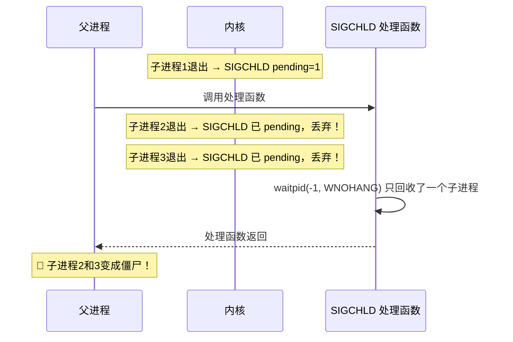

## 目录
- [[#信号是什么]]
- [[#常见 Linux 信号一览]]
- [[#信号的发送与接收]]
	- [[#发送信号]]
	- [[#接收信号（处理信号）]]
- [[#信号的阻塞与未决]]
- [[#编写安全的信号处理函数]]
	- [[#异步信号安全（Async-Signal-Safe）]]
	- [[#保存恢复 errno]]
	- [[#用 volatile 修饰共享变量]]
- [[#信号的非队列特性（信号丢失问题）]]
- [[#💡 架构师视角映射]]
- [[#🔭 深挖指南]]

---

## 信号是什么

**信号（Signal）**：一种发送给进程的软件**通知（notification）**，告知某个事件发生了。

> 类比：信号就像操作系统给进程发送的**短信通知**。内容只有一个"信号号码"（比如 SIGKILL=9），没有附加数据。进程收到后，可以忽略它（ignore）、用默认方式处理（default）、或者用自定义函数处理（handler）。

> CS 术语：信号是 Linux 异常控制流的**软件层面扩展**，让内核和进程之间、进程与进程之间能异步通信。

---

## 常见 Linux 信号一览

| 信号号 | 名称 | 默认行为 | 典型触发场景 |
|-------|------|---------|------------|
| 1 | `SIGHUP` | 终止 | 终端挂起 / 守护进程重载配置 |
| 2 | `SIGINT` | 终止 | 用户按 **Ctrl+C** |
| 3 | `SIGQUIT` | 终止+Core | 用户按 **Ctrl+\\** |
| 6 | `SIGABRT` | 终止+Core | `abort()` 调用 |
| 9 | `SIGKILL` | 终止 | **不可被捕获/忽略！** `kill -9` |
| 11 | `SIGSEGV` | 终止+Core | 段错误（非法内存访问） |
| 14 | `SIGALRM` | 终止 | `alarm()` 计时器到期 |
| 15 | `SIGTERM` | 终止 | `kill` 命令默认发送，**可以被捕获** |
| 17 | `SIGCHLD` | 忽略 | 子进程停止或终止 |
| 18 | `SIGCONT` | 继续 | 让停止的进程继续（`fg` 命令） |
| 19 | `SIGSTOP` | 停止 | **不可被捕获/忽略！** `Ctrl+Z` |
| 20 | `SIGTSTP` | 停止 | `Ctrl+Z`（可被捕获）|

> [!warning] SIGKILL 和 SIGSTOP 不可屏蔽
> 这两个信号永远不能被进程捕获或忽略，是内核保留的"最终手段"。
> 这就是为什么 `kill -9` 总是能杀死进程（即使进程进入了死循环或故意忽略 SIGTERM）。

---

## 信号的发送与接收

### 发送信号

```c
#include <signal.h>
int kill(pid_t pid, int sig);
// pid > 0：发送给进程 pid
// pid = 0：发送给同一进程组的所有进程
// pid = -1：发送给所有有权限的进程
// pid < -1：发送给进程组 |pid| 的所有进程

// 进程给自己发信号
int kill(getpid(), SIGUSR1);

// 用 raise() 更简洁
int raise(int sig);  // 等价于 kill(getpid(), sig)
```

```bash
# Shell 命令发送信号
kill -15 1234    # 发送 SIGTERM 给进程 1234（优雅停止）
kill -9 1234     # 发送 SIGKILL 给进程 1234（强制杀死）
kill -HUP 1234   # 发送 SIGHUP（守护进程重载配置的惯例用法）
```

---

### 接收信号（处理信号）

```c
#include <signal.h>
typedef void (*sighandler_t)(int);

sighandler_t signal(int signum, sighandler_t handler);
// handler = SIG_DFL：恢复默认行为
// handler = SIG_IGN：忽略该信号
// handler = 自定义函数指针：注册信号处理函数

// 示例：捕获 Ctrl+C（SIGINT），优雅退出
volatile sig_atomic_t quit_flag = 0;

void sigint_handler(int sig) {
    write(STDOUT_FILENO, "\n收到 SIGINT，准备退出...\n", 30);  // 异步安全版输出
    quit_flag = 1;  // 设置标志，主循环检查后退出
}

int main() {
    signal(SIGINT, sigint_handler);

    while (!quit_flag) {
        // 正常工作...
        sleep(1);
    }
    // 清理资源
    cleanup();
    return 0;
}
```

---

## 信号的阻塞与未决

```
信号的三种状态:

┌────────────────────────────────────────────────────────────────┐
│  信号 k 的状态（对于某个进程）:                                   │
│                                                                │
│  pending（未决）位：该信号是否已发送但尚未被处理                   │
│  block（阻塞）位：是否暂时屏蔽该信号（即使发送也不处理）            │
│                                                                │
│  发送信号 → pending 置 1                                        │
│  pending=1 且 blocked=0 → 信号被"交付（delivered）"给进程处理   │
│  pending=1 且 blocked=1 → 信号处于"未决（pending）"状态，等待解除│
└────────────────────────────────────────────────────────────────┘
```

```c
#include <signal.h>
// 使用 sigprocmask 阻塞/解除阻塞信号
sigset_t mask, prev;
sigemptyset(&mask);
sigaddset(&mask, SIGCHLD);

// 阻塞 SIGCHLD
sigprocmask(SIG_BLOCK, &mask, &prev);

// ... 临界区操作 ...

// 恢复之前的阻塞集合
sigprocmask(SIG_SETMASK, &prev, NULL);
```

> [!important] 信号不是队列
> 每个信号类型只有 1 个 pending 位。在信号处理函数执行期间，同类型的新信号到来只会设置 pending=1，**不会排队**。如果已经 pending，新到来的同类型信号会被**丢弃**。
> 这意味着：如果同时有 5 个子进程退出（5 个 SIGCHLD），你的处理函数**只能保证至少调用一次**，不保证调用 5 次！

---

## 编写安全的信号处理函数

信号处理函数是异步调用的，必须遵守严格的安全规范：

### 异步信号安全（Async-Signal-Safe）

> [!caution] 信号处理函数只能调用异步安全的函数！
> 异步安全 = 可重入（Reentrant）= 不访问共享状态（或只使用原子操作）
>
> **禁止**在信号处理函数中调用：
> - `printf`、`fprintf`（内部有锁，不可重入）
> - `malloc`、`free`（内部有全局锁）
> - `exit`（调用 atexit 钩子，有共享状态）
>
> **可以**调用：
> - `write`（系统调用，可重入）
> - `_exit`（直接退出，无清理步骤）
> - `signal`、`sigprocmask`

### 保存恢复 errno

```c
void sigchld_handler(int sig) {
    int saved_errno = errno;  // ① 保存 errno

    // ... 调用可能修改 errno 的函数 ...
    pid_t pid;
    while ((pid = waitpid(-1, NULL, WNOHANG)) > 0) {
        // 回收所有已退出子进程
    }

    errno = saved_errno;      // ② 恢复 errno
}
// 原因：信号处理函数可能在任意时刻打断主程序，主程序可能正要检查 errno
```

### 用 volatile 修饰共享变量

```c
// 信号处理函数与主程序共享的标志必须声明为 volatile
volatile sig_atomic_t flag = 0;  // ✅ volatile + sig_atomic_t（原子读写保证）

void handler(int sig) {
    flag = 1;  // 原子写
}

int main() {
    signal(SIGUSR1, handler);
    while (!flag) {  // 主循环读取 flag
        pause();     // 等待信号到来
    }
    // ...
}
```

---

## 信号的非队列特性（信号丢失问题）



**正确写法**：在 SIGCHLD 处理函数中用**循环**回收所有已退出子进程：

```c
void sigchld_handler(int sig) {
    int saved_errno = errno;
    pid_t pid;
    // 循环直到没有更多已退出子进程
    while ((pid = waitpid(-1, NULL, WNOHANG)) > 0) {
        printf("回收子进程 %d\n", pid);
    }
    errno = saved_errno;
}
```

---

## 💡 架构师视角映射

> [!info] 与 Java 后端的联系

**JVM 的信号处理**：
- JVM 内部注册了大量信号处理函数，接管了 SIGSEGV（用于 NullPointerException）、SIGBUS、SIGFPE 等
- `sun.misc.Signal`（以及 JDK 9+ 的 `jdk.internal.misc.Signal`）允许 Java 代码注册自己的信号处理逻辑
- Spring Boot 应用的**优雅停机（Graceful Shutdown）**：容器发送 `SIGTERM`（kill -15），JVM 的 ShutdownHook 被触发，执行清理逻辑（关闭连接池、完成正在处理的请求）

**Linux 守护进程管理（systemd）**：
- `systemd` 通过 `SIGTERM` 请求服务优雅停止，等待超时再发 `SIGKILL`
- Java 服务的 `spring.lifecycle.timeout-per-shutdown-phase` 配置的本质，就是控制响应 SIGTERM 的最大时间

**Kubernetes 的 Pod 优雅终止**：
```
Pod 删除流程:
1. k8s 发送 SIGTERM → 应用开始优雅停机
2. preStop Hook 执行（如 sleep 5，等待 Ingress 摘除流量）
3. terminationGracePeriodSeconds 倒计时（默认 30s）
4. 超时未退出 → k8s 发送 SIGKILL 强制终止
对应：SIGTERM（可捕获+优雅处理）→ SIGKILL（不可捕获+强制）
```

**Redis 的信号处理**：
- Redis 捕获 `SIGTERM` → 执行 `shutdown save` → 先持久化再退出
- 捕获 `SIGHUP` → 重新加载配置（无需重启）

---

## 🔭 深挖指南

> [!tip] 核心知识点与延伸阅读
>
> **本节最重要的三点**：
> 1. **信号不排队**（每种信号只有 1 个 pending 位）→ SIGCHLD 处理函数必须用循环 `waitpid` 回收所有子进程
> 2. 信号处理函数只能调用**异步安全**函数——这是信号编程最容易踩坑的地方
> 3. `SIGTERM`（优雅停机）vs `SIGKILL`（强制终止）是生产运维的必备知识
>
> **深挖路径**：
> - 信号的完整发送/接收/阻塞机制 → 原书 **8.5.1~8.5.7 节**
> - POSIX 异步安全函数完整列表 → `man 7 signal-safety`
> - Java ShutdownHook 实现原理 → JDK 源码 `ApplicationShutdownHooks.java`
> - 《Unix 网络编程》卷 1 第 5 章：信号在并发服务器中的应用
