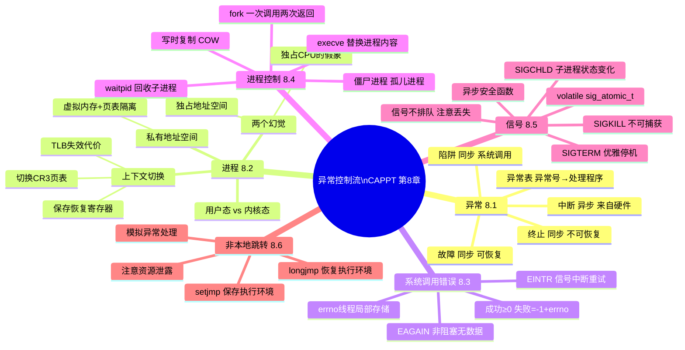

## 目录
- [[#非本地跳转（Nonlocal Jump）]]
	- [[#setjmp 与 longjmp]]
	- [[#使用场景]]
	- [[#非本地跳转的危险]]
- [[#第八章小结]]
	- [[#ECF 全景思维导图]]
	- [[#核心概念总结]]
- [[#💡 架构师视角映射]]
- [[#🔭 深挖指南]]

---

## 非本地跳转（Nonlocal Jump）

**非本地跳转**：C 语言提供的一种直接跳转到**任意调用栈位置**的机制，跨越正常的函数返回规则。

> 类比：正常出门需要逐层走楼梯（函数返回），而非本地跳转相当于直接"传送"——不管你在哪一层楼，一秒钟跳回到你预先标记的那个入口处。

> CS 术语：**非本地跳转直接操作调用栈（Call Stack）**，将栈指针恢复到 `setjmp` 时保存的状态，跳过中间所有函数帧的正常返回流程。

---

### setjmp 与 longjmp

```c
#include <setjmp.h>

int setjmp(jmp_buf env);
// 第一次调用：保存当前执行环境（寄存器、栈指针、返回地址）到 env，返回 0
// 被 longjmp 跳转回来时：以指定的 retval 作为"返回值"

void longjmp(jmp_buf env, int retval);
// 恢复 env 中保存的执行环境，跳回到对应的 setjmp 调用位置
// retval 不能为 0（若传 0，longjmp 会自动改成 1）
```

```c
// 示例：用 setjmp/longjmp 实现异常处理（C 语言没有 try-catch）
#include <stdio.h>
#include <setjmp.h>

jmp_buf buf;  // 保存跳转目标的环境

void risky_func() {
    printf("risky_func: 发现错误，准备跳出...\n");
    longjmp(buf, 1);  // 跳回 setjmp 处，返回值 = 1
    printf("risky_func: 这行永远不会执行\n");
}

int main() {
    int ret = setjmp(buf);  // 设置跳转点

    if (ret == 0) {
        printf("第一次执行 setjmp，ret = 0\n");
        risky_func();       // 调用可能失败的函数
    } else {
        printf("从 longjmp 跳转回来，ret = %d，处理错误\n", ret);
    }

    return 0;
}
```

```
执行流程:
main() → setjmp(ret=0) → risky_func() → longjmp()
                ↑________________________________|
                重新从 setjmp 处执行，此时 ret=1
                进入 else 分支处理错误
```

---

### 使用场景

**场景 1：C 语言的"异常处理"**

没有 `try-catch` 的 C 语言，可以用 `setjmp/longjmp` 模拟：

```c
jmp_buf error_handler;

int safe_divide(int a, int b) {
    if (b == 0) longjmp(error_handler, ERR_DIV_ZERO);
    return a / b;
}

int main() {
    if (setjmp(error_handler) == 0) {
        // try
        int result = safe_divide(10, 0);
        printf("结果: %d\n", result);
    } else {
        // catch
        printf("错误: 除零！\n");
    }
}
```

**场景 2：信号处理后的软重启**

```c
jmp_buf restart;

void sigint_handler(int sig) {
    longjmp(restart, 1);  // 收到 SIGINT 后跳回主循环入口
}

int main() {
    signal(SIGINT, sigint_handler);
    setjmp(restart);          // 跳转目标
    while (1) {
        do_request();         // 处理请求，若 Ctrl+C 就重新开始
    }
}
```

---

### 非本地跳转的危险

> [!warning] 非本地跳转的三大陷阱
> 1. **资源泄露**：`longjmp` 跳过了中间函数的清理代码（如 `free`、`close`），可能造成内存/文件描述符泄露。
>    （这正是 Java/C++ 用 finally/RAII 解决的问题）
> 2. **longjmp 回到已返回的函数**：如果 `setjmp` 所在的函数已经返回，`longjmp` 跳回去会访问已被销毁的栈帧 → **未定义行为**！
> 3. **volatile 变量问题**：`longjmp` 后，`setjmp` 所在函数中未用 `volatile` 修饰的局部变量可能被恢复为 `setjmp` 时的旧值（编译器优化导致）。

---

## 第八章小结

### ECF 全景思维导图



---

### 核心概念总结

| 概念 | 核心要点 | 工程关联 |
|------|---------|---------|
| 四种异常 | 中断（异步）、陷阱（系统调用）、故障（可恢复）、终止 | 系统调用、缺页故障、NullPointerException |
| 进程 | 独占CPU+独占地址空间的幻觉 | JVM 是一个 OS 进程，Java 线程共享地址空间 |
| 上下文切换 | 保存/恢复寄存器+切换页表，有TLB失效的间接代价 | BIO vs NIO 的性能差异底层原因 |
| fork/execve | 一次调用两次返回；写时复制（COW）降低 fork 代价 | Redis BGSAVE、Shell 执行命令的底层 |
| 信号 | 软件通知机制；不排队；处理函数仅可调用异步安全函数 | SIGTERM 优雅停机、Kubernetes Pod 终止 |
| 非本地跳转 | C 语言的"异常处理"机制，绕过正常栈帧返回 | Java try-catch 的前身概念 |

> [!tip] ECF 是这一切的基础
> 进程调度依赖**时钟中断**（ECF）；
> 系统调用依赖**陷阱**（ECF）；
> 缺页的虚拟内存机制依赖**故障**（ECF）；
> 信号是**软件层**的 ECF 扩展。
>
> 理解了 ECF，基本上就打通了"操作系统如何控制一切"的完整链路。

---

## 💡 架构师视角映射

> [!info] Java try-catch 与 setjmp/longjmp 的关系

Java 的 try-catch 机制在概念上是 `setjmp/longjmp` 的优雅进化：
- `try {}` = `setjmp(env)`：登记可能的跳转点
- `throw new Exception()` = `longjmp(env, code)`：触发跳转
- `finally {}` = 保证在跳转过程中也能执行的清理代码（解决了 longjmp 的资源泄露问题）
- JVM 字节码中用**异常表（Exception Table）** 实现，记录每个 try 块对应的 catch/finally 处理程序地址

```java
try {
    riskyOperation();    // 可能抛 RuntimeException
} catch (Exception e) {
    handleError(e);      // longjmp 跳到这里
} finally {
    cleanup();           // 保证执行，解决资源泄露问题
}
```

---

## 🔭 深挖指南

> [!tip] 核心知识点与延伸阅读
>
> **本节最重要的两点**：
> 1. `setjmp/longjmp` 的执行流程（调用一次，返回多次）——理解这个才能理解 try-catch 的本质
> 2. `longjmp` 资源泄露问题 → `finally / RAII` 的存在意义
>
> **第 8 章整体深挖路径**：
> - ECF 完整实现（异常表、中断向量表）→ 原书 **8.1 节** + Intel SDM 卷 3A 第 6 章
> - Linux 进程调度 CFS 完整原理 → 《深入理解 Linux 内核》第 7 章
> - JVM 字节码异常表 → `javap -verbose YourClass.class` 查看异常表
> - setjmp/longjmp 的高级用法（协程实现）→ 参考 Lua、ucontext.h 的实现
> - 《操作系统导论》(OSTEP) 全书免费在线阅读，是 CSAPP 第 8 章的最佳配套材料
