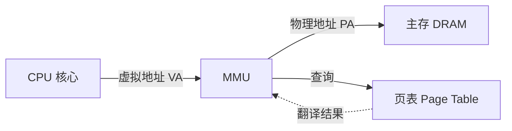

## 目录
- [[#物理寻址（Physical Addressing）]]
- [[#虚拟寻址（Virtual Addressing）]]
- [[#MMU：地址翻译的硬件核心]]
- [[#💡 架构师视角映射]]
- [[#🔭 深挖指南]]

---

## 物理寻址（Physical Addressing）

最简单的寻址方式：CPU 直接用**物理地址（Physical Address, PA）** 访问主存。

```
物理寻址模型:

  CPU 发出地址 4  ──────────────►  主存（DRAM）
                                    │
                  ┌─────────────────┼─────────────────┐
                  │  [0] [1] [2] [3]│[4] [5] [6] [7]  │
                  │                  ▲                  │
                  │              返回该字节             │
                  └────────────────────────────────────┘
```

> 类比：你在一个巨大的快递柜前，柜子编号就是 0、1、2、3……你直接说"给我 4 号柜的东西"，管理员直接打开 4 号柜 → 这就是**物理寻址**。
> CS 术语：CPU 发出的地址直接对应 DRAM 中的物理字节位置，**没有任何翻译层**。

**使用场景**：早期简单系统、嵌入式微控制器、DSP 等。这些系统没有操作系统或只有极简 OS，不需要多进程隔离。

---

## 虚拟寻址（Virtual Addressing）

现代处理器使用**虚拟寻址**：CPU 生成的是**虚拟地址（Virtual Address, VA）**，在到达主存之前必须经过**地址翻译**才能转换为物理地址。

```
虚拟寻址模型:

  CPU ─── 虚拟地址(VA) ──►  MMU ─── 物理地址(PA) ──►  主存（DRAM）
                              │
                              │ 查询
                              ▼
                          页表（Page Table）
                         （存储在主存中）
```

> 类比：你在一个"别名系统"的快递柜前。你说"给我小明的快递"（虚拟地址），前台查了一下"小明 = 4 号柜"（翻译），然后帮你打开 4 号柜（物理地址）。你永远不需要关心物理编号，前台帮你做映射。
> CS 术语：CPU 产生的虚拟地址经过 **MMU（Memory Management Unit，内存管理单元）** 硬件实时翻译为物理地址，才能访问实际的 DRAM。

> [!important] 虚拟寻址的意义
> 虚拟寻址是一切现代操作系统能力的基石：
> - **进程隔离**：每个进程有独立的虚拟地址空间，互不干扰
> - **内存保护**：OS 控制哪些地址可读/可写/可执行
> - **内存超卖**：虚拟空间可以远大于物理内存（磁盘辅助）
> - **简化编程**：每个进程都认为自己独占整个内存空间

---

## MMU：地址翻译的硬件核心

**MMU（Memory Management Unit）** 是 CPU 芯片上的专用硬件，负责将虚拟地址翻译为物理地址。



MMU 的翻译过程依赖**页表（Page Table）**，页表存储在主存中，由操作系统内核负责维护和更新。

> [!info] 硬件与软件的协作
> **硬件（MMU）** 做翻译 → 速度极快（纳秒级）
> **软件（OS 内核）** 维护页表 → 决定映射关系
> 当翻译出错（如缺页）时，MMU 触发异常 → OS 接管处理（参见 [[8.1 异常]]）

---

## 💡 架构师视角映射

> [!info] 与 Java 后端的联系

**JVM 运行在虚拟寻址之上**：
- Java 程序中 `new Object()` 分配的内存地址是**虚拟地址**
- JVM 通过 `mmap` 系统调用向 OS 申请虚拟内存段（堆、方法区、线程栈等）
- 真正的物理内存由 OS 通过 MMU + 页表按需分配

**`-Xmx` 设置的是虚拟内存上限**：
- 例如 `-Xmx4g` 意味着 JVM 堆的虚拟地址空间最大 4GB
- 但实际占用的物理内存（RSS）通常远小于 4GB → 虚拟寻址的功劳
- 使用 `top` 命令看到的 `VIRT`（虚拟内存）和 `RES`（常驻物理内存）的区别就源于此

**Docker 容器的内存限制**：
- `docker run --memory=2g` 限制的是容器的物理内存使用量
- JVM 不感知容器边界 → 如果 `-Xmx` 设太大，OS 的 OOM Killer 可能直接杀进程
- 现代 JVM（JDK 10+）可以自动感知 cgroup 限制，但理解底层机制更重要

---

## 🔭 深挖指南

> [!tip] 核心知识点与延伸阅读
>
> **本节最重要的两点**：
> 1. **物理寻址 vs 虚拟寻址**的根本区别——现代系统全部使用虚拟寻址
> 2. **MMU 是硬件翻译器**——在 CPU 和主存之间做实时地址转换，依赖 OS 维护的页表
>
> **深挖路径**：
> - 虚拟地址如何具体翻译为物理地址 → 本章 [[9.6 地址翻译]]
> - MMU 内部的 TLB 加速机制 → 原书 **9.6.2 节**
> - 多级页表的设计与权衡 → 原书 **9.6.3 节**
> - JVM 内存模型与 OS 虚拟内存的关系 → 《深入理解 Java 虚拟机》第 2 章
