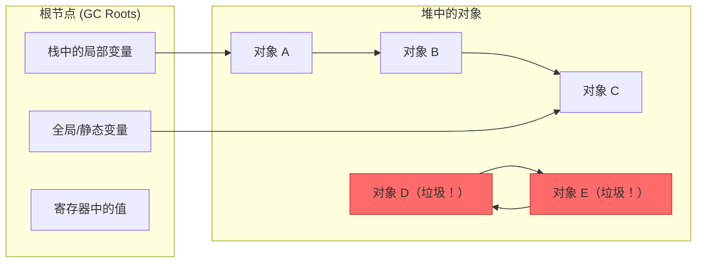

## 目录
- [[#垃圾收集的基本概念]]
- [[#可达性图]]
- [[#Mark & Sweep 垃圾收集器]]
- [[#保守的 Mark & Sweep（C 语言的困境）]]
- [[#💡 架构师视角映射]]
- [[#🔭 深挖指南]]

---

## 垃圾收集的基本概念

**垃圾收集器（Garbage Collector, GC）** 是一种**隐式分配器**——程序员只负责分配（`malloc` / `new`），释放由 GC 自动完成。

```
显式 vs 隐式释放:

  C 语言（显式释放）:
    int *p = malloc(100);
    // ... 使用 p ...
    free(p);           ← 程序员负责释放，忘了就内存泄漏

  Java / Go / Python（隐式释放 = GC）:
    Object obj = new Object();
    // ... 使用 obj ...
    obj = null;        ← 不需要手动释放
    // GC 会在某个时刻自动回收 obj 占用的内存
```

> 类比：显式释放就像你自己清理餐桌——吃完了必须自己收碗，忘了就堆在那里（内存泄漏）。GC 就像餐厅的服务员巡视——你吃完放下碗筷（不再引用），服务员发现没人用了就自动收走。
> CS 术语：GC 通过分析**对象的可达性（Reachability）** 来判断哪些内存可以安全回收。

---

## 可达性图

GC 的核心思路：**从根节点出发，通过指针能到达的对象是"活的"，到达不了的就是"垃圾"**。



```
可达性分析:

  从所有 GC Roots 出发，沿着指针做图的遍历（BFS/DFS）:
  ✅ A → 可达（从 R1 经过指针到达）
  ✅ B → 可达（从 A 到达）
  ✅ C → 可达（从 B 或 R2 到达）
  ❌ D → 不可达（没有任何根能到达它）
  ❌ E → 不可达（虽然 D→E→D 形成环，但整个环不可达）

  结论：D 和 E 是垃圾，应被回收
```

> [!important] 循环引用不影响 GC
> D 和 E 互相引用形成环，但由于没有任何根节点能到达这个环 → 它们仍然是垃圾。
> 这是 **可达性分析**（Java、Go）优于**引用计数**（Python、Swift）的地方：引用计数无法处理循环引用。

---

## Mark & Sweep 垃圾收集器

**标记-清除（Mark & Sweep）** 是最基础的 GC 算法，分两个阶段：

```
Mark & Sweep 的两个阶段:

  阶段1: Mark（标记）
  ─────────────────────────────
  从所有 GC Roots 出发，遍历可达性图
  将所有可达的对象标记为 "已标记"

  阶段2: Sweep（清除）
  ─────────────────────────────
  遍历整个堆，将所有 "未标记" 的对象释放（加入空闲链表）
  清除所有对象的标记（为下次 GC 做准备）
```

```c
// Mark 阶段伪代码（深度优先遍历）
void mark(ptr p) {
    if (!is_ptr(p)) return;            // 不是指针，跳过
    if (is_marked(p)) return;          // 已标记，跳过（防止循环）
    set_marked(p);                     // 标记为可达
    for (int i = 0; i < length(p); i++) {
        mark(p[i]);                    // 递归标记所有子指针
    }
}

// Sweep 阶段伪代码
void sweep() {
    ptr p = heap_start;
    while (p < heap_end) {
        if (is_marked(p)) {
            unset_marked(p);           // 清除标记（留到下次 GC 判断）
        } else {
            free(p);                   // 未标记 → 垃圾 → 释放
        }
        p = next_block(p);             // 移到下一个块
    }
}
```

---

## 保守的 Mark & Sweep（C 语言的困境）

C 和 C++ 不存储类型信息 → GC 无法精确判断一个值是**指针**还是**整数**。

| 语言 | 指针识别 | GC 精确度 |
|------|---------|----------|
| Java / Go | 精确（有类型信息、对象头） | **精确 GC**：100% 正确识别指针 |
| C / C++ | 无法确定 | **保守 GC**：可能将整数误认为指针 |

```
保守 GC 的问题:

  栈上有一个值: 0x0060A000

  这是一个指针吗？还是碰巧等于某个地址的整数？
  保守 GC 的策略：如果它"看起来像"指针（值在堆地址范围内）→ 按指针处理
  
  后果：
  - 不会漏标（不会误释放活着的对象）→ ✅ 安全
  - 但可能多标（把无关整数当指针，对象不该保留却被保留了）→ ❌ 内存浪费
```

> [!warning] 保守 GC 永远不会误释放，但可能内存泄漏
> 这是一种安全但不精确的权衡。实际中 C/C++ 很少使用 GC（Boehm GC 是一个例外），更多依赖手动内存管理或 RAII（C++）。

---

## 💡 架构师视角映射

> [!info] 与 Java 后端的联系

**JVM GC 是 Mark & Sweep 的高级演化**：
- **Serial GC**：最基础的 Mark-Sweep-Compact，单线程，STW
- **CMS GC**：并发标记清除，减少 STW 时间，但有碎片问题
- **G1 GC**：Region 化 + 增量回收 + 复制算法 → 可控 STW
- **ZGC / Shenandoah**：着色指针 + 读屏障 → 亚毫秒 STW → 最先进的 GC

**GC Roots 在 JVM 中的具体实现**：
- 虚拟机栈中的局部变量表中引用的对象
- 方法区中类静态属性引用的对象
- 方法区中常量引用的对象
- JNI（Native 方法）引用的对象
- 活跃线程对象
- JVM 使用 **OopMap** 精确记录栈帧中哪些位置是指针 → **精确 GC**

**Go 的 GC 对比**：
- Go 使用**三色标记 + 写屏障**实现并发 GC
- 与 JVM 的 CMS/G1 思路相似，但更简单（没有分代）
- 目标是极低延迟（< 1ms STW）

---

## 🔭 深挖指南

> [!tip] 核心知识点与延伸阅读
>
> **本节最重要的两点**：
> 1. **可达性分析**是现代 GC 的理论基础——从 GC Roots 出发的图遍历
> 2. **精确 GC vs 保守 GC**——Java 有类型信息所以能精确 GC，C 没有所以只能保守
>
> **深挖路径**：
> - JVM 各代 GC 的实现原理 → 《深入理解 Java 虚拟机》第 3 章
> - 三色标记算法与写屏障 → 原书中无详细展开，推荐《The Garbage Collection Handbook》
> - Go GC 的设计文档 → Go 官方博客 "Getting to Go: The Journey of Go's Garbage Collector"
> - OopMap 与安全点（Safepoint） → HotSpot 源码 `oop.hpp`
