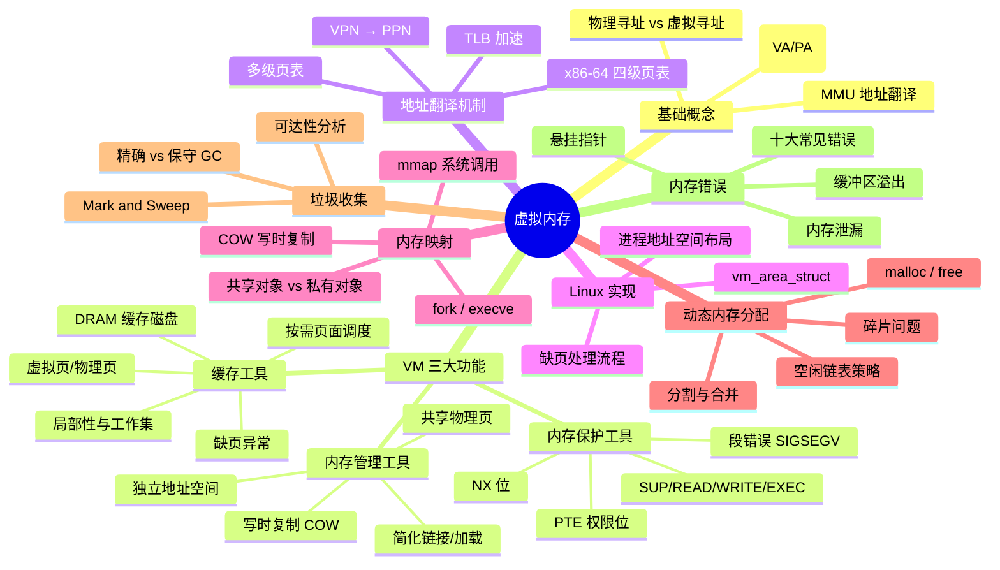
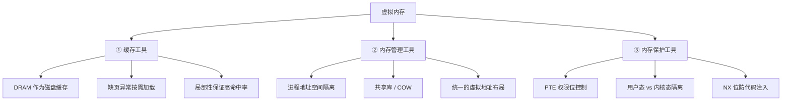

## 目录
- [[#第九章知识全景图]]
- [[#核心概念速查表]]
- [[#虚拟内存的三重身份]]
- [[#与 Java 后端的关键映射]]

---

## 第九章知识全景图

---

## 核心概念速查表

| 概念 | 核心要点 |
|------|---------|
| 虚拟寻址 | CPU 产生虚拟地址 → MMU 翻译为物理地址 → 访问 DRAM |
| 页 | 虚拟/物理内存被分为固定大小的块（通常 4KB），是管理的基本单位 |
| 页表 | 每进程一个，存储 VPN → PPN 的映射关系（+ 权限位） |
| 缺页异常 | 访问未缓存的虚拟页 → MMU 触发异常 → OS 从磁盘加载 → 重新执行 |
| TLB | MMU 中的 PTE 缓存，命中率 > 99%，避免每次访问主存中的页表 |
| 多级页表 | 稀疏表示，避免为未使用的地址空间分配页表空间 |
| 内存映射 | mmap 将文件/匿名区域映射到虚拟地址空间，按需加载 |
| 写时复制 | 共享只读页，写入时才复制独立副本 → fork 高效实现 |
| 动态分配 | malloc/free 管理堆空间，核心问题是碎片和效率 |
| 垃圾收集 | 通过可达性分析自动释放不可达对象，消除手动释放的错误 |

---

## 虚拟内存的三重身份

> [!tip] 虚拟内存是操作系统最重要的抽象
> 虚拟内存将物理内存、磁盘、安全保护、多进程隔离等复杂问题统一到一套优雅的机制中。
> 理解虚拟内存就相当于理解了操作系统的一半核心原理。

---

## 与 Java 后端的关键映射

| CSAPP 第 9 章概念 | Java 后端对应 |
|------------------|--------------|
| 缺页异常 → 按需加载 | JVM 类加载的懒加载、JVM `-XX:+AlwaysPreTouch` 预触碰 |
| 共享物理页 | JVM CDS（Class Data Sharing）多进程共享类元数据 |
| 写时复制（COW） | Redis BGSAVE fork 子进程做持久化 |
| mmap 内存映射 | Java NIO `MappedByteBuffer`、Kafka 零拷贝 |
| TLB + 大页 | JVM `-XX:+UseLargePages` 减少 TLB miss |
| 页表权限位 | JVM 用 SIGSEGV 实现零开销 NullPointerException |
| 动态内存分配 | JVM TLAB + 指针碰撞（Bump Pointer）分配 |
| GC（Mark & Sweep）| JVM Serial → CMS → G1 → ZGC 的演化 |
| 内存泄漏 | Java 引用泄漏（集合持有、ThreadLocal 未清理等） |
| 进程地址空间 | Docker 容器中的 JVM 内存可见性问题 |

> [!info] 学完本章，你已具备理解以下技术的底层视角：
> - JVM 内存模型与 GC 调优
> - Redis 持久化机制（RDB/AOF）
> - Kafka/RocketMQ 的高性能 I/O
> - Docker 容器的内存限制与 OOM
> - Netty 的堆外内存管理
> - 数据库 Buffer Pool 设计

---

> [!tip] 延伸学习路径
> - **向上**：JVM 内存管理 → 《深入理解 Java 虚拟机》第 2、3 章
> - **向下**：Linux 内核内存管理 → 《深入理解 Linux 内核》第 8、9 章
> - **横向**：操作系统理论 → 《操作系统导论》(OSTEP) 第 13~24 章（虚拟化部分，免费在线）
> - **实用**：性能诊断 → `perf stat`（TLB miss 统计）、`vmstat`（缺页统计）、`pmap`（进程内存映射）
