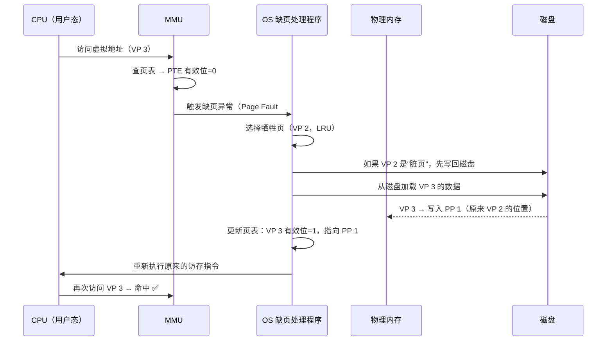

## 目录
- [[#核心思想：DRAM 作为磁盘的缓存]]
- [[#虚拟页与物理页]]
- [[#页表（Page Table）]]
- [[#缺页（Page Fault）]]
- [[#页面调度策略]]
- [[#局部性拯救了虚拟内存]]
- [[#💡 架构师视角映射]]
- [[#🔭 深挖指南]]

---

## 核心思想：DRAM 作为磁盘的缓存

虚拟内存系统将主存（DRAM）视为磁盘的一个**缓存**：
- 磁盘是"完整的存储"（后备存储，Backing Store）
- DRAM 只缓存最近使用的"热数据"
- CPU 通过虚拟地址访问数据，如果数据在 DRAM 中就直接使用（命中），否则从磁盘加载（缺页）

```
存储层次中虚拟内存的位置:

  CPU 寄存器  ←  最快, 最小
       ↑
  L1/L2/L3 Cache
       ↑
  主存 DRAM    ←  虚拟内存把 DRAM 当作磁盘的缓存（本节重点）
       ↑
  磁盘 Disk    ←  最慢, 最大
```

> 类比：你的书桌（DRAM）只能放 10 本书，但书柜（磁盘）里有 1000 本。你把最近要看的书放在桌上（缓存），要看新的书时就把不用的换回书柜再拿新的来（页面调度）。
> CS 术语：虚拟内存是 [[6.3 存储器层次结构]] 的一个层级——DRAM 缓存磁盘上的数据，利用**局部性原理**保证命中率。

> [!important] DRAM 缓存的特殊性（对比 L1/L2 Cache）
> | 特征 | SRAM Cache (L1/L2) | DRAM Cache（虚拟内存） |
> |------|-------------------|----------------------|
> | 不命中代价 | ~10 ns | ~10 ms（差 100 万倍！）|
> | 页/块大小 | 64 B | **4 KB~2 MB**（大页面，摊销磁盘延迟）|
> | 替换策略 | 简单（LRU 近似） | **精细化 LRU**（不命中代价太高，必须精确）|
> | 写策略 | 写回/写直达 | **总是写回**（磁盘太慢，不能每次都写）|
> | 映射方式 | 组相联 | **全相联**（任何虚拟页可映射到任何物理页）|

---

## 虚拟页与物理页

虚拟内存将地址空间分割为固定大小的块，称为**页（Page）**：
- **虚拟页（Virtual Page, VP）**：虚拟地址空间被分为 N 个虚拟页
- **物理页（Physical Page, PP）**：物理内存被分为 M 个物理页（也叫**页帧 Page Frame**）
- 页的大小通常为 **4KB**（2^12 字节）

```
虚拟页与物理页的映射:

虚拟地址空间                    物理内存 (DRAM)
┌──────────┐                  ┌──────────┐
│  VP 0    │──── 已缓存 ─────►│  PP 0    │
│  VP 1    │  未分配（空）      │  PP 1    │◄─── VP 4
│  VP 2    │──── 已缓存 ─────►│  PP 2    │
│  VP 3    │  未缓存（在磁盘）  │  PP 3    │◄─── VP 6
│  VP 4    │──── 已缓存 ─────►│          │
│  VP 5    │  未分配（空）      └──────────┘
│  VP 6    │──── 已缓存 ────►
│  VP 7    │  未缓存（在磁盘） ►  磁盘 Disk
│   ...    │
└──────────┘
```

每个虚拟页处于三种状态之一：

| 状态 | 含义 | PTE 标志 |
|------|------|---------|
| **已缓存（Cached）** | 已加载到 DRAM 的某个物理页中 | 有效位=1 |
| **未缓存（Uncached）** | 存储在磁盘上，尚未加载到 DRAM | 有效位=0，地址指向磁盘位置 |
| **未分配（Unallocated）** | 尚未被进程使用，不占用任何空间 | PTE 为 null |

---

## 页表（Page Table）

**页表**是存储在物理内存中的数据结构，每个进程有一个独立的页表，由 OS 内核维护。

页表本质上是一个**页表条目（Page Table Entry, PTE）数组**，数组的索引就是虚拟页号（VPN）。

```
页表结构:

                       页表（存储在物理内存中）
  虚拟页号(VPN)  →  ┌───────────────────────────────────┐
       0          │ 有效位=1 │ 物理页号 PP3           │ → 已缓存
       1          │ 有效位=0 │ null                   │ → 未分配
       2          │ 有效位=1 │ 物理页号 PP1           │ → 已缓存
       3          │ 有效位=0 │ 磁盘地址 0xDISK_ADDR   │ → 未缓存(在磁盘)
       4          │ 有效位=1 │ 物理页号 PP0           │ → 已缓存
       5          │ 有效位=0 │ null                   │ → 未分配
       ...        └───────────────────────────────────┘
```

> [!info] 关键字段说明
> - **有效位（Valid Bit）**：1 = 该虚拟页已缓存在 DRAM；0 = 未缓存或未分配
> - **物理页号（PPN）**：有效时，指向 DRAM 中的物理页帧号
> - **磁盘地址**：无效时，指向磁盘上的交换区位置（如果已被分配过）
> - **权限位**：读/写/执行权限（详见 [[9.5 虚拟内存作为内存保护的工具]]）

---

## 缺页（Page Fault）

当 CPU 访问一个**未缓存的虚拟页**（有效位=0，但已分配在磁盘上）时，MMU 触发**缺页异常（Page Fault）**。



> [!warning] 缺页的代价极大
> 一次缺页处理需要约 **10ms**（磁盘 I/O），而正常的 DRAM 访问只需约 **100ns**
> 比例：10ms / 100ns = **100,000 倍**！
> 因此，虚拟内存系统的性能好坏几乎完全取决于**缺页率**

缺页处理的关键步骤：

1. **选择牺牲页（Victim Page）**：OS 使用近似 LRU 算法选择一个物理页来替换
2. **写回脏页（如果需要）**：如果牺牲页被修改过（脏位=1），先写回磁盘
3. **加载新页**：从磁盘读取目标虚拟页的数据到物理页
4. **更新页表**：将牺牲页的 PTE 标记为无效，目标页的 PTE 标记为有效
5. **重新执行指令**：返回引起缺页的指令重新执行（这次会命中）

---

## 页面调度策略

虚拟内存的页面调度完全由 OS 内核（软件）负责，不像 SRAM Cache 由硬件自动管理。

**按需页面调度（Demand Paging）**：只有当 CPU 访问到某个虚拟页时，才将其从磁盘加载到 DRAM。

> 类比：你不会一次性把书柜里 1000 本书全搬到桌上，而是**需要哪本拿哪本**。如果桌子满了，就把最久没翻过的书放回去（LRU 替换）。这就是"按需调度"。
> CS 术语：按需页面调度（Demand Paging）是大多数 OS 的默认策略，与之相对的"预取"（Prefetching）策略会提前加载预测的页面。

---

## 局部性拯救了虚拟内存

> [!tip] 为什么虚拟内存在实践中表现优秀？
> 虽然磁盘比 DRAM 慢 100,000 倍，但**程序的局部性原理**保证了：
> - **工作集（Working Set）**：在任何时刻，程序频繁访问的页面集合通常很小
> - 只要工作集能被 DRAM 容纳，缺页率就极低（接近 0）
> - 缺页只在程序启动或切换工作阶段时频繁发生，稳定运行后几乎不缺页

```
局部性与工作集:

  程序生命周期:
  ─────────────────────────────────────────►
  │ 启动阶段 │    稳定运行     │ 阶段切换 │
  │ 缺页频繁 │  缺页极少 ✅    │ 短暂频繁 │
  │(冷启动)  │ (工作集在DRAM中)│          │
```

> [!caution] 抖动（Thrashing）
> 如果工作集大于 DRAM 容量 → 会不断缺页 → 换入换出 → 磁盘 I/O 打满 → 系统性能崩溃
> 这就是**抖动（Thrashing）**，可通过 `vmstat` / `sar` 命令监控

---

## 💡 架构师视角映射

> [!info] 与 Java 后端的联系

**JVM 的冷启动与缺页**：
- JVM 启动时，大量类加载 → 触发密集缺页（工作集快速建立）
- 这就是 Java 微服务"冷启动慢"的原因之一（除了类加载、JIT 编译外）
- **预热（Warm-up）** 本质上就是在建立工作集，减少后续缺页

**MySQL InnoDB 的 Buffer Pool**：
- InnoDB 的 Buffer Pool 其实是在**应用层**复刻了虚拟内存的思想
- 磁盘上的数据页（16KB）按需加载到 Buffer Pool（DRAM），使用 LRU 管理
- 差异：OS 的页面大小 4KB，InnoDB 的页面大小 16KB → InnoDB 有自己的页面管理

**Redis 的 `maxmemory` 与 `swap`**：
- 如果 Redis 使用的物理内存超过机器容量 → OS 将 Redis 的页面换出到 swap → 延迟暴增
- 这就是为什么生产环境**必须禁用 swap** 或确保 `maxmemory` 合理

---

## 🔭 深挖指南

> [!tip] 核心知识点与延伸阅读
>
> **本节最重要的三点**：
> 1. **DRAM 是磁盘缓存**——虚拟内存的核心抽象，所有设计决策都围绕这一点
> 2. **缺页异常（Page Fault）** 是虚拟内存运作的核心机制——理解它就理解了整个系统
> 3. **局部性原理**保证了缺页率极低——否则虚拟内存机制根本不可行
>
> **深挖路径**：
> - 缺页处理的完整内核实现 → Linux 源码 `mm/memory.c` 的 `handle_pte_fault()`
> - 页面替换算法（LRU、Clock 等） → 《操作系统导论》(OSTEP) 第 22 章
> - 抖动的诊断与处理 → `vmstat` 的 `si/so` 列（swap in/swap out）
> - 存储层次结构回顾 → [[6.3 存储器层次结构]]
