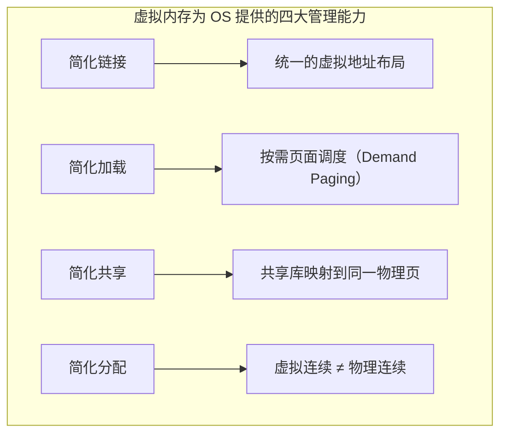

## 目录
- [[#独立地址空间简化内存管理]]
- [[#虚拟内存提供的关键能力]]
- [[#共享物理页]]
- [[#简化链接与加载]]
- [[#💡 架构师视角映射]]
- [[#🔭 深挖指南]]

---

## 独立地址空间简化内存管理

操作系统为**每个进程**维护一个独立的页表，使得每个进程拥有自己的**虚拟地址空间**。

```
多进程的独立页表:

  进程 A 的页表              物理内存                进程 B 的页表
  ┌────────────┐          ┌──────────┐          ┌────────────┐
  │ VP 0 → PP 2│ ────────►│  PP 0    │◄──────── │ VP 0 → PP 0│
  │ VP 1 → PP 5│ ──┐      │  PP 1    │          │ VP 1 → PP 8│
  │ VP 2 → PP 9│   │      │  PP 2    │◄─ A:VP0  │ VP 2 → PP 3│
  │ ...        │   │      │  PP 3    │◄─ B:VP2  │ ...        │
  └────────────┘   │      │  ...     │          └────────────┘
                   └─────►│  PP 5    │
                          │  ...     │
                          │  PP 9    │◄─ A:VP2
                          └──────────┘
```

> 类比：A 和 B 两个人各有一本通讯录（页表），里面写的是"联系人昵称 → 手机号"。A 的"小明"和 B 的"小明"可以指向不同的真实号码（不同物理页），也可以指向同一个号码（共享页）。两个人互不干扰，互看不到对方的通讯录。
> CS 术语：每个进程有独立的**页表**，使得同一虚拟地址在不同进程中可以映射到**不同物理地址**，实现进程间的完全隔离。

---

## 虚拟内存提供的关键能力

| 能力 | 描述 |
|------|------|
| **简化链接** | 每个进程的虚拟地址空间布局统一（代码从 0x400000 开始），链接器不需要关心物理地址 |
| **简化加载** | 加载 `.text` 和 `.data` 段时只需分配虚拟页并标记为指向磁盘文件，实际数据按需加载（缺页） |
| **简化共享** | OS 可以将多个进程的虚拟页映射到同一物理页（如共享库 libc.so） |
| **简化内存分配** | `malloc` 分配的虚拟页不需要在物理内存中连续，OS 自由安排 |



---

## 共享物理页

多个进程可以将各自的虚拟页映射到**同一个物理页**，实现内存共享。

```
共享库的映射（以 libc.so 为例）:

  进程 A                    物理内存               进程 B
  ┌──────────┐            ┌──────────┐           ┌──────────┐
  │ 代码段    │            │          │           │ 代码段    │
  │ 数据段    │            │  libc.so │           │ 数据段    │
  │ libc.so  │──── 共享 ──►│ 物理页   │◄── 共享 ──│ libc.so  │
  │          │            │（只读）   │           │          │
  │ 堆      │            │          │           │ 堆      │
  │ 栈      │            │          │           │ 栈      │
  └──────────┘            └──────────┘           └──────────┘
```

> [!important] 共享的前提：只读
> 共享的物理页必须是**只读的**（如代码段、共享库代码段），否则一个进程的修改会影响其他进程。
> 如果需要写入（如共享库的数据段），会使用**写时复制（Copy-on-Write, COW）** 技术——写入时才复制一份独立副本。

---

## 简化链接与加载

**链接简化**：
- 每个 Linux 进程的虚拟地址空间布局是统一的：
  - 代码段从 `0x400000` 开始
  - 栈从用户空间顶部向下增长
  - 堆在数据段之上向上增长
- 链接器只需要处理**虚拟地址**，不关心物理布局

**加载简化**：
- `execve` 加载程序时，并不立即把整个可执行文件读入 DRAM
- 而是只**设置页表映射**（虚拟页 → 磁盘文件的对应位置）
- 代码和数据在首次访问时通过**缺页异常**按需加载

> 类比：你在 Kindle 上打开一本 1000 页的电子书，Kindle 不会一次性把 1000 页全渲染出来，而是**只渲染你当前看到的那一页**。翻到新页面时才渲染新内容（按需加载）。
> CS 术语：这就是**按需页面调度（Demand Paging）**——OS 利用缺页异常实现"懒加载"。

---

## 💡 架构师视角映射

> [!info] 与 Java 后端的联系

**JVM 的类加载 ≈ 虚拟内存的按需加载**：
- JVM 不会在启动时加载所有类，而是在**首次使用时**才通过 ClassLoader 加载（懒加载）
- 这和虚拟内存的按需页面调度异曲同工

**共享库映射 → Java 的共享类数据（CDS）**：
- JVM 的 **Class Data Sharing（CDS）** 技术允许多个 JVM 进程共享同一份类元数据的物理内存
- 底层就是通过 `mmap` 将共享归档文件映射到多个进程的虚拟地址空间
- 这显著减少了多个 Java 微服务部署时的内存占用

**Fork 与 Copy-on-Write**：
- Linux `fork()` 创建子进程时不复制物理内存，而是让父子进程**共享同一份只读物理页**
- 只有某一方**写入**时才复制（COW）→ Redis 的 `BGSAVE` 就利用了这个机制
- Redis fork 出子进程做持久化时，如果主进程写入量不大，实际内存开销极小

---

## 🔭 深挖指南

> [!tip] 核心知识点与延伸阅读
>
> **本节最重要的两点**：
> 1. 虚拟内存不只是"缓存磁盘"——它是 OS 进行**内存管理**的核心工具
> 2. **共享物理页**和**写时复制（COW）** 是节省内存的关键技术
>
> **深挖路径**：
> - 写时复制的内核实现 → Linux 源码 `mm/memory.c` 的 `do_wp_page()`
> - Linux 进程地址空间的完整布局 → 原书 **9.7.2 节**
> - Redis COW 与 fork 的性能影响 → Redis 官方文档 Persistence 章节
> - JVM CDS/AppCDS 技术详解 → OpenJDK Wiki "Class Data Sharing"
