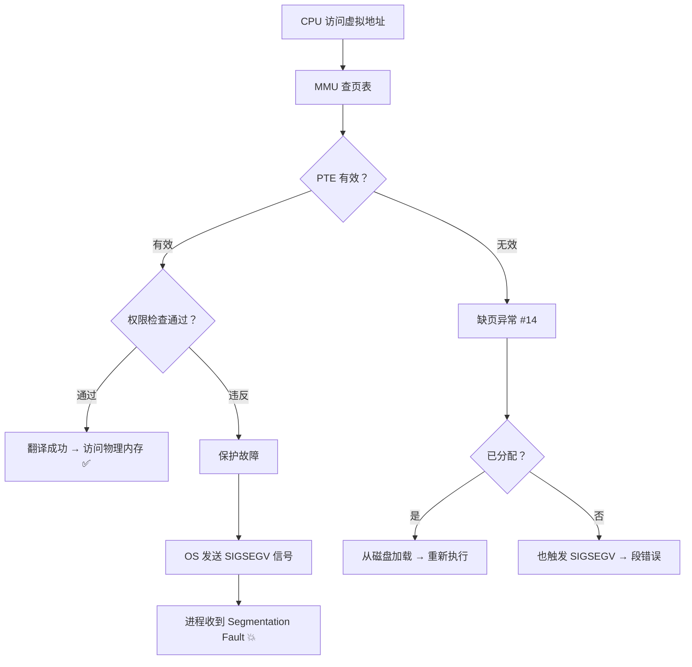

## 目录
- [[#内存保护的必要性]]
- [[#页表条目中的权限位]]
- [[#权限违反：段错误与保护故障]]
- [[#💡 架构师视角映射]]
- [[#🔭 深挖指南]]

---

## 内存保护的必要性

操作系统需要控制：
1. **用户进程不能修改内核数据**（内核保护）
2. **用户进程不能读写其他进程的私有内存**（进程隔离）
3. **用户进程不能修改只读的共享页**（如共享库代码段）
4. **防止代码注入攻击**（不允许执行数据段的内容）

虚拟内存通过在**页表条目（PTE）中增加权限位**来实现这些保护。

---

## 页表条目中的权限位

每个 PTE 除了包含物理页号（PPN）之外，还包含若干**许可位（Permission Bits）**：

```
PTE 的完整结构（简化版）:

  ┌─────┬──────┬──────┬──────┬──────────────────┐
  │ SUP │ READ │ WRITE│ EXEC │ 物理页号 (PPN)    │
  │  位 │  位  │  位  │  位  │                  │
  └─────┴──────┴──────┴──────┴──────────────────┘

  SUP  = 1 → 只有内核模式才能访问该页（用户态访问 → 故障）
  READ = 1 → 允许读取
  WRITE= 1 → 允许写入
  EXEC = 1 → 允许作为指令执行
```

```
不同内存区域的权限配置:

  虚拟地址空间区域        SUP   READ  WRITE  EXEC
  ─────────────────────────────────────────────────
  内核代码段               1     1     0      1     ← 用户态无法访问
  内核数据段               1     1     1      0     ← 用户态无法访问
  用户代码段 (.text)       0     1     0      1     ← 可读可执行，不可写
  用户数据段 (.data)       0     1     1      0     ← 可读写，不可执行
  用户只读数据 (.rodata)   0     1     0      0     ← 只读
  用户堆                   0     1     1      0     ← 可读写
  用户栈                   0     1     1      0     ← 可读写
  共享库代码               0     1     0      1     ← 只读可执行
```

> 类比：每个房间的门上不仅贴了"房号"（物理页号），还贴了"权限标签"——"仅限管理员进入"（SUP）、"可以看但不能拿"（READ-only）、"可以放东西进去"（WRITE）。保安（MMU）每次开门前都会检查你的身份和权限。
> CS 术语：MMU 在每次地址翻译时检查 PTE 的权限位，如果当前访问违反了权限 → 触发**保护故障（Protection Fault）**。

---

## 权限违反：段错误与保护故障



常见触发段错误的场景：

| 场景 | 原因 | 权限违反类型 |
|------|------|-------------|
| 访问 `NULL` 指针 | 虚拟地址 0x0 所在页未映射 | 访问无效页 |
| 写只读内存（如字符串字面量） | `.rodata` 段的 WRITE 位 = 0 | 写保护违反 |
| 栈溢出 | 超出栈的映射范围 | 访问无效页 |
| 缓冲区溢出尝试执行 shellcode | 数据区的 EXEC 位 = 0（NX 位） | 执行保护违反 |

> [!warning] NX 位（No-Execute）与安全防御
> 现代 CPU 支持 **NX 位**（AMD）/ **XD 位**（Intel），即"不可执行"标记。
> 将堆和栈标记为不可执行 → 即使攻击者注入了 shellcode 到栈上，CPU 也拒绝执行。
> 这是 **DEP（Data Execution Prevention，数据执行保护）** 的硬件基础。

---

## 💡 架构师视角映射

> [!info] 与 Java 后端的联系

**JVM 的 NullPointerException 底层就是段错误**：
- Java 中 `obj.method()` 如果 `obj == null` → JVM 尝试访问地址 0x0 附近 → 触发 SIGSEGV
- JVM 的信号处理程序捕获 SIGSEGV → 转化为 Java 的 `NullPointerException`
- 这比每次访问前检查 `if (obj != null)` 效率更高（利用硬件异常处理，零开销的快路径）

**JIT 编译代码的 W^X 策略**：
- JVM JIT 编译器生成的机器码需要**先写入，再执行**
- 安全策略要求内存页不能**同时可写且可执行**（**W^X**，Write XOR Execute）
- JVM 先将代码写入标记为 WRITE 的页 → 然后调用 `mprotect` 切换为 EXEC → 再跳转执行

**Netty 的 DirectByteBuffer**：
- `DirectByteBuffer` 使用 `mmap` 分配的堆外内存
- 这些页面有独立的权限设置（读写但不可执行）
- 如果越界访问 → OS 直接发送 SIGSEGV → JVM 崩溃（不像堆内会抛 ArrayIndexOutOfBoundsException）

---

## 🔭 深挖指南

> [!tip] 核心知识点与延伸阅读
>
> **本节最重要的两点**：
> 1. **PTE 的权限位**是实现内存保护的硬件基础——SUP / READ / WRITE / EXEC 四种控制
> 2. **段错误（SIGSEGV）** 本质上是 MMU 检测到权限违反后触发的保护故障
>
> **深挖路径**：
> - x86-64 页表条目的完整位域 → Intel 手册 Vol.3 Chapter 4.5
> - Linux 的 `mprotect()` 系统调用 → `man 2 mprotect`
> - NX/XD 位与 ASLR、Stack Canary 等安全机制 → 《深入理解计算机系统》第 3 章缓冲区溢出部分
> - JVM 如何利用 SIGSEGV 实现零开销空指针检查 → HotSpot 源码 `os_linux_x86.cpp`
