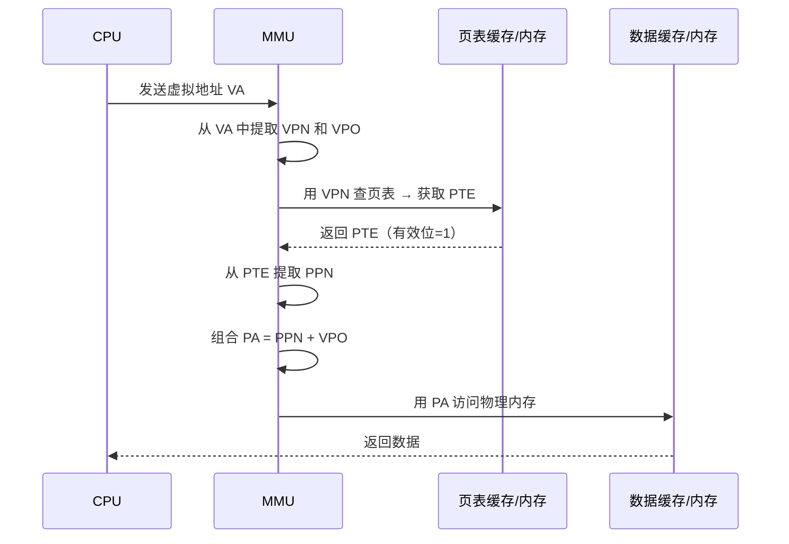
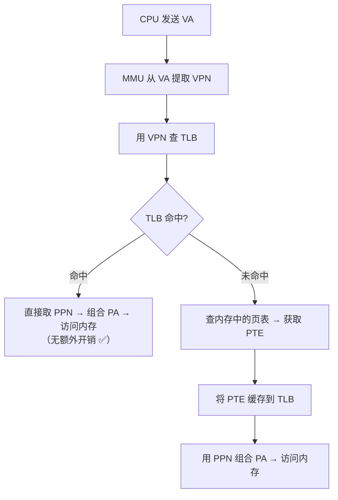

## 目录
- [[#地址翻译的基本流程]]
- [[#虚拟地址与物理地址的结构]]
- [[#翻译的完整步骤（页命中）]]
- [[#缺页时的处理]]
- [[#TLB：翻译后备缓冲器]]
- [[#多级页表]]
- [[#端到端地址翻译实例]]
- [[#💡 架构师视角映射]]
- [[#🔭 深挖指南]]

---

## 地址翻译的基本流程

地址翻译是一个**映射函数**：

```
MAP: 虚拟地址(VA) → 物理地址(PA) 或 缺页异常

  虚拟地址 = VPN（虚拟页号）+ VPO（页内偏移）
  物理地址 = PPN（物理页号）+ PPO（页内偏移）

  关键：VPO == PPO（页内偏移不变！）
  翻译本质：VPN → PPN（把虚拟页号翻译成物理页号）
```

> 类比：你知道要去"XX 小区 3 号楼 502 室"（虚拟地址）。前台帮你翻译"XX 小区 3 号楼"→"实际门牌号是 B 栋"（VPN → PPN），但"502 室"不变（偏移量保留）。最终你找到"B 栋 502 室"（物理地址）。
> CS 术语：地址翻译只替换**页号部分**，**页内偏移（Page Offset）直接复制**，因为同一页内的字节布局不变。

---

## 虚拟地址与物理地址的结构

```
虚拟地址（n 位）:
┌──────────────────────────────┬───────────────┐
│     VPN（虚拟页号）            │  VPO（页内偏移）│
│      n - p 位                │    p 位        │
└──────────────────────────────┴───────────────┘

物理地址（m 位）:
┌──────────────────────────────┬───────────────┐
│     PPN（物理页号）            │  PPO（页内偏移）│
│      m - p 位                │    p 位        │
└──────────────────────────────┴───────────────┘

以 4KB 页面为例（p = 12）:
  虚拟地址 48 位 → VPN 36 位 + VPO 12 位
  物理地址 52 位 → PPN 40 位 + PPO 12 位
  VPO = PPO（12 位偏移直接复制）
```

---

## 翻译的完整步骤（页命中）



---

## 缺页时的处理

```
缺页异常的处理流程:

  1. CPU 发送 VA → MMU 查页表 → PTE 有效位 = 0
  2. MMU 触发缺页异常（异常号 #14）→ 控制转移给 OS 内核
  3. OS 的缺页处理程序执行:
     a) 判断地址是否合法（是否在进程的虚拟地址范围内）
        → 不合法 → SIGSEGV（段错误）
     b) 判断权限（是否有读/写权限）
        → 权限违反 → SIGSEGV（保护故障）
     c) 选择牺牲页（LRU），如果脏页先写回磁盘
     d) 从磁盘加载目标页到物理内存
     e) 更新页表 PTE（有效位=1，PPN=新物理页）
     f) 返回用户程序 → 重新执行引起缺页的指令
```

---

## TLB：翻译后备缓冲器

每次地址翻译都需要查页表（存在内存中），这意味着**每次内存访问实际上需要两次内存访问**（一次查页表 + 一次访问数据）——性能开销太大！

**TLB（Translation Lookaside Buffer，翻译后备缓冲器）** 是 MMU 中的一个小型高速缓存，专门缓存最近使用的 PTE。

```
TLB 的结构与查找:

  虚拟地址中的 VPN:
  ┌──────────────────┬─────────┐
  │   TLBT（TLB 标记）│ TLBI    │
  │                  │(TLB索引)│
  └──────────────────┴─────────┘

  TLB（通常 64~256 条目，4~16 路组相联）:
  ┌───────┬────────┬────────┬─────┐
  │ 组 0  │ Tag=XX │ PPN=PP3│ V=1 │  ← 命中：直接返回 PPN
  │       │ Tag=YY │ PPN=PP7│ V=1 │
  ├───────┼────────┼────────┼─────┤
  │ 组 1  │ Tag=ZZ │ PPN=PP1│ V=1 │
  │       │ Tag=.. │ ...    │ ... │
  └───────┴────────┴────────┴─────┘
```



> [!tip] TLB 的命中率通常 > 99%
> 因为程序的局部性原理，进程短期内访问的虚拟页数量很少（工作集小），TLB 虽然只有几百条目，但足以覆盖绝大多数访问。
> TLB 未命中的代价约 **10~100 个时钟周期**（查主存中的页表），而 TLB 命中只需 **1~2 个时钟周期**。

---

## 多级页表

**问题**：如果用一级页表，48 位虚拟地址 + 4KB 页面 → 需要 2^36 ≈ 680 亿个 PTE → 每个 PTE 8 字节 → 页表本身需要 **512 GB** 内存！

**解决方案**：**多级页表（Multi-Level Page Table）**——只为实际使用的虚拟地址范围分配页表。

```
两级页表示意:

  虚拟地址:
  ┌───────────────┬───────────────┬──────────────┐
  │ VPN1（一级索引）│ VPN2（二级索引）│ VPO (偏移)   │
  │   10 位        │   10 位        │  12 位       │
  └───────┬───────┴───────┬───────┴──────────────┘
          │               │
          ▼               │
  一级页表（1024 条目）    │
  ┌─────────────────┐    │
  │ 条目 0 → 二级表A│────│──► 二级页表 A（1024条目）
  │ 条目 1 → NULL   │    │    ┌─────────────────┐
  │ 条目 2 → 二级表B│    └──► │ 条目 k → PPN    │
  │ ...             │         │ ...             │
  │ 条目 1023→ NULL │         └─────────────────┘
  └─────────────────┘
  ↑                           ↑
  如果 NULL → 整个 4MB        实际存储 PPN
  的虚拟区域不存在,            指向物理页
  节省了二级表的内存!
```

> 类比：一个大公司的电话本不是一本厚书，而是**目录 + 分册**。总目录只列出有员工的部门（一级页表），每个部门有自己的详细通讯录（二级页表）。空部门不印分册（NULL），大大节省了纸张。
> CS 术语：多级页表是一种**稀疏表示**，利用了虚拟地址空间中大量区域是未分配的特点，只为有效区域分配页表空间。

> [!info] x86-64 使用四级页表
> 现代 x86-64 系统使用 **4 级页表**（每级 9 位索引 + 12 位偏移 = 48 位地址）：
> - PML4（Page Map Level 4）→ PDPT → PD → PT → 物理页
> - 每级页表 512 条目（2^9），每个条目 8 字节
> - CR3 寄存器存储一级页表（PML4）的物理基地址
>
> Intel 最新的 5 级页表扩展到 57 位虚拟地址（128 PB 地址空间）

---

## 端到端地址翻译实例

用一个简化的例子串联整个翻译过程：

```
示例配置:
  虚拟地址: 14 位 → VPN 8 位 + VPO 6 位（页大小 64B）
  物理地址: 12 位 → PPN 6 位 + PPO 6 位
  TLB: 4 组, 2 路组相联
  L1 Cache: 16 组, 4 字节/块, 直接映射

给定虚拟地址: 0x03D4 = 0000 0011 1101 0100

1) 提取 VPN 和 VPO:
   VPN = 0x0F = 00001111
   VPO = 0x14 = 010100

2) 查 TLB:
   TLBI（组索引）= VPN 低 2 位 = 11 → 第 3 组
   TLBT（标记）= VPN 高 6 位 = 000011
   → 在第 3 组找到匹配: PPN = 0x0D ✅ TLB 命中!

3) 构造物理地址:
   PA = PPN + PPO = 0x0D + 0x14 = 001101 010100 = 0x354

4) 用 PA 查 L1 Cache:
   CO（块内偏移）= PA 低 2 位 = 00
   CI（组索引）= 接下来 4 位 = 0101 → 第 5 组
   CT（标记）= 剩余位 = 001101
   → 在第 5 组匹配标记 → 命中 → 返回字节 M[0x354] ✅
```

---

## 💡 架构师视角映射

> [!info] 与 Java 后端的联系

**TLB 刷新与线程切换**：
- OS 切换进程时，需要切换 CR3（页表基地址），这会导致 **TLB 全部失效（TLB flush）**
- 但**同进程内的线程切换不需要刷新 TLB**（共享同一页表）→ 这就是为什么线程切换比进程切换快！
- JVM 的 Java 线程都是同一个进程的系统线程 → 线程切换无 TLB 开销

**大页（Huge Pages）与 JVM 性能**：
- 默认 4KB 页面 → 大堆（如 8GB）需要 200 万个 PTE，TLB 容量不够 → 频繁 TLB 未命中
- 使用 **2MB 大页（Huge Pages）** → 只需 4096 个 PTE → TLB 命中率飙升
- JVM 参数：`-XX:+UseLargePages` 可启用大页 → 对大堆的 GC 和应用性能有显著提升

**MySQL InnoDB 与 TLB**：
- InnoDB Buffer Pool 通常很大（几十 GB），使用大页可以减少 TLB miss
- MySQL 配置：`large-pages` + OS 层面预分配 Huge Pages

---

## 🔭 深挖指南

> [!tip] 核心知识点与延伸阅读
>
> **本节最重要的三点**：
> 1. **地址翻译 = VPN → PPN**——页内偏移直接复制
> 2. **TLB** 是使虚拟内存可行的关键硬件——缓存 PTE，避免每次都查主存
> 3. **多级页表** 解决了单级页表内存开销过大的问题——稀疏表示
>
> **深挖路径**：
> - x86-64 四级页表的完整结构 → 原书 **9.7.1 节** 或 Intel 手册 Vol.3 Ch.4
> - TLB 的组织与替换策略 → 原书 **9.6.2 节**
> - Linux Huge Pages 配置与使用 → `man 5 proc` 搜索 `nr_hugepages`
> - PCID（Process Context ID）技术避免 TLB flush → Intel 手册中的 PCID 相关章节
