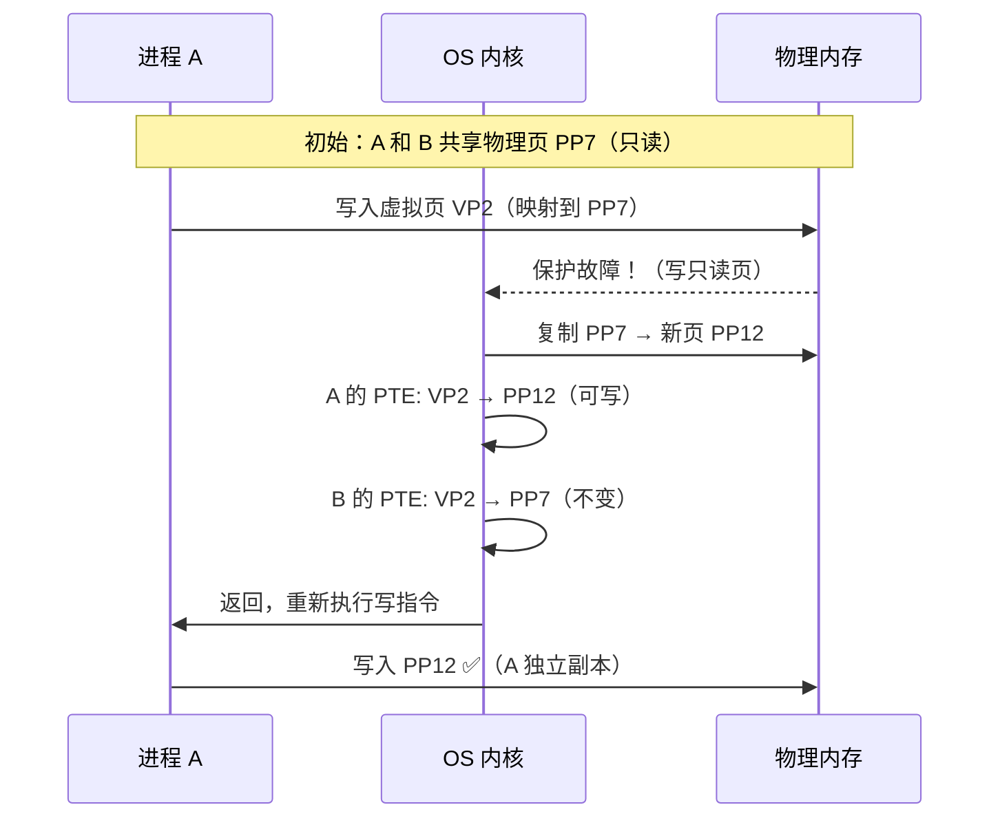

## 目录
- [[#什么是内存映射]]
- [[#共享对象与私有对象]]
- [[#写时复制（COW）]]
- [[#fork 与内存映射]]
- [[#execve 与内存映射]]
- [[#mmap 系统调用]]
- [[#💡 架构师视角映射]]
- [[#🔭 深挖指南]]

---

## 什么是内存映射

**内存映射（Memory Mapping）** 是将一个**磁盘上的文件**（或匿名区域）与虚拟内存的一个区域关联起来的过程。

```
内存映射的基本概念:

  磁盘文件（如 a.out, libc.so, data.txt）
       │
       │  mmap() 映射
       ▼
  虚拟地址空间中的一段区域(VMA)
       │
       │  首次访问时触发缺页
       ▼
  OS 将文件内容加载到物理页
```

一旦建立了映射：
- **读映射区域** → 如果物理页已缓存则直接读取，否则触发缺页，自动从磁盘加载
- **写映射区域** → 取决于映射类型（共享或私有）

> 类比：你在桌面上创建了一个"快捷方式"（映射），指向书柜里的某本书。你点开快捷方式时，系统自动帮你取来那本书。你不需要手动搬运，一切透明发生。
> CS 术语：内存映射利用**虚拟内存的按需页面调度**机制，实现了文件 I/O 和内存访问的统一接口。

---

## 共享对象与私有对象

映射到虚拟内存的对象可以分为两类：

| 类型 | 写入行为 | 典型用途 |
|------|---------|---------|
| **共享对象（Shared Object）** | 修改对**所有映射该对象的进程**可见，并写回磁盘 | 共享库代码、共享内存通信（IPC） |
| **私有对象（Private Object）** | 修改对**其他进程不可见**，不写回磁盘 | 进程的代码段、数据段 |

```
共享对象:
  进程 A ──映射──► 物理页 X ◄──映射── 进程 B
                     │
                   同一份数据
  A 的写入 → B 也能看到 → 最终写回磁盘

私有对象（初始）:
  进程 A ──映射──► 物理页 X ◄──映射── 进程 B
                     │
                   共享物理页（只读）

私有对象（A 写入后 → 触发 COW）:
  进程 A ──映射──► 物理页 Y（副本）    进程 B ──映射──► 物理页 X（不变）
```

---

## 写时复制（COW）

**私有对象**使用**写时复制（Copy-on-Write, COW）** 技术：

1. 初始时，多个进程共享同一物理页（标记为**只读**）
2. 某个进程尝试**写入** → 触发**保护故障**（写只读页）
3. OS 的故障处理程序：
   a. 复制该物理页到一个新的物理页
   b. 更新写入进程的 PTE 指向新页，并设置为可写
   c. 原物理页保留给其他进程



> [!tip] COW 的价值
> **延迟复制**：只有真正需要修改时才复制，如果一直只读就永远共享 → 极大节省内存
> **fork() 的高效实现**：fork 后父子进程共享所有页面（只读），只有被写入的页面才复制

---

## fork 与内存映射

`fork()` 创建子进程时：
1. 为子进程创建**新的 `mm_struct` 和 VMA 链表**（与父进程完全相同）
2. 为子进程创建**新的页表**，但所有 PTE 指向与父进程**相同的物理页**
3. 将父子进程的所有页面标记为**只读**（写时复制）

```
fork 后的内存状态:

  父进程                        子进程
  ┌──────────┐                ┌──────────┐
  │ VP 0 → PP2│◄── 共享 ──►  │ VP 0 → PP2│  （只读）
  │ VP 1 → PP5│◄── 共享 ──►  │ VP 1 → PP5│  （只读）
  │ VP 2 → PP9│◄── 共享 ──►  │ VP 2 → PP9│  （只读）
  └──────────┘                └──────────┘

  任何一方写入某页 → COW → 复制出独立副本
```

> [!important] fork 的内存开销几乎为零
> 因为没有真正复制物理页，fork 的主要开销只是创建新的页表和内核数据结构。
> 这就是 Redis `BGSAVE` 能高效 fork 子进程做持久化的原因。

---

## execve 与内存映射

`execve()` 加载新程序时：
1. **删除**当前进程的所有用户区域 VMA
2. **映射私有区域**：将新程序的 `.text`、`.data`、`.bss` 映射到虚拟地址空间
3. **映射共享区域**：如果程序链接了共享库（如 libc.so），映射到共享区域
4. **设置程序计数器（PC）** 指向代码段的入口点（`_start`）

```
execve 加载过程:

  旧进程地址空间        execve("./hello")        新进程地址空间
  ┌──────────┐                                ┌──────────────┐
  │ 旧代码    │ ──── 全部清除 ────►           │ hello 的 .text│ ← 映射文件
  │ 旧数据    │                               │ hello 的 .data│ ← 映射文件
  │ 旧堆      │                               │ .bss         │ ← 匿名映射
  │ 共享库    │                               │ libc.so      │ ← 共享映射
  │ 旧栈      │                               │ 新栈         │ ← 匿名映射
  └──────────┘                                └──────────────┘
                                              PC → _start 入口
```

> 所有这些映射只是设置了 PTE（虚拟页 → 磁盘文件位置），**没有真正加载数据到内存**。
> 实际数据在首次访问时通过**缺页异常按需加载**。

---

## mmap 系统调用

```c
// mmap 函数原型
void *mmap(void *addr, size_t length, int prot, int flags, int fd, off_t offset);

// 参数说明:
// addr   = 建议的映射起始地址（通常传 NULL，让 OS 自行选择）
// length = 映射区域大小
// prot   = 权限: PROT_READ | PROT_WRITE | PROT_EXEC
// flags  = MAP_SHARED（共享）| MAP_PRIVATE（私有，COW）| MAP_ANONYMOUS（匿名）
// fd     = 文件描述符（匿名映射传 -1）
// offset = 文件内偏移
```

**两种典型用法**：

```c
// 1. 映射文件到内存（文件 I/O 的高效替代方案）
int fd = open("data.bin", O_RDONLY);
char *ptr = mmap(NULL, filesize, PROT_READ, MAP_PRIVATE, fd, 0);
// 现在可以直接通过指针 ptr 读取文件内容，无需 read() 系统调用

// 2. 匿名映射（分配大块内存，malloc 的底层实现之一）
void *p = mmap(NULL, 1024*1024, PROT_READ|PROT_WRITE,
               MAP_PRIVATE|MAP_ANONYMOUS, -1, 0);
// 分配 1MB 的匿名内存
```

---

## 💡 架构师视角映射

> [!info] 与 Java 后端的联系

**JVM 的 MappedByteBuffer 就是 mmap**：
- `FileChannel.map()` 底层调用 `mmap` → 将文件直接映射到进程的虚拟地址空间
- 读写 MappedByteBuffer 就是读写虚拟内存 → OS 自动处理缺页和写回
- 适合大文件的随机读写（如日志索引、数据库文件）

**Kafka 的零拷贝（Zero-Copy）**：
- Kafka 使用 `sendfile()` 系统调用（底层利用 mmap）
- 数据从磁盘 → 页缓存 → 网卡，完全不经过用户态 → **零拷贝**
- 这依赖于内存映射：内核页缓存中的物理页直接 DMA 传输给网卡

**Redis 的 RDB 持久化**：
- `BGSAVE` fork 子进程 → 子进程遍历所有 key → 写入 RDB 文件
- fork 使用 COW → 主进程继续服务写请求，只有被修改的页面才复制
- 如果写入量大 → COW 复制大量页面 → 内存翻倍风险

**RocketMQ / Kafka 的 mmap 文件**：
- 消息中间件将日志文件通过 mmap 映射到内存
- 写消息 = 写虚拟内存 → OS 后台异步 flush 到磁盘
- 性能接近内存操作，但有持久化保证（OS 保证脏页最终写回）

---

## 🔭 深挖指南

> [!tip] 核心知识点与延伸阅读
>
> **本节最重要的三点**：
> 1. **内存映射统一了文件 I/O 和内存访问**——mmap 是连接两者的桥梁
> 2. **写时复制（COW）** 使得 fork 几乎零开销——是 Unix 多进程模型的基石
> 3. **execve 的懒加载**——设置映射但不加载，利用缺页按需加载
>
> **深挖路径**：
> - mmap 的完整使用场景 → `man 2 mmap`
> - Linux 文件系统的页缓存（Page Cache）→ 《深入理解 Linux 内核》第 15 章
> - Java NIO 的 MappedByteBuffer 详解 → JDK 源码 `FileChannelImpl.c`
> - Kafka 零拷贝实现原理 → 原论文或 Kafka 官方文档 "Efficiency" 部分
