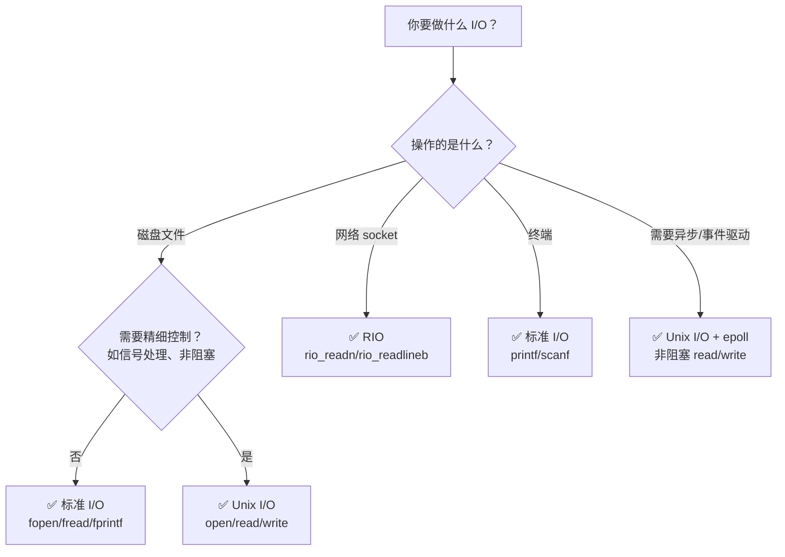

## 目录
- [[#三种 I/O 的对比]]
- [[#选择指南]]
- [[#为什么网络编程不能用 stdio]]
- [[#I/O 函数选择决策树]]
- [[#💡 架构师视角映射]]
- [[#🔭 深挖指南]]

---

## 三种 I/O 的对比

| 特性 | Unix I/O | 标准 I/O (stdio) | RIO |
|------|---------|-----------------|-----|
| **接口** | `open/read/write/close` | `fopen/fread/fprintf/fclose` | `rio_readn/rio_readlineb` |
| **缓冲** | ❌ 无（每次都是系统调用） | ✅ 有（用户态缓冲区） | ✅ 有（内部缓冲） |
| **不足值处理** | ❌ 需要手动处理 | ✅ 自动处理 | ✅ 自动处理 |
| **适用场景** | 需要精细控制、信号处理 | 磁盘文件读写 | 网络 socket 读写 |
| **线程安全** | ✅ 是 | ✅ 是（有锁保护） | ✅ 是 |

---

## 选择指南

> [!important] 三条黄金选择规则

**规则 1：尽量使用标准 I/O**
- 磁盘文件的读写 → `fopen/fread/fwrite/fclose`
- 终端 I/O → `printf/scanf`
- 标准 I/O 自带缓冲，效率高，可移植性好

**规则 2：不要使用 `scanf` / `rio_readlineb` 读二进制文件**
- 这些函数专为**文本行**设计（以 `\n` 为分隔）
- 二进制文件中的 `\n` 字节不代表"行结束"
- 读二进制用 `fread` 或 `rio_readnb`

**规则 3：网络 socket 使用 RIO（或 Unix I/O），不要用 stdio**
- stdio 对 socket 有致命问题（见下节）

---

## 为什么网络编程不能用 stdio

> [!failure] stdio 用于 socket 的两大致命问题

**问题 1：输入输出的限制**

stdio 的 `FILE` 流打开后的类型决定了操作限制：

```
stdio 流的限制矩阵:

  如果 FILE 流是"只读"模式打开:
    → 只能调用输入函数（fread, fgets, fscanf）
    → 不能调用输出函数

  如果 FILE 流是"只写"模式打开:
    → 只能调用输出函数（fwrite, fputs, fprintf）
    → 不能调用输入函数

  如果 FILE 流是"读写"模式打开:
    → 在输入后想输出？ 必须先 fseek/fflush/rewind
    → 在输出后想输入？ 必须先 fseek/fflush
    → 但 socket 不支持 fseek/lseek！❌
```

**问题 2：socket 不支持 lseek/fseek**
- socket 是**流式**的（字节序列一去不返），没有"文件位置"的概念
- `fseek` 底层调用 `lseek`，对 socket 调用会失败
- 导致 stdio 的读写切换在 socket 上无法正常工作

```c
// ❌ 错误示范：用 stdio 操作 socket
FILE *fp = fdopen(sockfd, "r+");  // 读写模式
fgets(buf, sizeof(buf), fp);     // 读取请求行
// 现在想输出响应...
// 需要 fseek 或 fflush，但 fseek 对 socket 无效！ ❌
fprintf(fp, "HTTP/1.0 200 OK\r\n");  // 可能不会按预期工作
```

```c
// ✅ 正确做法1：为 socket 的输入和输出分别打开 stdio 流
FILE *fpin  = fdopen(sockfd, "r");   // 只读流
FILE *fpout = fdopen(sockfd, "w");   // 只写流
fgets(buf, sizeof(buf), fpin);       // 从只读流读
fprintf(fpout, "HTTP/1.0 200 OK\r\n"); // 向只写流写
fflush(fpout);

// ⚠️ 但还有问题：关闭时 fclose(fpin) 和 fclose(fpout) 都会 close(sockfd)
// → 第二次 close 是对已关闭 fd 的操作 → 危险！
```

```c
// ✅ 正确做法2：直接使用 RIO（推荐）
rio_t rio;
rio_readinitb(&rio, sockfd);
rio_readlineb(&rio, buf, MAXLINE);              // 读请求
rio_writen(sockfd, "HTTP/1.0 200 OK\r\n", 19); // 写响应
```

---

## I/O 函数选择决策树



---

## 💡 架构师视角映射

> [!info] 与 Java 后端的联系

**Java 的 I/O 选择与 C 的选择完全平行**：

| 场景 | C 选择 | Java 选择 |
|------|--------|----------|
| 读写磁盘文件 | stdio (`fread`) | `BufferedInputStream` / `Files.readAllBytes()` |
| 网络 socket | RIO / Unix I/O | `InputStream`（BIO）或 `Channel`（NIO） |
| 高并发网络 | Unix I/O + epoll | Netty（NIO + EventLoop） |
| 二进制数据 | `fread` / `read` | `DataInputStream` / `ByteBuffer` |

**Netty 为什么不用 Java 传统 I/O**：
- `java.io.InputStream/OutputStream` 类似 stdio → 带缓冲但不支持事件驱动
- Netty 使用 `java.nio.channels.SocketChannel` → 类似 Unix I/O + epoll
- Netty 的 `ByteBuf` → 类似 RIO 的带缓冲读写，但功能更强大

**为什么 Tomcat 也不推荐 BIO 模式**：
- BIO（`java.io`）每个连接一个线程 → 不能处理高并发
- NIO（`java.nio`）基于 Selector（底层 epoll）→ 一个线程处理多个连接
- 这就是 Unix I/O + IO 多路复用的 Java 翻版

---

## 🔭 深挖指南

> [!tip] 核心知识点与延伸阅读
>
> **本节最重要的三点**：
> 1. **一般磁盘文件用 stdio**——自带缓冲、自动处理不足值、可移植
> 2. **网络 socket 不要用 stdio**——fseek 限制会导致读写切换出问题
> 3. **需要精细控制时用 Unix I/O**——如信号处理、非阻塞 I/O、epoll
>
> **深挖路径**：
> - Unix I/O + epoll 实现事件驱动 → 《Unix 网络编程》第一卷 第 6 章
> - Java NIO 的 Selector 与 Unix epoll 的对应 → Netty 源码分析
> - 高性能网络框架的 I/O 模型选择 → 《高性能服务器编程》

---
