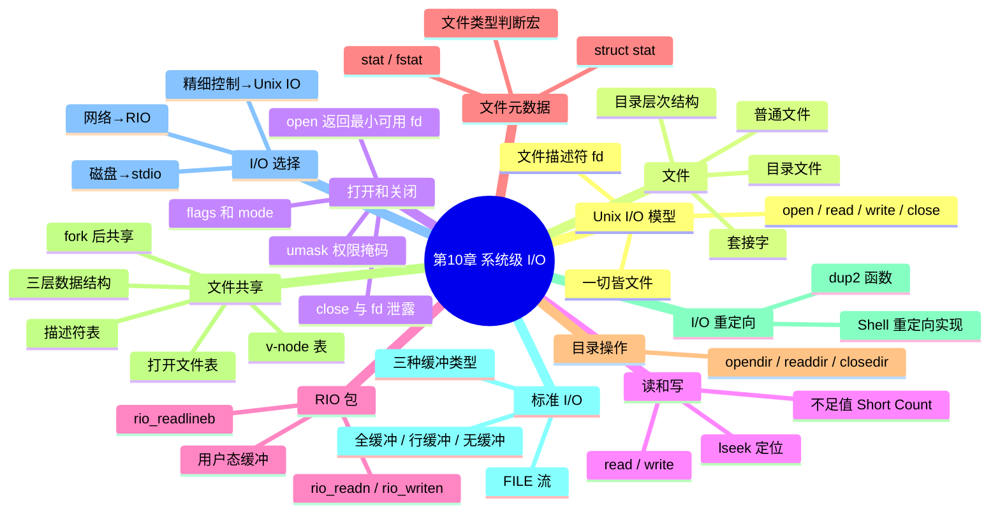
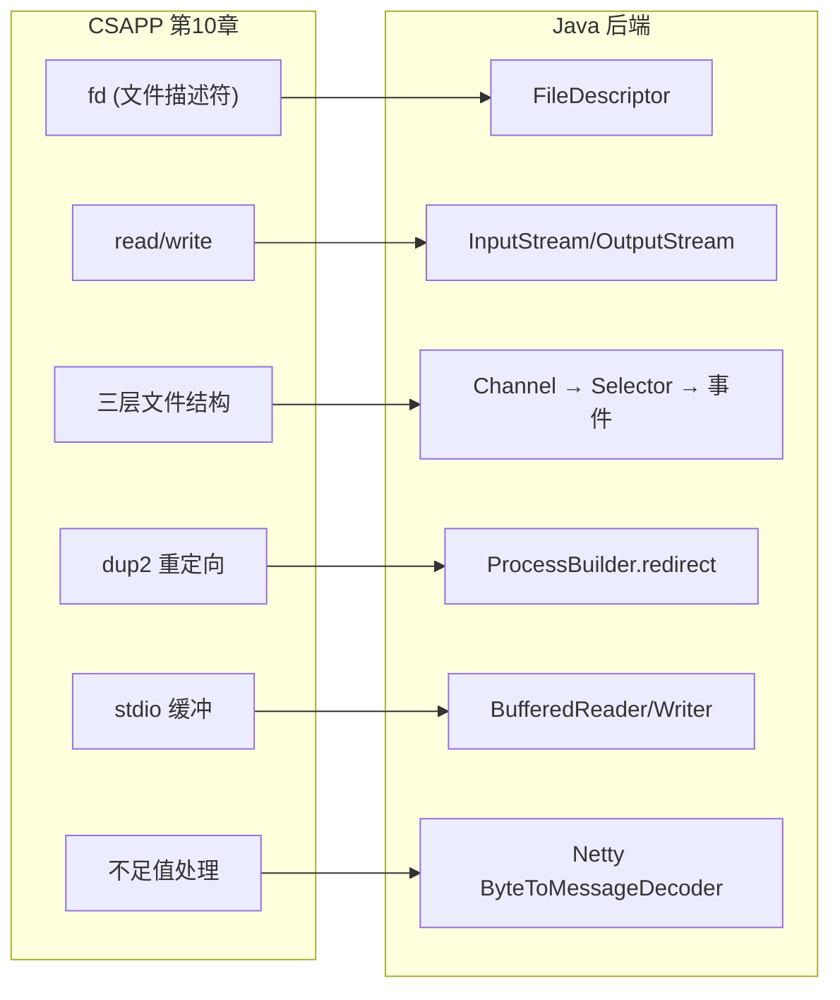

## 目录
- [[#知识全景图]]
- [[#核心概念速查表]]
- [[#系统调用速查]]
- [[#💡 架构师视角映射]]
- [[#🔭 章节回顾路径]]

---

## 知识全景图



---

## 核心概念速查表

| 概念 | 核心要点 |
|------|---------|
| Unix I/O | 一切皆文件，统一的 open/read/write/close 接口 |
| 文件描述符 | 小的非负整数，进程级间接引用，0/1/2 预留 |
| 不足值 | read/write 返回 < 请求字节数，网络 I/O 中常见，必须用循环处理 |
| RIO | CSAPP 提供的健壮 I/O 库，自动处理不足值 + 带缓冲读取 |
| 文件元数据 | stat/fstat 获取 inode 信息（大小、类型、权限、时间等） |
| 三层文件结构 | 描述符表（进程级）→ 打开文件表（系统级）→ v-node（文件级） |
| dup2 重定向 | `dup2(oldfd, newfd)` 让 newfd 指向 oldfd 的打开文件表项 |
| 标准 I/O | C 标准库对 Unix I/O 的带缓冲封装，FILE 流抽象 |
| I/O 缓冲 | 全缓冲（文件）、行缓冲（终端 stdout）、无缓冲（stderr） |
| I/O 选择 | 磁盘 → stdio，网络 → RIO/Unix IO，事件驱动 → Unix IO + epoll |

---

## 系统调用速查

```
文件操作:
  open(pathname, flags, mode)    → 打开文件，返回 fd
  close(fd)                      → 关闭文件

读写操作:
  read(fd, buf, n)               → 读取最多 n 字节
  write(fd, buf, n)              → 写入最多 n 字节
  lseek(fd, offset, whence)      → 设置文件位置

文件元数据:
  stat(pathname, &buf)           → 通过路径获取元数据
  fstat(fd, &buf)                → 通过 fd 获取元数据

目录操作:
  opendir(path)                  → 打开目录流
  readdir(dirp)                  → 读取下一个目录项
  closedir(dirp)                 → 关闭目录流

重定向:
  dup2(oldfd, newfd)             → 将 newfd 重定向到 oldfd
```

---

## 💡 架构师视角映射

> [!info] 第十章知识在 Java 后端中的完整映射



**本章知识在后端架构中的核心价值**：

1. **理解 Netty 的 I/O 模型**
   - fd + 不足值 + epoll → Netty 的 Channel + ByteBuf + EventLoop
   - 本章是理解 Netty 源码的先决条件

2. **排查线上 I/O 问题**
   - fd 泄露 → `lsof` + `Too many open files`
   - 缓冲延迟 → 日志不及时刷新 → `fflush` / `flush`
   - 文件权限 → 部署时 umask 不当导致读写失败

3. **理解中间件的 I/O 设计**
   - Kafka 的零拷贝 → [[9.8 内存映射]] + 本章的文件 I/O
   - Redis 的 AOF 持久化 → `write` + `fsync` 的刷盘策略
   - MySQL 的 `innodb_flush_method` → 控制 O_DIRECT 绕过 OS 缓冲区

---

## 🔭 章节回顾路径

> [!tip] 复习优先级与深挖建议
>
> **面试高频考点**（必须掌握）：
> 1. 文件描述符与三层数据结构 → [[10.8 文件共享]]
> 2. I/O 重定向原理 → [[10.9 IO 重定向]]
> 3. 不足值与缓冲机制 → [[10.4 读和写文件]] + [[10.5 用 RIO 包健壮地读写]]
>
> **与其他章节的联系**：
> - 本章的 fd 和 I/O → 第 11 章（网络编程）的 socket I/O
> - 本章的文件共享 + fork → 第 8 章（异常控制流）的进程管理
> - 本章的 mmap 提及 → [[9.8 内存映射]] 的深入扩展
>
> **推荐的延伸阅读**：
> - 《UNIX 环境高级编程》（APUE）第 3-5 章 → 文件 I/O 的工业级深度
> - 《Unix 网络编程》第一卷 第 6 章 → I/O 多路复用（select/poll/epoll）
> - 《Netty 实战》第 1-5 章 → Java 世界中的系统级 I/O 应用

---
