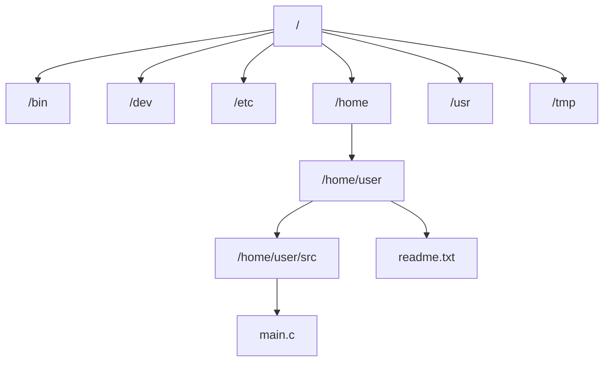

## 目录
- [[#文件类型]]
- [[#普通文件]]
- [[#目录文件]]
- [[#目录层次结构]]
- [[#路径名]]
- [[#💡 架构师视角映射]]
- [[#🔭 深挖指南]]

---

## 文件类型

每个 Linux 文件都有一个**类型（Type）**，用来指示它在系统中扮演的角色：

| 文件类型 | 说明 | 标识 |
|---------|------|------|
| **普通文件（Regular File）** | 包含任意数据 | `-` |
| **目录（Directory）** | 包含一组链接，每个链接映射文件名→文件 | `d` |
| **套接字（Socket）** | 用于进程间通信 | `s` |
| 字符设备 | 键盘、终端等逐字符 I/O | `c` |
| 块设备 | 磁盘等按块 I/O | `b` |
| 命名管道（FIFO） | 进程间管道通信 | `p` |
| 符号链接（Symbolic Link） | 指向另一个文件的快捷方式 | `l` |

```
ls -l 的输出中，第一个字符就是文件类型:

-rw-r--r--  1 user group  4096 Mar 27 readme.txt     ← 普通文件 (-)
drwxr-xr-x  2 user group  4096 Mar 27 src/            ← 目录 (d)
srwxrwxrwx  1 user group     0 Mar 27 mysql.sock      ← 套接字 (s)
lrwxrwxrwx  1 user group     7 Mar 27 link -> target  ← 符号链接 (l)
```

---

## 普通文件

普通文件分为两种：

**文本文件（Text File）**：
- 由 **ASCII 或 Unicode 字符**组成
- 以**换行符（`\n`, 0x0a）** 结尾的每一行称为**文本行（Text Line）**
- Linux 中文本行以 `\n` 结尾；Windows 中以 `\r\n` 结尾（这是跨平台开发中常见的"换行符问题"）

**二进制文件（Binary File）**：
- 除文本文件以外的所有文件
- 如编译后的可执行文件、图片、视频、`.class` 文件等
- 对内核而言，**文本文件和二进制文件没有区别**——内核一视同仁地处理字节序列

> [!important] 内核不区分文本和二进制
> 内核只看到**字节流**，它并不知道也不关心文件内容是文本还是二进制。
> "文本文件" vs "二进制文件"的区分是**应用层**的概念（如编辑器解释 `\n` 为换行）。

---

## 目录文件

目录（Directory）是一个特殊文件，它的内容是一组**目录项（Directory Entry）**，也叫**链接（Link）**。

每个目录项将一个**文件名**映射到一个**文件**：

```
目录的内部结构:

  目录 "/home/user"
  ┌──────────────────────────────┐
  │  文件名         → 文件       │
  │  .              → 当前目录   │  ← 每个目录必有
  │  ..             → 父目录     │  ← 每个目录必有
  │  readme.txt     → 普通文件   │
  │  src            → 子目录     │
  │  main.c         → 普通文件   │
  └──────────────────────────────┘
```

> [!info] 两个特殊链接
> - **`.`（点）**：指向目录自身的链接
> - **`..`（双点）**：指向父目录的链接
> - 根目录 `/` 的 `..` 指向自己

> 类比：目录就像一本**电话簿**——它本身不存储联系人的详细资料（文件内容），只存储 "名字 → 电话号码" 的映射（文件名 → 文件位置）。每本电话簿的开头还有两个固定条目：自己的号码（`.`）和上级电话簿的号码（`..`）。
> CS 术语：目录项本质上是**文件名→inode 号**的映射关系，inode 中存储了文件的元数据（大小、权限、数据块位置等）。

---

## 目录层次结构

Linux 内核将所有文件组织为一棵**目录层次树（Directory Hierarchy）**，根节点为 `/`：



每个进程都有一个**当前工作目录（Current Working Directory, cwd）**，用于解释**相对路径**。

---

## 路径名

| 路径类型 | 规则 | 示例 |
|---------|------|------|
| **绝对路径（Absolute Pathname）** | 以 `/` 开头，从根目录开始 | `/home/user/src/main.c` |
| **相对路径（Relative Pathname）** | 不以 `/` 开头，从 cwd 开始 | `./src/main.c` |

```
路径解析示例:

  cwd = /home/user

  相对路径 "src/main.c" 的解析:
    /home/user  →  找到目录项 "src"  →  进入 /home/user/src
                →  找到目录项 "main.c"  →  到达文件

  等价绝对路径: /home/user/src/main.c
```

---

## 💡 架构师视角映射

> [!info] 与 Java 后端的联系

**Java 的 `File` vs `Path`**：
- `java.io.File` 是 Java 旧版文件抽象，混合了路径操作和 I/O 操作
- `java.nio.file.Path`（JDK 7+）是现代设计，将**路径表示**与**文件操作**分离
- `Path.resolve()`、`Path.relativize()` 对应 Unix 的路径解析规则

**Spring Boot 的文件访问**：
- `classpath:` 前缀 → 从类加载器路径中查找资源文件（不是 Unix 路径）
- `file:` 前缀 → 使用操作系统文件系统路径（Unix 绝对路径）
- 生产环境中日志文件、配置文件的路径管理都依赖对目录层次结构的理解

**Linux 换行符问题在实际开发中的影响**：
- Git 的 `core.autocrlf` 配置就是处理 `\n` 与 `\r\n` 的跨平台兼容问题
- Docker 容器（Linux）中运行的脚本如果有 `\r\n` 换行会报 `/bin/bash^M: bad interpreter`

---

## 🔭 深挖指南

> [!tip] 核心知识点与延伸阅读
>
> **本节最重要的两点**：
> 1. **文件类型的分类**——理解 Linux 中"文件"是一个远比日常理解更广泛的概念
> 2. **目录是链接的集合**——目录项的本质是文件名→inode 的映射
>
> **深挖路径**：
> - inode 与目录项的详细结构 → 《深入理解 Linux 内核》第 12 章（VFS）
> - 硬链接与符号链接的区别 → `man 2 link`、`man 7 symlink`
> - 虚拟文件系统 VFS 如何统一 ext4/xfs/ntfs → 《Linux 内核设计与实现》第 13 章

---
