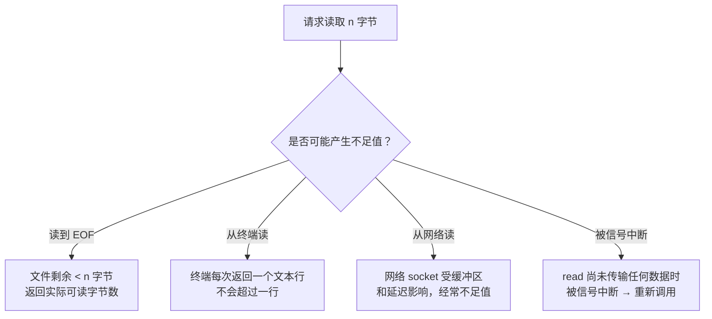

## 目录
- [[#read 函数]]
- [[#write 函数]]
- [[#不足值（Short Count）]]
- [[#lseek 函数]]
- [[#💡 架构师视角映射]]
- [[#🔭 深挖指南]]

---

## read 函数

```c
#include <unistd.h>

ssize_t read(int fd, void *buf, size_t n);
// 成功：返回实际读取的字节数（可能 < n）
// EOF：返回 0
// 失败：返回 -1
```

`read` 从 fd 引用的文件的**当前文件位置**开始，拷贝最多 `n` 个字节到内存中的 `buf`，然后**更新文件位置**。

```
read 的执行过程:

  文件内容:  [H][e][l][l][o][ ][W][o][r][l][d]
  文件位置:   ^（初始位置 = 0）

  read(fd, buf, 5);
  → 读取 5 字节: "Hello"
  → 文件位置移动到 5

  文件内容:  [H][e][l][l][o][ ][W][o][r][l][d]
  文件位置:                   ^（位置 = 5）
```

---

## write 函数

```c
#include <unistd.h>

ssize_t write(int fd, const void *buf, size_t n);
// 成功：返回实际写入的字节数（可能 < n）
// 失败：返回 -1
```

`write` 从 `buf` 拷贝最多 `n` 个字节到 fd 引用的文件的**当前文件位置**，然后更新文件位置。

```c
// 完整的 "Hello, World\n" 写入示例
char *msg = "Hello, World\n";
write(STDOUT_FILENO, msg, strlen(msg));
// → 向标准输出（终端）写入 13 个字节
```

---

## 不足值（Short Count）

> [!warning] read 和 write 返回的字节数可能小于请求的 n！

**不足值（Short Count）** 是指 `read` 或 `write` 传送的字节数**小于应用程序请求的字节数**。这不是错误，而是**正常行为**。

产生不足值的常见场景：



| 场景 | 说明 | 示例 |
|------|------|------|
| **读到 EOF** | 文件只剩 20 字节，但请求读 50 字节 | `read(fd, buf, 50)` 返回 20 |
| **从终端读** | 终端一次只返回一个文本行 | 用户输入 "hi\n"，read 返回 3 |
| **从网络 socket 读** | 内核缓冲区中可能还没收到那么多数据 | 请求 4096 但只收到 512 |
| **被信号中断** | 处理信号后返回部分数据 | 可通过 SA_RESTART 标志重试 |

> [!important] 磁盘读写通常不会产生不足值（除了 EOF）
> 从磁盘读普通文件时，除非到达文件末尾，否则 read 总是返回请求的字节数。
> 写入磁盘文件时，write 总是返回 n（除非磁盘满了）。
> **不足值主要发生在网络和终端 I/O 中**。

> 类比：你去食堂打饭，对阿姨说"来一大碗"（请求 n 字节）。如果锅里饭多，阿姨一定给你打满（磁盘读）。但如果是外卖送餐（网络读），骑手可能先送来一半，另一半还在路上——你得等第二趟（短计数）。
> CS 术语：不足值是**非阻塞/流式 I/O** 的本质特征。健壮的网络程序必须在循环中处理不足值，或使用封装好的 I/O 库（如 RIO）。

---

## lseek 函数

```c
#include <unistd.h>

off_t lseek(int fd, off_t offset, int whence);
// 设置 fd 的文件位置到指定偏移
```

| whence | 含义 |
|--------|------|
| `SEEK_SET` | 设置到 offset 字节处 |
| `SEEK_CUR` | 设置到 当前位置 + offset |
| `SEEK_END` | 设置到 文件末尾 + offset |

```
lseek 示意:

  文件: [A][B][C][D][E][F][G][H]
         0  1  2  3  4  5  6  7

  lseek(fd, 0, SEEK_SET);   → 位置 = 0（回到开头）
  lseek(fd, 3, SEEK_SET);   → 位置 = 3（指向 'D'）
  lseek(fd, -2, SEEK_END);  → 位置 = 6（倒数第二个 'G'）
  lseek(fd, 2, SEEK_CUR);   → 位置在当前基础上 +2
```

> [!info] 每个打开的文件都有当前位置
> 文件位置（file position / file offset）是内核为每个打开的文件维护的一个字节偏移量。
> `read` 和 `write` 操作后自动更新，也可以通过 `lseek` 手动设置。

---

## 💡 架构师视角映射

> [!info] 与 Java 后端的联系

**Java NIO 的 `FileChannel.position()` 就是 lseek**：
```java
FileChannel channel = FileChannel.open(path, StandardOpenOption.READ);
channel.position(100);  // 等价于 lseek(fd, 100, SEEK_SET)
ByteBuffer buf = ByteBuffer.allocate(1024);
channel.read(buf);      // 从位置 100 开始读取
```

**Netty 中的不足值处理**：
- 网络 socket 几乎每次 read 都可能返回不足值
- Netty 的 `ByteToMessageDecoder` 正是处理不足值的核心组件
- 它在内部维护一个**累积缓冲区（Cumulation Buffer）**，不断拼接收到的字节，直到凑齐一个完整的消息

**MySQL InnoDB 的随机读写**：
- InnoDB 按 16KB 的页（Page）读写数据文件
- 使用 `pread(fd, buf, 16384, page_no * 16384)` 进行**定位读取**（pread = lseek + read 的原子组合）
- 这也是为什么 SSD 的随机读性能对数据库如此重要

---

## 🔭 深挖指南

> [!tip] 核心知识点与延伸阅读
>
> **本节最重要的两点**：
> 1. **不足值是正常现象**——网络编程中必须用循环处理，不能假设一次读完
> 2. **文件位置是内核状态**——read/write 自动推进，lseek 可手动设置
>
> **深挖路径**：
> - 健壮的 I/O 封装 → 见 [[10.5 用 RIO 包健壮地读写]]
> - pread/pwrite 的线程安全性 → `man 2 pread`
> - Netty 的 ByteToMessageDecoder 源码分析 → 理解不足值在网络框架中的处理

---
