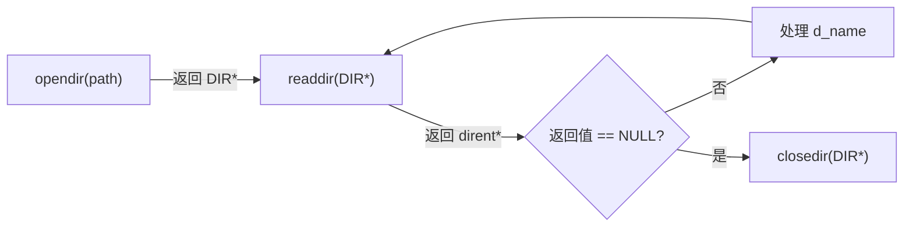

## 目录
- [[#目录操作函数]]
- [[#读取目录内容的流程]]
- [[#完整示例：列出目录内容]]
- [[#💡 架构师视角映射]]
- [[#🔭 深挖指南]]

---

## 目录操作函数

应用程序可以用 `readdir` 系列函数来读取目录的内容：

```c
#include <sys/types.h>
#include <dirent.h>

DIR *opendir(const char *name);
// 成功：返回目录流指针
// 失败：返回 NULL

struct dirent *readdir(DIR *dirp);
// 成功：返回指向下一个目录项的指针
// 到末尾或出错：返回 NULL

int closedir(DIR *dirp);
// 成功：返回 0
// 失败：返回 -1
```

每个目录项（`struct dirent`）包含：

```c
struct dirent {
    ino_t  d_ino;       // inode 编号
    char   d_name[256]; // 文件名
    // 其他字段因系统而异
};
```

> [!info] DIR 是什么？
> `DIR` 是一个**目录流（Directory Stream）**的抽象，类似于 C 标准库中的 `FILE *`。
> 它封装了底层的 fd 和缓冲区，让你可以逐项遍历目录内容。

---

## 读取目录内容的流程



```
读取目录的标准模式:

  1. opendir("/home/user")           → 获得 DIR* dirp
  2. readdir(dirp) → dirent(".")     → 处理（通常跳过）
  3. readdir(dirp) → dirent("..")    → 处理（通常跳过）
  4. readdir(dirp) → dirent("src")   → 处理
  5. readdir(dirp) → dirent("main.c")→ 处理
  6. readdir(dirp) → NULL            → 遍历完毕
  7. closedir(dirp)                  → 释放资源
```

---

## 完整示例：列出目录内容

```c
#include <stdio.h>
#include <dirent.h>
#include <errno.h>

int main(int argc, char *argv[]) {
    DIR *dirp;
    struct dirent *dep;

    if (argc != 2) {
        fprintf(stderr, "usage: %s <dirname>\n", argv[0]);
        return 1;
    }

    dirp = opendir(argv[1]);
    if (dirp == NULL) {
        fprintf(stderr, "opendir error: %s\n", strerror(errno));
        return 1;
    }

    errno = 0;
    while ((dep = readdir(dirp)) != NULL) {
        printf("inode=%lu, name=%s\n", (unsigned long)dep->d_ino, dep->d_name);
    }

    if (errno != 0) {
        fprintf(stderr, "readdir error\n");
    }

    closedir(dirp);
    return 0;
}
```

```
运行输出示例:

$ ./listdir /home/user
inode=1234, name=.
inode=1000, name=..
inode=1235, name=src
inode=1236, name=readme.txt
inode=1237, name=Makefile
```

> [!warning] readdir 的错误检测
> `readdir` 在到达末尾和出错时都返回 NULL。
> 区分方式：调用前将 `errno` 清零，readdir 返回 NULL 后检查 `errno`：
> - `errno == 0` → 正常到达末尾
> - `errno != 0` → 出错

---

## 💡 架构师视角映射

> [!info] 与 Java 后端的联系

**Java 的 `Files.list()` / `Files.walk()` 对应 opendir/readdir**：
```java
// 列出目录下所有文件（非递归）
Files.list(Path.of("/home/user"))
     .forEach(System.out::println);

// 递归遍历目录树
Files.walk(Path.of("/home/user"))
     .filter(Files::isRegularFile)
     .forEach(System.out::println);
```

**Spring Boot 的类路径扫描**：
- `@ComponentScan` 底层使用类似 `readdir` 的机制扫描 `.class` 文件
- `PathMatchingResourcePatternResolver` 遍历 classpath 目录找到匹配的资源
- 本质上就是递归 opendir/readdir + 文件名模式匹配

**Linux 的 `find` 命令**：
- `find /path -name "*.java"` 就是递归调用 opendir/readdir + stat 的组合
- `-type f` 选项利用 `d_type` 或 `stat` 判断文件类型

---

## 🔭 深挖指南

> [!tip] 核心知识点与延伸阅读
>
> **本节最重要的两点**：
> 1. **opendir/readdir/closedir 是目录遍历的标准接口**
> 2. **readdir 的返回值和 errno 需要配合判断**——分辨"到末尾"和"出错"
>
> **深挖路径**：
> - `getdents` 系统调用（readdir 的底层）→ `man 2 getdents`
> - 目录项在磁盘上的存储格式 → ext4 的 `dx_entry`、`ext4_dir_entry_2`
> - Java NIO 的 `DirectoryStream` → JDK 文档，对比 C 的 opendir/readdir

---
