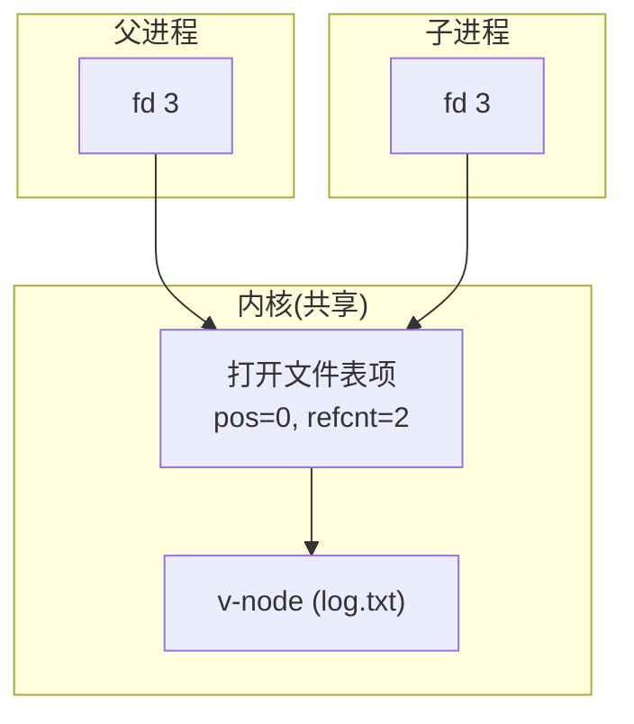

## 目录
- [[#内核的三层文件数据结构]]
- [[#典型场景：无共享]]
- [[#场景一：不同 fd 打开同一文件]]
- [[#场景二：fork 后父子进程共享文件]]
- [[#💡 架构师视角映射]]
- [[#🔭 深挖指南]]

---

## 内核的三层文件数据结构

内核用**三层数据结构**来表示已打开的文件：

```
内核维护的三层文件表结构:

  ┌─────────────────┐
  │ 描述符表          │  ← 每个进程独立拥有
  │ (fd table)       │     一个 fd → 一个表项
  │ fd 0 ──► 表项 A  │
  │ fd 1 ──► 表项 B  │
  │ fd 3 ──► 表项 C  │
  └─────────────────┘
        │   │   │
        ▼   ▼   ▼
  ┌─────────────────┐
  │ 打开文件表        │  ← 所有进程共享
  │ (open file table)│     记录文件位置、引用计数
  │ 表项 A: pos=100  │     等信息
  │         refcnt=1 │
  │         ──► v-node X│
  │ 表项 B: pos=0    │
  │         refcnt=1 │
  │         ──► v-node Y│
  └─────────────────┘
        │   │
        ▼   ▼
  ┌─────────────────┐
  │ v-node 表        │  ← 所有进程共享
  │                  │     记录文件的 stat 信息
  │ v-node X: stat.. │     (大小、类型、权限等)
  │ v-node Y: stat.. │
  └─────────────────┘
```

| 层次 | 名称 | 归属 | 关键信息 |
|------|------|------|---------|
| **第 1 层** | 描述符表（Descriptor Table） | **每个进程独有** | fd → 打开文件表项的指针 |
| **第 2 层** | 打开文件表（Open File Table） | **所有进程共享** | 文件位置（offset）、引用计数（refcnt）、指向 v-node 的指针 |
| **第 3 层** | v-node 表 | **所有进程共享** | 文件的 `stat` 结构（来自 inode），如大小、类型等 |

> [!important] 理解这三层结构是理解文件共享和 I/O 重定向的关键
> - **fd** 是进程级别的"索引"
> - **打开文件表项** 是系统级别的"状态"（尤其是文件位置 offset）
> - **v-node** 是文件级别的"身份"（对应磁盘上的 inode）

---

## 典型场景：无共享

一个进程打开了两个**不同文件**（如 fd 3 → `a.txt`，fd 4 → `b.txt`）：

```
进程的描述符表:
  fd 3 ────► 打开文件表项 A (pos=100) ────► v-node X (a.txt 的 inode)
  fd 4 ────► 打开文件表项 B (pos=200) ────► v-node Y (b.txt 的 inode)

  → 两个不同的打开文件表项，两个不同的 v-node
  → 完全独立，互不影响
```

---

## 场景一：不同 fd 打开同一文件

同一个进程两次 `open()` 同一个文件：

```c
int fd1 = open("data.txt", O_RDONLY);  // fd1 = 3
int fd2 = open("data.txt", O_RDONLY);  // fd2 = 4
```

```
  fd 3 ────► 打开文件表项 A (pos=0)  ─┐
                                       ├───► v-node X (data.txt)
  fd 4 ────► 打开文件表项 B (pos=0)  ─┘

  → 两个不同的打开文件表项（各自有独立的文件位置 pos）
  → 但指向同一个 v-node（同一个文件）
  → fd1 的 read 不会影响 fd2 的文件位置
```

> 类比：你和你的同学各自从图书馆借了同一本书的**两本拷贝**（两个打开文件表项）。你读到第 100 页（pos=100），同学读到第 50 页（pos=50），互不影响。但你们看的是同一本书（同一个 v-node）。
> CS 术语：每次 `open()` 都创建一个新的打开文件表项，拥有独立的文件偏移量（offset）。

---

## 场景二：fork 后父子进程共享文件

```c
int fd = open("log.txt", O_WRONLY);
if (fork() == 0) {
    // 子进程：fd 与父进程共享同一个打开文件表项！
    write(fd, "child\n", 6);
} else {
    // 父进程
    write(fd, "parent\n", 7);
}
```

```
fork 后的文件共享状态:

  父进程描述符表:                      子进程描述符表:
  fd 3 ──────┐                        fd 3 ──────┐
             │                                    │
             ▼                                    ▼
        打开文件表项 A (pos=0, refcnt=2)
             │
             ▼
        v-node X (log.txt)

  → 父子进程的 fd 3 指向同一个打开文件表项
  → 共享同一个文件位置（pos）！
  → 父进程写入 "parent\n" → pos = 7
  → 子进程接着写 "child\n" → pos = 13
  → 不会覆盖！因为它们共享 pos
```



> [!important] fork 的关键行为
> `fork()` 后子进程**继承**父进程的描述符表的一份**副本**。
> 但副本中的每个 fd 仍然指向**同一个打开文件表项**（refcnt + 1）。
> 因此父子进程**共享文件位置**——这是 Shell I/O 重定向能正确工作的基础。

> [!warning] fork 后必须关闭不需要的 fd
> fork 后 refcnt = 2。只有当父子进程**都** close 了 fd，打开文件表项才会被释放。
> 如果子进程不需要某个 fd（如管道的写端），必须显式 close，否则：
> - fd 泄露
> - 管道永远不会收到 EOF（因为写端引用计数不为 0）

---

## 💡 架构师视角映射

> [!info] 与 Java 后端的联系

**JVM 的 FileDescriptor 共享**：
- Java 的 `System.out`（PrintStream）和 `System.err` 内部各自持有一个 `FileDescriptor`
- 但它们可能指向同一个终端设备的不同打开文件表项

**多线程写同一个日志文件**：
- 多个线程通过同一个 `FileOutputStream` 写日志 → 共享同一个 fd → 共享同一个打开文件表项 → 共享同一个 pos
- 并发写入可能导致数据交错 → 需要用 `synchronized` 或 `FileChannel.lock()` 保护
- 这就是为什么 Log4j/Logback 内部都有**锁机制**

**Redis 的多进程文件共享**：
- `BGSAVE` fork 后，子进程继承父进程的所有 fd
- 包括 socket fd（客户端连接）→ 子进程应该关闭这些 fd
- Redis 源码中 fork 后会调用 `closeListeningSockets()` 清理

---

## 🔭 深挖指南

> [!tip] 核心知识点与延伸阅读
>
> **本节最重要的三点**：
> 1. **三层结构**：描述符表（进程级）→ 打开文件表（系统级）→ v-node 表（文件级）
> 2. **每次 open 创建新的打开文件表项**——同一文件的不同 open 有独立的文件位置
> 3. **fork 共享打开文件表项**——父子进程共享文件位置，这是 I/O 重定向的基础
>
> **深挖路径**：
> - Linux 内核的 `struct file` 和 `struct inode` → 《深入理解 Linux 内核》第 12 章
> - dup/dup2 如何创建共享同一打开文件表项的新 fd → 见 [[10.9 IO 重定向]]
> - 进程的 fd 表存储在 `task_struct` → `files_struct` → `fdtable` 中

---
