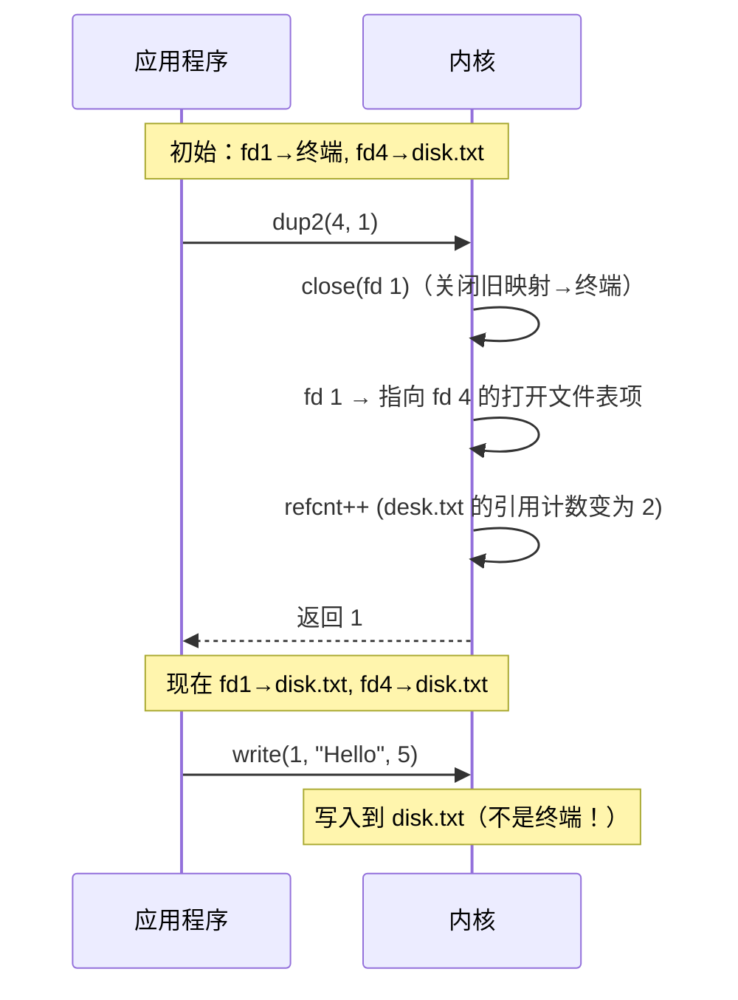

## 目录
- [[#什么是 I/O 重定向]]
- [[#dup2 函数]]
- [[#dup2 的工作原理]]
- [[#Shell 重定向的实现]]
- [[#💡 架构师视角映射]]
- [[#🔭 深挖指南]]

---

## 什么是 I/O 重定向

Linux Shell 提供的 **I/O 重定向**操作符允许用户将标准输入/输出/错误关联到磁盘文件：

```bash
# 将 stdout 重定向到文件
ls > output.txt

# 将 stderr 重定向到文件
gcc main.c 2> errors.txt

# 将 stdin 从文件读取
sort < data.txt

# 管道：将 ls 的 stdout 连接到 grep 的 stdin
ls -l | grep ".txt"
```

> 类比：I/O 重定向就像一个**水管工**重新接管道。正常情况下水龙头（stdout）出水到洗手台（终端），但水管工可以把管道改接到花园水管（文件）上，让水流到花园里。程序本身不知道管道被改了——它只管往水龙头里放水。
> CS 术语：I/O 重定向通过修改进程的**描述符表**，改变 fd 与打开文件表项之间的映射关系，对程序本身完全透明。

---

## dup2 函数

I/O 重定向的核心系统调用是 **`dup2`**：

```c
#include <unistd.h>

int dup2(int oldfd, int newfd);
// 成功：返回 newfd
// 失败：返回 -1
```

`dup2(oldfd, newfd)` 的语义：**将 newfd 重定向到 oldfd 所指向的文件**。

具体操作：
1. 如果 `newfd` 已经打开，先**关闭** `newfd`
2. 将描述符表中 `newfd` 的表项复制为 `oldfd` 的表项
3. 现在 `newfd` 和 `oldfd` 指向**同一个打开文件表项**

---

## dup2 的工作原理

```
dup2 之前:

  描述符表:
  fd 1 ────► 打开文件表项 A (终端)   refcnt=1
  fd 4 ────► 打开文件表项 B (disk.txt) refcnt=1
```

```c
dup2(4, 1);  // 将 fd 1 重定向到 fd 4 指向的文件
```

```
dup2(4, 1) 之后:

  描述符表:
  fd 1 ────► 打开文件表项 B (disk.txt) refcnt=2  ← fd 1 现在指向 disk.txt
  fd 4 ────► 打开文件表项 B (disk.txt) refcnt=2
  
  打开文件表项 A (终端) → 被关闭释放（refcnt 变为 0）
```



> [!important] dup2 的三个关键点
> 1. 如果 `oldfd == newfd`，什么都不做，直接返回 `newfd`
> 2. dup2 执行后，`newfd` 和 `oldfd` 共享**同一个打开文件表项**（包括同一个文件位置 pos）
> 3. dup2 是**原子操作**——"关闭 newfd + 复制表项"是不可分割的，不会被信号中断

---

## Shell 重定向的实现

当你在 Shell 中输入 `ls > output.txt` 时，Shell 的实现流程如下：

```c
// Shell 的简化实现
if (fork() == 0) {
    // 子进程中执行重定向
    
    // 1. 打开目标文件
    int fd = open("output.txt", O_WRONLY | O_CREAT | O_TRUNC, 0644);
    // 假设 fd = 4
    
    // 2. 用 dup2 将 stdout (fd 1) 重定向到 output.txt
    dup2(fd, STDOUT_FILENO);  // dup2(4, 1)
    // 现在 fd 1 → output.txt
    
    // 3. 关闭多余的 fd 4（fd 1 已经指向 output.txt）
    close(fd);
    
    // 4. 执行 ls
    execve("/bin/ls", ...);
    // ls 往 fd 1 (stdout) 写的所有内容都会进入 output.txt
}
```

```
Shell 重定向的完整步骤:

  1. fork() 子进程
  2. 子进程: open("output.txt") → fd 4
  3. 子进程: dup2(4, 1)         → fd 1 重定向到 output.txt
  4. 子进程: close(4)           → 清理多余 fd
  5. 子进程: execve("ls")       → ls 的 stdout 输出到文件
  6. 父进程: wait()             → 等待子进程完成
```

---

## 💡 架构师视角映射

> [!info] 与 Java 后端的联系

**Java 的 `ProcessBuilder.redirectOutput()`**：
```java
// Java 中实现类似 shell 重定向的功能
ProcessBuilder pb = new ProcessBuilder("ls", "-l");
pb.redirectOutput(new File("output.txt"));  // stdout → file
pb.redirectError(ProcessBuilder.Redirect.INHERIT);  // stderr → 父进程终端
Process p = pb.start();
```
底层实现就是 fork + dup2 + execve。

**Docker 日志重定向**：
- 容器内进程的 stdout/stderr 默认被 Docker daemon 捕获
- 实现方式：Docker 创建管道（pipe），dup2 将容器进程的 fd 1/fd 2 重定向到管道
- `docker logs` 命令读取管道的另一端

**Tomcat 的 `catalina.out`**：
- Tomcat 启动脚本中 `>> catalina.out 2>&1` 就是 Shell 重定向
- `2>&1` = `dup2(1, 2)` → 将 stderr 重定向到与 stdout 相同的文件

---

## 🔭 深挖指南

> [!tip] 核心知识点与延伸阅读
>
> **本节最重要的三点**：
> 1. **dup2 修改描述符表的映射**——让一个 fd 指向另一个 fd 的打开文件表项
> 2. **Shell 重定向 = fork + open + dup2 + execve**——理解了这个流程就理解了 Unix 的核心哲学
> 3. **dup2 是原子操作**——保证了重定向的安全性
>
> **深挖路径**：
> - `dup` 和 `dup2` 的区别 → `man 2 dup`
> - 管道（pipe）的实现 → CSAPP 第 8 章练习 或 《UNIX 环境高级编程》第 15 章
> - Shell 如何实现管道 `|` → fork 两次 + pipe + dup2

---
