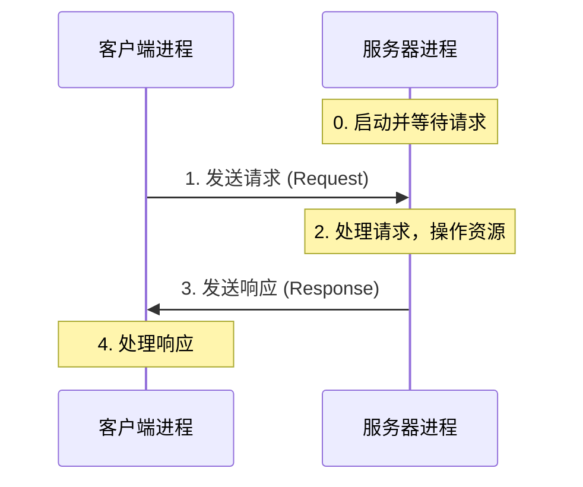

## 目录
- [[#客户端-服务器模型核心概念]]
- [[#基本事务过程]]
- [[#误区：服务器与机器不是一回事]]
- [[#💡 架构师视角映射]]
- [[#🔭 深挖指南]]

---

## 客户端-服务器模型核心概念

每个网络应用都是基于**客户端-服务器模型（Client-Server Model, C/S）** 的。

这个模型由一个**服务器（Server）** 进程和一个或多个**客户端（Client）** 进程组成。
- **服务器**：管理某种**资源**，并通过操作该资源来为客户端提供**服务**。
- **客户端**：向服务器发起**请求**，并等待**响应**。

> 类比：你去银行办理业务。你（客户端）向柜员（服务器进程）提交取款单（请求）。柜员管理着金库（资源），他验证你的身份后，从金库取出钱（操作资源），然后把钱给你（响应）。
> CS 术语：C/S 模型是一个**非对称**的通信模型，由客户端主动发起（主动打开），服务器被动等待请求（被动打开）。

---

## 基本事务过程

一个客户端-服务器**事务（Transaction）** 由四个基本步骤组成：



1. **请求**：当客户端需要服务时，它向服务器发送一个请求，发起一个事务。
2. **处理**：服务器收到请求后，解释它，并以适当的方式操作其资源。
3. **响应**：服务器给客户端发送一个响应（包含所请求的数据或状态码），并等待下一个请求。
4. **处理响应**：客户端收到响应并处理它（例如，由 Web 浏览器在屏幕上渲染 HTML，或由终端显示文件内容）。

> [!warning] 事务的定义
> 这里的"事务"（Transaction）是指执行上述 4 步的一个逻辑上的执行序列。
> **注意不要与数据库的事务（ACID 特性）混淆！** C/S 事务没有原子性、回滚等保证，它仅仅是请求-响应的一轮交互。

---

## 误区：服务器与机器不是一回事

> [!important] 进程 vs 机器
> 我们通常会说"服务器宕机了"或"我买了一台服务器"。这里的"服务器"指的是**硬件机器（Host/Machine）**。
> 但在 C/S 模型中，**客户端和服务器都是进程（Process）**。
> 一台机器可以同时运行多个客户端进程和多个服务器进程；一个客户端和一个服务器甚至可以运行在同一台机器上！

```
典型的网络拓扑映射:

  主机 A (客户端机器)            主机 B (服务器机器)
  ┌──────────────────┐         ┌────────────────────┐
  │ 客户端进程 1 (Web) │ ─请求─► │ 服务器进程 1 (Nginx)  │
  │ 客户端进程 2 (FTP) │ ─请求─► │ 服务器进程 2 (ftpd)   │
  └──────────────────┘         └────────────────────┘
```

---

## 💡 架构师视角映射

> [!info] 与 Java 后端的联系

**所有后端框架的本质**：
- Spring Boot / Tomcat 的本质：就是一个运行在 JVM 上的**服务器进程**。
- 它遵循着绝对的 C/S 模型：等待 HTTP 请求 → 处理请求（由于 Java 的多线程特性，通常交给一个工作线程池） → 响应。

**微服务架构（微服务间的 C/S 关系）**：
- 在微服务架构中，角色的边界变得**动态**。
- 订单服务（Order Service）如果是被前端调用，扮演的是**服务器**。
- 当订单服务内部需要调用库存服务（Inventory Service）时，它在这个事务中又扮演了**客户端**。
- → Feign / RestTemplate 等工具的作用就是将 Java 代码封装为"客户端进程"的请求动作。

**RPC 框架（如 Dubbo / gRPC）**：
- RPC 的核心目标是让"网络上的 C/S 事务"看起来像"本地函数调用"一样自然（封装了上述的请求和响应解析过程）。

---

## 🔭 深挖指南

> [!tip] 核心知识点与延伸阅读
>
> **本节最重要的两点**：
> 1. **C/S 是非对称的模型**——由客户端主动，服务器被动。
> 2. **C/S 是进程间的概念**——不要将服务器进程与物理机器混淆。
>
> **深挖路径**：
> - 另一种网络架构模型：P2P（点对点模型）→ CSAPP 仅简单拓展，更详细参考《计算机网络：自顶向下方法》第 2 章。
> - 并发服务器的处理模型（多进程/多线程/事件驱动）→ CSAPP 第 12 章。

---
