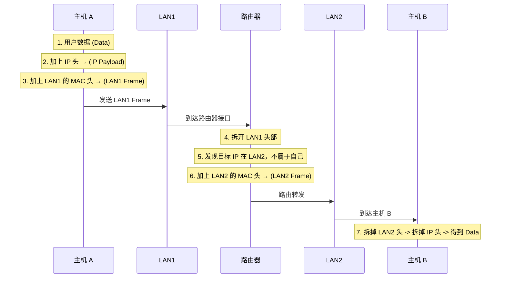

## 目录
- [[#网络在硬件层面的本质]]
- [[#局域网（LAN）]]
- [[#广域网（WAN）与路由器]]
- [[#互联网络协议（Internet Protocol）]]
- [[#数据封装的过程]]
- [[#💡 架构师视角映射]]
- [[#🔭 深挖指南]]

---

## 网络在硬件层面的本质

对主机（Host）而言，网络只是一种**I/O 设备**，它是作为数据源（输入）和数据接收方（输出）存在的。

```
主机内部的硬件结构：

  CPU ──── 内存 ───── 扩展总线（如 PCIe）
                       │
                       ├──── 磁盘控制器 (I/O)
                       ├──── 显卡适配器 (I/O)
                       └──── 网络适配器 (网卡，I/O 设备)  ──► [外部物理网络]
```

由于网络被抽象为 I/O 设备，在 Linux 中读写网络和读写磁盘文件一样，都是通过 `read` 和 `write` 系统调用。这就是 [[10.1 Unix IO]] 的核心哲学在网络编程中的体现。

---

## 局域网（LAN）

**局域网（Local Area Network, LAN）** 是一个小范围内的物理网络。目前最流行的局域网技术是 **以太网（Ethernet）**。

- **网段（Ethernet Segment）**：通过**集线器（Hub）**或**交换机（Switch）**连接的几台主机。
- 每个网卡都有一个全球唯一的、固化在 ROM 中的 48 位**MAC 地址**。
- 以太网数据传输的单位是**帧（Frame）**，帧包含**头部（MAC 地址信息）**和**有效载荷（数据）**。

> 类比：一个班级的教室（LAN）。班里有 30 个学生（主机），每个人都有学号（MAC 地址）。老师在讲台上喊"李雷（目标 MAC）出来一下"（广播帧），所有人都能听到，但只有李雷会站起来回应。

---

## 广域网（WAN）与路由器

多个不兼容的局域网通过称为**路由器（Router）**的特殊计算机连接在一起，组成一个**互联网络（internet，小写 i）**或**广域网（WAN）**。

> [!important] 路由器是连接不同网络的桥梁
> 局域网内部只能识别 MAC 地址。如果主机 A 要给另一个局域网的主机 B 发数据：
> A 会先把数据发给处于网关位置的路由器，路由器将其从一个 LAN（比如以太网）转发到另一个 LAN（比如 802.11 Wi-Fi）。

```
互联网络拓扑：

   [LAN 1 (以太网)] ──── (路由器) ──── [LAN 2 (Wi-Fi)]
    /         \            |            /        \
  主机 A      主机 B        |          主机 C     主机 D
                      (WAN 链路)
```

---

## 互联网络协议（Internet Protocol）

如果不同的局域网使用了完全不同的硬件和数据格式，如何实现跨网络通信？
**答案是：需要一种软件层面的通用协议（Protocol）。**

互联网络协议必须提供两种基本能力：
1. **统一的命名机制**：定义一套统一的主机地址格式（这就是 **IP 地址**），消除不同物理网卡 MAC 地址格式的差异。
2. **统一的交付机制**：定义一套统一的数据包格式（这就是 **IP 数据报**），将不同物理网络传输的"帧"封装在此数据包中。

> 类比：不同国家的快递系统（不同局域网）。中国寄顺丰，美国寄 UPS。为了实现跨国邮寄（互联网络），万国邮政联盟制定了**标准国际面单**（IP 协议）。你把顺丰的包裹装在一个标准国际包裹盒里，写上标准国际地址。各国的海关和邮局（路由器）只需看这个国际面单，就能把它在不同的国内快递系统中接力传递下去。
> CS 术语：IP 协议屏蔽了底层物理网络的异构性，在逻辑上向所有主机呈现了一个端到端、无缝的虚拟网络。

---

## 数据封装的过程

主机 A 发送数据到路由器，再由路由器发送到主机 B 的过程，涉及**协议栈的封装与解封装**：



> [!info] 互联网 vs 因特网
> - **互联网络（internet，小写 i）**：泛指任何通过路由器将多个网络连接起来的网络。
> - **因特网（Internet，大写 I）**：全球最大的那个互联网络，使用的是 **TCP/IP 协议族**。

---

## 💡 架构师视角映射

> [!info] 与 Java 后端的联系

**应用层不用关心物理层甚至路由器**：
- 作为 Java 后端开发，不论你使用的是 HttpURLConnection 还是 Netty，你操作的都是应用层。
- 操作系统网络栈（TCP/IP）完美隐藏了 LAN 和 WAN 的差异、帧的封装与解封装、MTU 的分片。你眼中只有一条"字节流"。

**MAC 地址的微服务坑点（Snowflake 算法）**：
- Twitter 的 Snowflake 雪花算法在生成分布式唯一 ID 时，常常使用**机器的 MAC 地址**来标识 workerId（防止多台机器生成重复 ID）。
- 在现代云原生（K8s / Docker）环境下，容器的 MAC 地址随时可能变化，或者多个容器可能在桥接网络中漂移。此时依赖 MAC 地址会面临严重的不稳定性。
- → 架构师必须将网络概念抽象化，在 Docker 等虚拟化网络中不能过度信任 L2 的 MAC 层属性。

---

## 🔭 深挖指南

> [!tip] 核心知识点与延伸阅读
>
> **本节最重要的两点**：
> 1. **在硬件层面，网络只是一个 I/O 设备**（配合 read/write 统一理解）。
> 2. **路由器和 IP 协议存在的意义**：屏蔽底层物理网络的异构性。
>
> **深挖路径**：
> - CSAPP 的网络篇幅极简，这部分属于计网范畴。想深入了解可以转到《计算机网络：自顶向下方法》的**链路层**与**网络层**章节。

---
